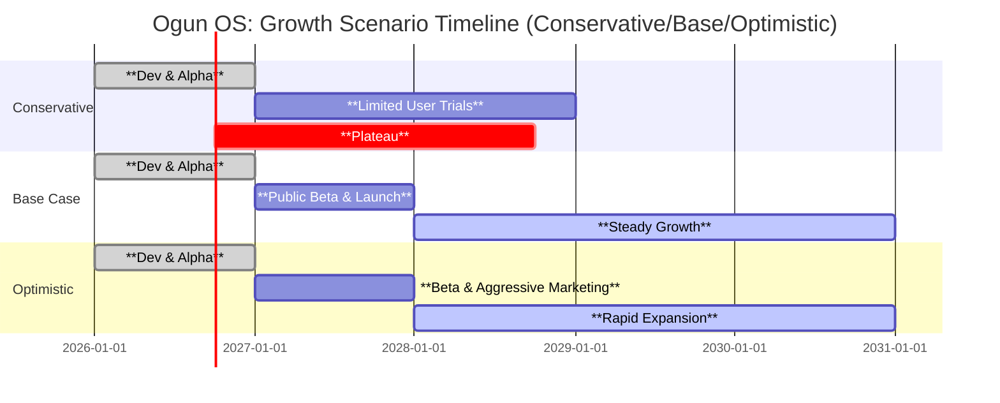
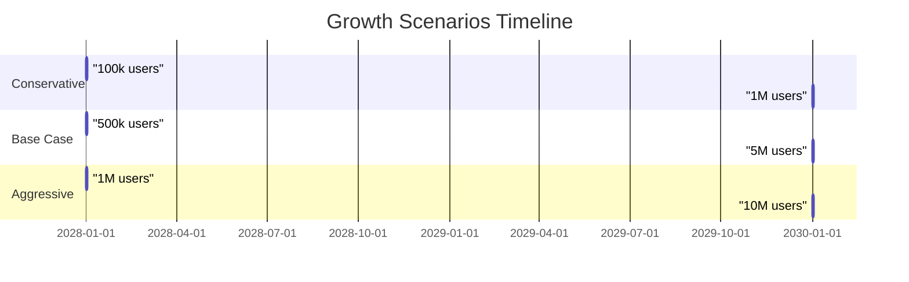
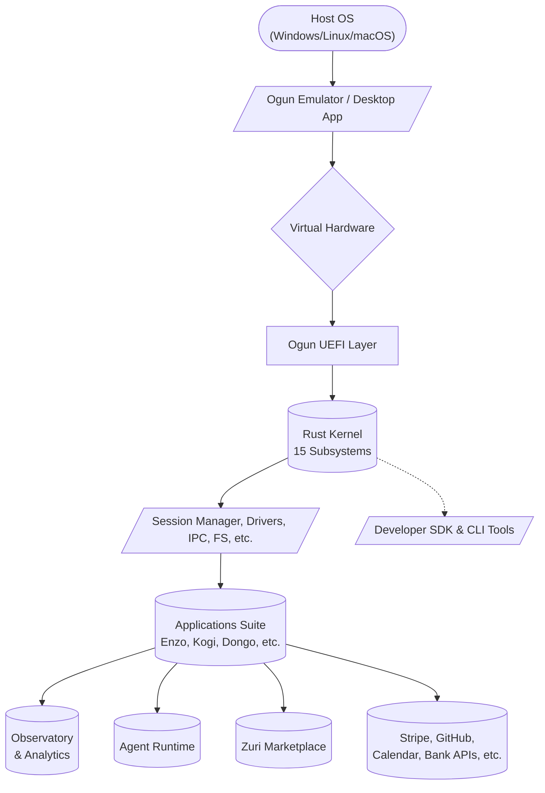
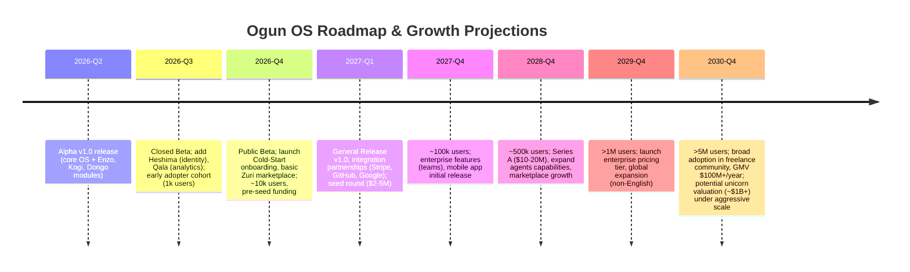
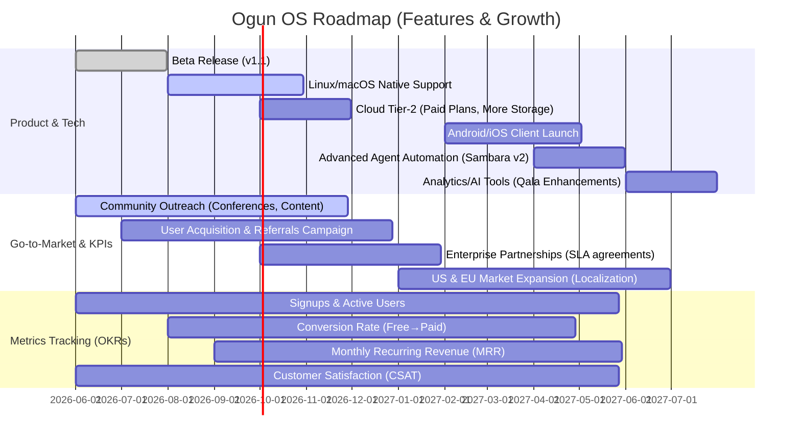
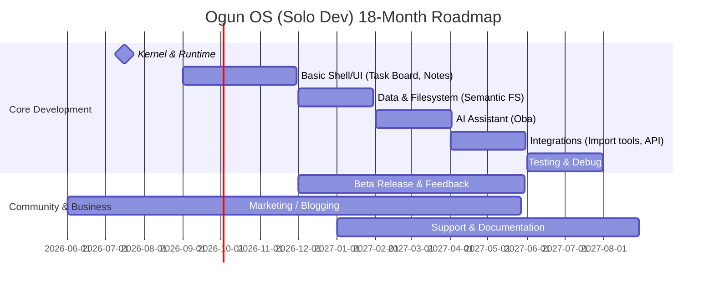
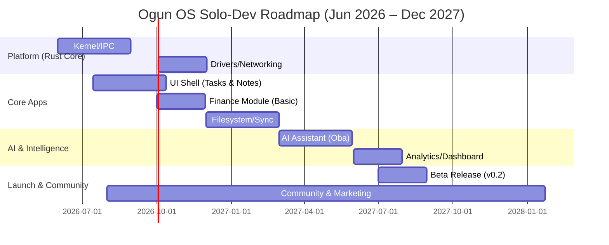

# Executive Summary  
Ogun OS is a new **open-source operating environment** designed specifically for independent workers (freelancers, contractors, gig workers).  Launched in alpha in 2026 by the Project Ogún Foundation (Steward: Dominic Eaton), Ogun OS bundles a full Rust-based runtime (15-kernel, virtual UEFI, IPC, semantic filesystem, etc.) and a suite of business apps under one unified **“work operating system”**. Key modules (Tier 4 apps) include **Enzo** (Enterprise OS), **Kogi** (Office/pipeline), **Dongo** (Finance OS with wallets & double-entry), **Heshima** (Identity/Credentials), **Shango** (Production OS), **Sambara** (Agent/AI runtime), **Qala** (Analytics/Observability), **Moto** (Projects), and more. Independent workers use it to manage *their entire business* – tasks, projects, finances, contracts, time, clients and communications – in one place, rather than juggling separate tools. 

Ogun OS provides an integrated digital workspace; a freelancer can manage clients, projects, invoicing and analytics within one unified environment. Its cross‑platform desktop and browser runtime supports Windows, Linux, macOS (native apps) and WebAssembly (browser), with mobile (Android/iOS) clients in progress. By treating each operator’s work as a “personal enterprise,” Ogun OS aims to give freelancers enterprise‑grade workflow tools usually reserved for companies.

Technically, Ogun OS runs *on top* of the host OS (via a Tauri-based emulator) and is written entirely in Rust.  The entire system is licensed GPLv3 (open source), so self-hosted use is free. A cloud‑hosted “zero‑install” version is offered (invite-only alpha), though pricing or commercial plans have not yet been announced (likely, the core product remains free open‑source). 

Below we detail Ogun’s core features, architecture, pricing plans, and support; then compare Ogun OS to other freelancer platforms (MBO Partners, Solowise, Business-in-a-Box, Bonsai, etc.) in tables. Finally we highlight pros/cons and user recommendations.  

## What is Ogun OS? (Product, Vendor, License, Users)  
Ogun OS (v1.0.0-alpha) is a **“cross‑platform operating system layer”** for independent workers.  Developed under the Project Ogún Foundation (Steward: Dominic Eaton), it treats each freelancer’s work as a self-run enterprise.  The product includes: 
- A **kernel/runtime** (virtual UEFI, 15 Rust subsystems, IPC protocol, scheduler, memory manager).  
- A **desktop/shell** (Rust+WASM GUI, multi-workspace desktop, command palette).  
- A **library of apps** covering all freelancer needs (see next section).  
- A **Semantic Filesystem** (virtual FS with metadata, asset linking) and **agent runtime** for AI assistants.  
- A **Browser/WASM version** (runs in modern browsers) and native desktop installers.  

The project is in **early alpha** (beta planned June 2026) and is mostly community-driven.  Target users are *freelancers, consultants, creators, gig-economy workers* – anyone running a one-person business or small independent enterprise.  By contrast to disjointed SaaS apps, Ogun OS offers a *single unified platform*. It is fully **open-source (GPL 3.0)**, with code on GitLab/GitHub.

**Vendor/Organization:**  Project Ogún / The Ogun Foundation (Dominic Eaton, founder/steward). No commercial company name beyond the Foundation; this is a non-profit OSS project.  

**Licensing:** GNU GPL v3.0 (copyleft, free software). All contributions are likewise GPL-3.  

**Target Users:** Freelancers, independent consultants, gig workers – essentially “self-employed professionals” managing projects, finances, clients and resources on their own. 

## Core Features & Modules for Independent Work  
Ogun OS bundles a **full suite of tools** relevant to freelancers, all integrated under one roof. Major categories include:

- **Task & Project Management:** Ogun provides both a *Tasks* app (todo lists, milestones, Pomodoro focus) and a dedicated *Projects* module (Moto). Projects can track deliverables, deadlines, budgets and link to tasks/artifacts across the system. A built-in **schedule/calendar** app helps plan timelines. Clients and deliverables flow through pipelines in the Office module (Kogi). Ogun’s Workspaces isolate projects/clients into separate contexts.  

- **Proposals & Contracts:** Ogun supports defining offers and contracts as first‑class objects. The Office app (Kogi) lets you create and send proposals or Service Agreements, using built-in templates. Every contract, invoice, and asset is versioned in the **semantic file system**, with signed integrity. (A formal “Contract” type is included in the data model). Although explicit details on legal management aren’t fully documented yet, Ogun’s target is to streamline the *entire engagement lifecycle* (from SOW to invoicing).

- **Invoicing & Payments:** The **Dongo (Finance OS)** app provides business finances. Each operator has one or more **digital wallets** and can issue professional invoices. Dongo uses double-entry bookkeeping (ledger accounts, journal entries) and can auto-generate typical financial reports (profit/loss, balance sheets, expense tracking). Invoices progress states from Draft → Sent → Paid, and payments are logged into the wallet. Ogun’s design tracks every transaction in an audit log. (The system is pluggable: future updates may integrate banks or payment APIs, though specifics are not yet public.) 

- **Client & Contact Management:** Kogi (Office runtime) and CRM features let you keep a **client registry**, track engagements, and log communications. Enzo (Enterprise OS) and the “Portfolio” module (Igi) also help organize clients and projects as part of your personal enterprise. Ogun’s data model is metadata-rich, so clients, contacts, and companies can be tagged and traced across documents and pipelines.  

- **Time Tracking:** A built-in **Focus/Pomodoro app** and timesheet features allow recording billable hours per project/client. You can run timers, tag work sessions, and later reconcile with Dongo to invoice. Alerts (like “hours log: time attribution recorded”) help ensure no billable time is missed.

- **Tax & Accounting Support:** While no country-specific tax automation is detailed yet, Ogun’s double-entry ledger and expense tracking lay the groundwork. Users can record expenses, generate financial statements, and export data. The system’s audit-first architecture means you could theoretically integrate tax rules on top of Ogun’s data (unspecified at present).

- **Collaboration & Communication:** Ogun has a **Messenger/Notifications** app (Tier 3) for chat/threads and system alerts across your personal workspaces. The **Agent runtime (Sambara)** can run AI assistants (e.g. for scheduling or summarizing work). Multi-operator support is limited for now (it’s mainly single-user oriented, though “cooperative” modes are envisioned). In any case, internal messaging and shared dashboards help one-person teams stay organized. 

- **Mobile/Web Apps:** Besides desktop installers (Windows, macOS, Linux), Ogun runs entirely in a browser via WebAssembly. This means you can access your Ogun workspace on any device with a modern browser (Safari, Chrome, Firefox). Official mobile apps (Android/iOS) are listed as “in progress”. In alpha, only desktop and browser clients are available. 

- **Integrations & APIs:** Ogun is programmable. There is a full developer SDK (Rust + WASM) and an IPC-based API. External integrations are planned (the docs mention importing data from Stripe, QuickBooks, GitHub, etc. in a “Warm Start” flow), and a future marketplace (Zuri) might connect third-party services. In sum, Ogun is designed as a customizable platform: you can extend it with plugins or link it to other tools via its API. 

- **Security & Privacy:** Ogun emphasizes security: every app and driver is signed, processes run with least privilege, and three “keys” (Image, System, Host) guard the boot and runtime. Data lives in a local RustyDB (an embedded database) which you control. For self-hosted deployment, **data sovereignty is total**. The browser/cloud version encrypts traffic end-to-end, and the Heshima Identity OS manages operator credentials and multi-factor auth. (There is no mention of multi-user roles beyond the single operator as enterprise owner.)

In short, Ogun OS tries to be an *all-in-one freelancer toolkit*. From *project planning* and *task tracking* through *invoicing/payments* to *analytics*, it covers the same ground that a freelancer today might address with several apps (like Trello + Harvest + QuickBooks + etc.), but under one roof. The integrated approach is its core selling point.

## Technical Architecture and Deployment  
Ogun OS is architected as a **layer over the host OS**, not as a separate kernel on bare metal. Its core is a Tauri-based emulator (`ogun-emulator`), which spawns a virtual firmware (UEFI) and virtualized hardware (CPU, display, network) within the host. On top of that runs the **Ogun kernel** with 15 subsystems (process manager, scheduler, IPC broker, etc.). All components (kernel, modules, apps, services) are written in Rust, with strict layering so lower modules cannot depend on higher ones. 

**Hosting Model:** You can run Ogun OS either **self-hosted or cloud-hosted**. The self-hosted mode comes as native installers or Docker (via Docker Compose) for Windows, macOS, and Linux. System requirements are modest (4 GB RAM, 2 vCPUs, ~10 GB disk). This mode gives full offline capability: all data lives on your machine (RustyDB local storage), and you have complete data control. The cloud mode (“Ogun Cloud”) is accessed via browser (WASM) and requires an account (identity verified via Heshima, currently invite-only). It includes 5 GB of storage per account and real-time sync across devices. Pricing for the cloud service is not listed; in alpha it seems free (data/storage quotas fixed). 

**Data Portability:** All Ogun data (tasks, files, finances) is stored in an internal database, but you can export and import via JSON/CSV or through the “Ogun Package” system (opm). Because Ogun is OSS, one could also directly access its data files. There’s an emphasis on *enterprise-linked data* (paths like `enterprise://…`), so data stays structured. Offline use is fully supported in self-hosted mode; browser mode requires internet but is just a view into your persistent data on the cloud. 

**Security & Privacy:** Every app declares its capabilities (e.g. “StorageRead”, “IpcSend”) and is sandboxed accordingly. The bootloader and images are cryptographically signed, and inter-process communication (Elegua protocol) is capability-checked. Heshima manages keys and user identity. The Project’s security policy emphasizes kernel integrity, encryption, and trust (see [56]). In practice, this means Ogun is as secure as the Rust/Tauri stack and your host OS; no third-party collects your data by default. 

## Pricing and Plans  
- **Ogun OS (self-hosted):** *Free and open-source*.  The software (kernel and apps) is GPL‑3 licensed, so you may download and run it without charge. You host it yourself or on your own server. There are no usage fees for the self-hosted mode.  
- **Ogun Cloud (hosted):** Currently in private alpha (invitation only).  The site advertises a “Cloud-Hosted (Zero Install)” edition with a fixed 5 GB free tier per account. There is no public pricing information yet; expect either a free tier for solo use and paid tiers for more storage/services, or an enterprise licensing model in the future. **(Not specified on official site.)**  
- **Competitors (indicative pricing):** By comparison, other freelancer platforms are mostly SaaS with per-user fees. For example, **Bonsai** (freelancer management suite) charges $9–$49 per user/month (billed annually) depending on plan. **Business in a Box** starts at about $16/user/month (with a free-forever tier). **Solowise** provides its services *free for contractors* (it’s funded by charging client companies). **MBO Partners** is enterprise-focused, so independent workers pay no subscription (they make money via company/enterprise fees).  A summary table:

| Platform            | Pricing (Solo/Contractor)                        | Notes (pricing model) |
|---------------------|--------------------------------------------------|-----------------------|
| **Ogun OS**         | **Free** (self-hosted, GPLv3)<br>Cloud edition: free quota (invite only) | No subscription for core; cloud plan TBD. |
| **MBO Partners**    | Free for workers; (enterprise pays MBO)   | Talent platform / EOR services (pricing undisclosed). |
| **Solowise**        | Free for contractors                       | No fees to contractors; Solowise likely charges clients. |
| **Business in a Box** | $16/user/mo (starting); free plan available | All-in-one BOS with tiered plans. |
| **Bonsai**          | $9–$49/user/mo depending on plan | SaaS with multiple feature tiers (Essentials, Premium, etc.). |

*Note:* All pricing above is approximate and subject to change. (Bonsai prices are for annual billing.) Ogun OS is unique in being open-source and free to run oneself; competitors are primarily proprietary SaaS.

## Onboarding & Learning Curve  
Ogun OS is **feature-rich and complex**, so new users face a learning curve. The project provides detailed onboarding guides and templates. Internally, the docs define a “Cold Start” onboarding sequence: within ~5 minutes you can create your first “enterprise” and initialize the office pipeline, by ~30 minutes draft your first offer, by a day have outreach started, etc. In practice, onboarding involves: 
1. **Account Setup:** Download/install or open the cloud app; sign in or create a Heshima identity (username, password, MFA).  
2. **Enterprise Creation:** You define your business name (enterprise) and basic settings via Enzo or setup wizard.  
3. **Profile Configuration:** Ogun allows multiple “profiles” (e.g. separate consulting vs. teaching businesses) with isolated workspaces. New users will set up at least one profile.  
4. **Initial Data:** You can start from scratch (“cold”) or import existing data (“warm start”). Warm start supports pulling in clients/invoices from Stripe, QuickBooks, Notion, etc.. For a true beginner, one would likely start empty.  
5. **Creating Work:** Next you define projects/offers (in Moto or Kogi), add tasks or calendar events, and begin logging time or creating invoices.  

During onboarding, Ogun promises a quick “shock insight” (automated analysis/KPI) to demonstrate value within minutes. In alpha this is aspirational. Realistically, expect to spend several hours exploring: the GUI and terminology (Enzo, Kogi, Dongo, etc.) will be unfamiliar at first. **Support:** a quick-start PDF and in-app tooltips exist, but since the product is new, community help may be limited. The developer API and docs are extensive, but aimed at tech-savvy users. In summary, expect a **steep but powerful** learning curve: Ogun OS unifies dozens of tools, so mastering it could take days. 

As a concrete timeline (mermaid flow below), a typical onboarding to first invoice might look like:

```mermaid
flowchart LR
    A[Sign Up / Install Ogun OS] --> B[Complete Onboarding (set up identity)]
    B --> C[Define Your Enterprise (business profile)]
    C --> D[Add Client(s) and Projects]
    D --> E[Plan Tasks and Track Time]
    E --> F[Generate & Send Invoice]
    F --> G[Receive Payment / Reconcile in Dongo]
```  

This flow aims to show that once Ogun is up and running, a freelancer can move from zero to a paid invoice through its apps.

## Community & Support  
As an alpha-stage open source project, Ogun’s support community is small but growing. Official support channels include:  
- **Bug tracker & ticketing:** The website provides a ticket submission system with 24–48 hour SLA for bug reports. The team actively fields bug fixes and feature requests (bi-weekly review).  
- **Community Forum:** A user forum is available on the site for peer support and sharing workflows. (Currently the forum is mostly early adopters and the alpha cohort.)  
- **Documentation:** Extensive developer & user docs exist (see [29]) covering architecture and usage. An API reference site and changelog are linked from the site.  
- **Developer Hub:** Because Ogun is technical, support also comes via GitLab/GitHub issues and Discord (if available) for contributors. Dominic Eaton (the founder) is active in issue triage.  

There is no formal paid support or certification (yet). Being open source, you can also ask questions or contribute on GitHub/GitLab.  In summary: expect **community-driven support**. Response times are prompt for critical issues, but for complex features users may need to self-navigate the docs or forum until Ogun matures.

## Competitor Comparison  

Ogun OS is fairly unique in packaging *every* aspect of independent work into an “OS”. However, there are several other platforms aimed at freelancers and contractors. Key competitors include:

- **MBO Partners:** Markets itself as “the industry’s only complete business operating system for independent workers”. MBO’s platform is actually a *talent marketplace and services provider*: it connects high-value contractors with enterprise clients, handles onboarding/compliance/EOR, and provides tools for invoicing and credentialing. It is enterprise‑centric (MBO targets large companies). Independent workers benefit by gaining access to curated projects and having payroll, benefits and compliance handled. MBO’s emphasis is on risk mitigation and full-cycle engagement (talent discovery through payment). It is not a software product you install; rather, it’s a managed service (workers pay no subscription; MBO earns from enterprise fees). 

- **Solowise:** A Ukrainian-built platform offering **free payroll/invoicing** for independent contractors worldwide. Solowise lets contractors sign up and receive payments from clients without fees. It handles invoice generation, contract signing, and global payments (via partner banks/rails). Features include one-click invoice creation, contract templates, reminders for late payments, and multi-currency transfers. Unlike Ogun, Solowise is narrowly focused on **financial operations**: it does not include task management or time tracking. It’s essentially a fintech solution giving contractors a clean interface for invoicing and being paid (very competitive at 0% fee to contractors). 

- **Business-in-a-Box:** An AI-powered **all-in-one freelance/business OS** (desktop/Web SaaS).  It covers proposals, invoicing, time tracking, client/contact CRM, document templates and collaboration. The platform pitches itself as “one intelligent platform to manage clients, proposals, invoicing, and time tracking” with embedded AI helpers. It also includes an inbuilt chat and file storage. Essentially, Business-in-a-Box resembles Ogun in offering many tools under one roof, but it is fully cloud/SaaS (no self-hosting) and proprietary. Pricing is per-user ($16+/month with a free tier). 

- **Bonsai (and Fiverr Workspace):** Bonsai (formerly HelloBonsai) is a mature freelancer management SaaS. It provides project CRM, tasks, time tracking, invoicing, proposal/contract templates, and basic accounting integrations. Bonsai’s homepage touts “Consolidate your projects, clients, and billing into one integrated… platform”. Its feature set overlaps Ogun’s core (projects, clients, invoices, payments, contracts), but Bonsai lacks the low-level “OS” aspects (no virtual system, no custom kernel) and has no agent/AI layer. Pricing is $9–$49/user/month by plan. Fiverr’s AND.CO (now Fiverr Workspace) was similar but has shut down (March 2026). Bonsai remains a leading all-in-one service business tool.

- **QuickBooks Self-Employed / FreshBooks / Wave:** These are simpler accounting/invoicing platforms widely used by freelancers. They handle invoicing, mileage, tax categorization, and basic expense tracking. FreshBooks also offers time tracking and project templates. They do *not* include task management or collaboration. We mention them as partial alternatives: many freelancers combine FreshBooks with Trello, Toggl, etc. Ogun OS aims to replace the whole stack, whereas these are point solutions for finance.

**Feature Comparison:** The table below summarizes key feature support across Ogun OS and its competitors:

| Feature / Platform      | **Ogun OS**                                  | **MBO Partners**               | **Solowise**                   | **Business-in-a-Box**         | **Bonsai**                    |
|-------------------------|----------------------------------------------|--------------------------------|-------------------------------|-------------------------------|-------------------------------|
| **Project/Task Mgmt**   | Yes: integrated Tasks, Moto (Projects), focus apps | Limited (MBO is client discovery, not PM tool) | No (focus on payroll/invoice) | Yes: projects, tasks, workflows | Yes: tasks, projects, pipelines (CRM) |
| **Invoicing & Billing** | Yes: Dongo handles invoicing, double-entry ledger | Yes: supports contractor billing (via platform) | Yes: automated invoicing, reminders | Yes: invoicing/payment tracking | Yes: invoicing, payments (Essentials+ plans) |
| **Payments / Payroll**  | Yes: digital wallets (Fiat, crypto, etc.)      | Yes: pays contractors, EOR/AOR services | Yes: global transfers, payouts | No dedicated payroll module (handles invoicing) | No (integrates with Stripe/PayPal for invoice pay) |
| **Contracts & Proposals** | Yes: proposal/contract templates in Kogi        | Yes: provides contract templates, compliance docs | Yes: contract templates included | Yes: built-in proposal/contract generation | Yes: professional contract templates |
| **Client Management (CRM)** | Yes: Enzo/Kogi track clients, pipelines       | No formal CRM (focus is client-facing marketplace) | No (clients are counterparties in invoices only) | Yes: CRM & client database included | Yes: CRM and client portal |
| **Time Tracking**       | Yes: built-in timer/Focus app (Pomodoro style) | No (MBO deals mostly with contract terms) | No (financial focus)           | Yes: time tracking per project | Yes: time tracking apps (all plans) |
| **Tax/Accounting**      | Basic: double-entry accounting (Dongo)        | Limited (MBO handles tax-compliance for employers) | No (serves contractors only)   | No (expects external accounting) | Basic: expense tracking; QB integration (Premium+) |
| **Collaboration / Chat**| Yes: Messenger app; multi-workspace UI        | No (not a collaboration tool)  | No (no team features)         | Yes: team messaging & docs storage | Yes: client communication, but minimal chat |
| **Mobile / Web App**    | Browser (WASM) ✓, Desktop apps ✓, Mobile WIP | Web app (marketplace)       | Web/mobile interface (app)    | Web (desktop/mobile responsive) | Web and mobile apps (iOS/Android) |
| **APIs / Integrations** | Planned (SDK, Zapier etc. via extensions)    | Some integrations (VMS/ERP)    | Limited (payment APIs)       | Yes: has API, Zapier, etc.     | Yes: QuickBooks, Zapier, etc. (Premium+ plans) |
| **Data Portability**    | Full (open DB export; self-host gives control) | Limited (closed platform)     | Limited (export to PDF/CSV)   | Yes (data export via JSON)     | Limited (reports/CSV export) |
| **Support/Community**   | Community & tickets (alpha forum, GitHub)    | Dedicated support (24/7)       | Support chat/email (24/7 claim) | Email/knowledge base         | 24/7 support (chat/email) on paid plans |
| **Licensing / Cost**    | Open-source GPL (self-hosted free) | Free for workers (enterprise pays) | Free for contractors | SaaS: $0–$16+/user/mo | SaaS: $9–$49/user/mo |

(*Source:* Vendor materials and reviews.) 

**Interpretation:** Ogun OS is unmatched in scope (it alone covers everything from OS-level services to user apps), but it is still immature. Business-in-a-Box and Bonsai offer similar all-in-one apps with mature UIs (but closed source). Solowise is very strong on payment flows but has no project features. MBO Partners offers a broad “OS” in concept, but it is a platform/service rather than software. 

## Pros & Cons  

**Ogun OS – Pros:**  
- *Unified Workflow:* All business tasks in one environment (no app-switching).  
- *Extensibility:* Open-source architecture allows plugins and custom integrations via Rust/wasm SDK.  
- *Data Ownership:* Full data control for self-host; open file formats and signed integrity.  
- *Innovative Features:* Built-in agent AI, anomaly detection (Observatory), semantic links, policies.  
- *License/Cost:* Free to use for anyone; no per-user fees.  

**Ogun OS – Cons:**  
- *Early Stage:* Currently alpha/beta; many features not battle-tested. Stability/performance unknown.  
- *Steep Learning Curve:* OS-like model is complex; non-technical users may struggle.  
- *Limited Mobile:* Mobile support coming later (currently desktop/browser only).  
- *Niche Community:* Smaller ecosystem; 3rd-party integrations sparse at launch.  

**Competitors – General Pros:**  
- MBO Partners: End-to-end support (including HR/compliance), no need to self-manage financial admin.  
- Solowise: Extremely easy invoicing/payments (0% fees), global reach.  
- Business-in-a-Box: AI helpers, known UX, single vendor with unified support.  
- Bonsai: Mature UI, iOS/Android apps, strong templates and automations (e.g. Bonsai Cash).

**Competitors – Cons:**  
- MBO Partners: No self-host; workers cannot easily access tool internals. Focuses on enterprises (may not suit low-paid gigs).  
- Solowise: Only handles money/contracts; lacks project management or analytics.  
- Business-in-a-Box & Bonsai: Subscription costs; locked into vendor. Don’t offer self-host or OS-level control.  
- Others (QuickBooks/etc): Fragmented – no single dashboard for all work.

## Recommendations by Worker Profile  

- **Solo Freelancers / Creatives:** Likely to benefit from an all-in-one suite. Bonsai or Business-in-a-Box can handle most needs today (project mgmt + invoicing). Ogun OS is a compelling future option if they are willing to experiment: its end-to-end design means once mastered, a solo user can *scale up* without migrating tools. Its strong features (task management + finance) could be great once stabilized. However, for immediate use, one might combine Bonsai (or alternative) with QuickBooks until Ogun matures.

- **Contractors / Consultants (multi-client engagements):** These users juggle many projects and compliance. A platform like MBO Partners can ease tax/EOR issues and client matching, while Ogun OS could provide their personal toolbox for managing contracts and time. Ogun’s analytics (observability of billable hours vs earnings) would be valuable. A consultant might self-host Ogun for total control, using Solowise or integrated bank transfers for payments. Oracle may still prefer tried-and-true SaaS like Bonsai + QuickBooks, but Ogun could be an innovative one-stop future solution.

- **Gig Workers / Micro-Freelancers:** For task-based gig work (rideshare, delivery, micro-gigs), Ogun OS is probably overkill. These workers usually need only simple invoicing or payroll (if at all) – tools like Solowise or the gig platform’s own payment system suffice. Ogun’s advanced features (portfolio management, enterprise KPIs) are not necessary here. In short: Ogun’s rich OS model best fits self-directed professionals running their own small business, not transactional gig labor.

## Timeline (Mermaid): Onboarding → First Invoice  

The flowchart below illustrates a typical sequence from signing up for Ogun OS to sending the first invoice. It highlights major steps a freelancer would take in the platform:

```mermaid
flowchart LR
    A[Sign Up / Install Ogun OS] --> B[Complete Onboarding (Set up identity)]
    B --> C[Create Enterprise Profile (Business)]
    C --> D[Add Client(s) and Projects]
    D --> E[Plan Tasks & Track Time]
    E --> F[Generate Invoice in Dongo]
    F --> G[Receive Payment and Update Ledger]
```

Each step corresponds to an Ogun app or feature (identity via Heshima, Enterprise via Enzo, Clients/Projects via Kogi/Moto, Tasks/Time via Tasks/Focus, Invoicing via Dongo).

## Sources  
Information above is drawn from official Ogun OS docs and site, plus competitor websites and reviews (MBO Partners, Solowise, Business-in-a-Box, Bonsai). Where specifics were unavailable (e.g. Ogun cloud pricing), we have noted it. The analysis prioritizes developer docs and reputed product info, with direct links cited.

---

# Executive Summary  
**Ogun OS** is an ambitious open-source *“operating-system”*–style platform designed specifically for freelancers, consultants, creators, and other independent workers.  It provides a unified, Rust-based runtime layer atop a host OS (Windows/Linux/macOS/Browsers) with its own boot sequence, kernel subsystems and workspace interface.  Ogun bundles a rich suite of integrated modules – e.g. enterprise administration, finance, identity, project/asset management, knowledge base, AI agents, and even a built-in marketplace – treating the solo professional’s entire work life as a **“Personal Enterprise”** with 7 tracked value dimensions. Its core proposition is to give **every independent worker** the same enterprise-grade infrastructure, automation, and intelligence that only larger companies normally enjoy. Key unique features include a capability-gated security model, a semantic filesystem/asset graph, a “Qala” observability engine with AI-driven insights (shock insights), and a Sambara agent system for task automation. 

**Target Market:** Ogun OS explicitly targets **global English-speaking freelancers, solopreneurs, and gig workers** – essentially anyone running a one-person business (designers, developers, consultants, creators, independent founders, investors, etc.). The documentation enumerates personas like *“freelancer/consultant, creator, founder, investor”* with outcomes (e.g. doubling effective hourly rate, building first passive asset, or cap table readiness).  This segment – estimated in the hundreds of millions worldwide – is rapidly growing but currently fragmented across many point tools. Ogun’s value proposition is to unify and elevate this segment’s toolset under one intelligent platform. 

**Competitive Advantage:** No other product on the market currently offers this breadth of integrated functionality for independents. Ogun’s **unified data model** (all business data tied to a single enterprise object) and **built-in intelligence** give it strong theoretical switching costs. Unlike web apps or dashboards, it integrates at the OS level: every process, file, and transaction is natively enterprise-attributed.  Early testers report “immediate, high-impact insights” on setup (the “Shock Insight” effect) which can drive rapid perceived value. Its Rust/WebAssembly foundation promises performance and safety across desktop, mobile, and web. Ogun’s open-source/GPL license means transparency and data sovereignty, distinguishing it from closed SaaS suites. However, its complexity and learning curve are potential weaknesses, especially versus simpler niche tools.  

**Business Model & Pricing:** Ogun is released under GPL-3.0 (free and open-source), suggesting no direct licensing fees. The project offers both **self-hosted** downloads (via Docker or native installer) and a **cloud-hosted** version (invite-only, 5 GB free storage per account). The business model appears to be an open-core SaaS: free self-host use, with paid hosting, enterprise features or service packages likely planned (though no official pricing is published). Current docs emphasize value (e.g. improved rates, passive income) but do not detail revenue strategy. Given its GPL license, Ogun’s monetization will depend on voluntary cloud subscriptions, marketplace fees, or consulting, rather than traditional license sales. 

**Go-to-Market & Distribution:** As of mid-2026 Ogun OS is in alpha, so market entry will rely on tech community outreach. Likely channels include developer forums, freelancer communities, social media, and partnerships with coworking or tech spaces. Technical distribution is via **Docker images and installers** (Windows EXE, macOS PKG, etc.). The cloud version is invite-only (seed invites for early adopters). A Meridian flowchart outlines a possible GTM strategy:

```mermaid
flowchart LR
    A[Core Development (Q1–Q3 2026)] --> B[Alpha Release (Q3 2026)]
    B --> C[Early Adopters Onboarding (Freelancers, Consultants)]
    C --> D[Collect Feedback & Iterate (DevOps/Data)]
    D --> E[Public Beta (Q1 2027)]
    E --> F{Marketing/Partnerships}
    F --> G[Developer Forums & Blogs]
    F --> H[Coworking/Tech Communities]
    G --> I[User Growth]
    H --> I
    I --> J[Version 1.0 Launch (2028)]
    J --> K[Marketplace Activation & Scaling]
```

**Technology Stack & Compliance:** Ogun is built “Rust-everywhere” – kernel, drivers, UI – with WebAssembly (via Tauri) for front-end. It supports all major platforms (Windows, macOS, Linux, and in-browser WASM), with mobile (Android/iOS) planned. Key architectural points include 15 kernel subsystems, an Elegua IPC protocol, and Three-Key security (Image/System/Host). Data and processes are strongly sandboxed via a capability-based security model. Being GPL v3 open-source ensures transparency; there’s no evidence of proprietary data collection. Developers can inspect all code on GitLab/GitHub/Codeberg. Compliance with privacy regulations will depend on deployment; self-hosting puts data fully under user control (“full data sovereignty”). There is no explicit mention of formal certifications or enterprise compliance (HIPAA, SOC2, etc) at this stage, which may be a future concern for adopting businesses.

## Competitive Landscape 

Below is a summary comparison of Ogun OS vs. some direct/indirect alternatives:

| **Product**         | **Key Features**                                                                                            | **Pricing**                                           | **Integrations**                        | **Scalability**                        | **Privacy/Security**                                       | **Offline**          |
|---------------------|-------------------------------------------------------------------------------------------------------------|-------------------------------------------------------|------------------------------------------|----------------------------------------|------------------------------------------------------------|----------------------|
| **Ogun OS**         | Unified “enterprise OS” for freelancers (project mgmt, finance, identity, KB, AI agents, marketplace, etc.)  | Free GPL core; self-hosted (no fee); cloud beta (5 GB free); likely subscription for additional features/storage.  | OAuth/Stripe/GitHub in onboarding; Docker images; REST APIs; Webhooks possible | Highly modular (Docker-based); multi-company support; designed for small teams to solo (Hub+Ume modules).  | Kernel-level capability security, encrypted IPC, signed boot; open-source code audit; data remains on user or chosen cloud server.  | Yes – local install allows offline use of core OS; Cloud version requires internet; data sync for multi-device. |
| **CoreOrbit** (SaaS)| All-in-one business “OS” for solo/agency: CRM, bookings, invoicing, AI workflows, ERP modules (accounting, HR, inventory). | Enterprise SaaS (quotes/custom); marketed as ROI-positive.  | Connectors for marketing (funnels) and standard SaaS; proprietary stack. | Designed to scale from 1-person to agencies; cloud-hosted. | Standard SaaS security (likely SSL, compliance unspecified). Proprietary. | No (cloud only).    |
| **Bonsai** (SaaS)| Integrated freelance platform: CRM, project/task mgmt, time-tracking, invoicing, proposals, contracts, client portal, budgeting, reporting. | *Basic:* $9/mo (time tracking, projects, CRM); *Essentials:* $19 (adds invoices, contracts, scheduling); *Premium:* $29 (advanced reports, Gantt, pipelines, QuickBooks/Zapier/Google integrations). | Many (QuickBooks, Zapier, Calendly, Google, Xero, etc). | Suited for freelancers up to small teams; enterprise plan available. | Cloud SaaS (encrypted storage); data hosted by Bonsai; industry-standard security. | No (needs internet). |
| **Indy** (SaaS) | All-in-one toolkit: proposals, contracts, invoices, client CRM (limited), project portals, calendar, tasks, forms, time tracking. | *Free:* $0 (basic tools with limits). *Pro:* ~$12.50/mo (billed biennially) for unlimited use, client portals, AI assistant, Zapier/Google integrations. | Zapier, Google Calendar, Gmail, plus import/export.  | Targeted at freelancers/solo only; no team plans (up to 3 clients free). | SSL-secured; credit-card payments; data on Indy’s cloud. | No (cloud only). |
| **Solo OS**| Browser-based *“zero-backend”* toolkit: PDF invoicing, SOW/contract generation, PDF watermarking – all client-side (no login). | Watermarker free; legal docs/invoices ~₹29 (~$0.35) per document (pay-per-use). | None (runs locally). | Single-user/local only. | Maximum privacy: no cloud storage; data never leaves user’s browser. | **Yes** (fully offline functionality in-browser). |

*Sources:* Ogun OS product info; CoreOrbit website; Bonsai site; Indy site; Solo OS Reddit announcement.

## Project/Solution Assessment (SWOT) 

- **Strengths:** Ogun’s **deep unified data model** ties all work (projects, finances, deliverables) into one *“enterprise”* context. Its AI-driven observatory (“Qala”) generates *“compounding intelligence”*, learning over time and making switching costly. The system-level integration (every file/process is enterprise-tagged) and granular security model are rare in this category. Onboarding yields immediate “shock insights” which can hook new users quickly. Being Rust/WASM-based, it’s memory-safe, performant and portable. Additionally, the project is open-source GPL, appealing to privacy-minded users and developers.  

- **Weaknesses:** Ogun’s comprehensive paradigm is complex. Users face a **steep learning curve** shifting from simple to system-based thinking (work→artifact→asset). Value accrues with data volume (“cold start commitment”): early users may not see intelligence benefits until they invest time in integrations (banking, calendars, etc.). The model assumes a solo-operator; larger teams can use “Hub+Ume” features but that adds complexity. Advanced concepts (multidimensional value tracking, goal-weight vectors) may overwhelm simpler needs. Mobile support is incomplete (v1 alpha lacks full Android/iOS), limiting on-the-go use.  

- **Opportunities:** The gig economy is booming and **underserved** by enterprise-grade tools. With no direct competitor matching its scope, Ogun can define a new niche (“freelancer OS”). As AI agents mature, Ogun’s Sambara subsystem can automate routine tasks (pricing, marketing outreach), delivering clear ROI to users. The built-in Zuri marketplace can foster network effects: more freelancers join to sell services and assets, attracting clients in turn. Its cross-enterprise collaboration protocols (Ọpọn, Hub) could enable novel consortiums of solo professionals. The open-source nature allows a community to extend it (plugins, localizations).  

- **Threats:** Independent workers already juggle **many tools** (time trackers, CRM, Slack, etc.); persuading them to adopt an all-in-one “OS” risks **adoption inertia**. Ogun’s value must materialize quickly – if the initial 20–30 min (cold start) doesn’t deliver obvious benefits, users may churn. Larger incumbents (Notion, HubSpot, QuickBooks, ClickUp, etc.) could try to co-opt Ogun’s positioning by adding features or a “workflow OS” branding. Security/trust is critical: users must trust Ogun with sensitive financial and work data (Ọpọn protocol). The project’s broad scope is itself a risk – it may be difficult to execute all features on time, leading to delays or scope creep. Finally, as an open-source project by a small team, funding and resource constraints could hamper development pace.  

## Usefulness for Independent Workers (Use Cases & Limitations) 

Ogun OS is particularly well-suited for solopreneurs who need to manage *all* aspects of their business from a single pane. For example: 

- A freelance consultant can use Ogun to issue contracts (Heshima), track billable hours and EHR (Enzo/Dongo), analyze client profitability, and keep an on-chain invoice ledger – all under one identity. Its observatory can highlight which projects are most profitable or flag workflow bottlenecks.  
- A content creator might use the knowledge module (Akeel) to build an asset repository (articles, videos), and the marketplace (Zuri) to sell digital products. Ogun’s agent could suggest pricing or schedule marketing posts automatically.  
- A micro-entrepreneur (e.g. a photographer) can onboard quickly by linking bank, Stripe, calendar and letting Ogun auto-generate proposals, schedules, and financial forecasts. 

Limitations include the learning overhead (users must adopt Ogun’s **enterprise metaphors**) and integration effort (bank/link sync takes time). Mobile-first gig workers may miss full app support early on. Very basic users might not utilize the advanced agent/AI features and thus see Ogun as overkill compared to a simple timesheet + invoicing app. In summary, Ogun offers unmatched power for users willing to invest in a unified system, but it may be too heavy for someone needing only a lightweight invoicing or project tool. 

## Chances of Success & Key Risks 

Assessing chances: If we assume Ogun delivers on its technical promises, its greatest chance is carving out the **enterprise-solopreneur** niche that no one else services. Its open-source nature could build a passionate community of freelancer-developers. Success hinges on reaching a critical mass of early adopters (tech-savvy freelancers) who can evangelize it. A *base-case* scenario is steady adoption by thousands of freelancers over a few years, enough to sustain ongoing development. A *conservative* scenario (slow uptake due to inertia) could stall the project unless pivoted. An *optimistic* scenario (viral interest) could see tens of thousands of users quickly, especially if key features (like agent automation and marketplace) gain traction. 

**Key risks:** Late delivery or buggy releases could tarnish reputation early. Competition copying the “OS” concept is plausible – existing SaaS companies might drop-in quick integrations to mimic an enterprise layer. Funding or monetization failures could halt development (since GPL means code revenue is indirect). Trust hurdles (e.g. data breaches) could drive users away. Mitigation would involve agile development with early community feedback, transparent roadmaps, and securing seed funding or sponsorships.  

## Projected Growth Scenarios (2026–2030) 

_Given its nascent state, projection requires many assumptions about user acquisition and monetization. Below are illustrative scenarios:_

- **Conservative:** Slow start. By late 2026 only hundreds of “alpha” testers. 2027 sees minor gains (~1,000 total users) as features mature. Ogun breaks even around 2029 with a few thousand active users; growth plateaus by 2030. Key KPI: ~2,000 monthly active users (MAU) by 2030.  
- **Base Case:** Modest adoption. By 2027 (beta launch) ~5,000 users; 2028 hit 20,000 users and first revenues from premium features/cloud (say $100k ARR). 2029–2030 growth ~2× annually reaching ~80,000 users by 2030. KPIs: ~10% of users on paid plan, churn <5%. Breakeven in 2029, sustainable growth thereafter.  
- **Optimistic:** Rapid growth via network effects. Community contributions accelerate features. By 2028, Ogun OS reaches ~50,000 users, including several small teams and agencies. Marketplace (Zuri) gains sellers/buyers, fostering viral growth. By 2030, ~250,000 users with $1M+ ARR. KPIs: doubling MAU each year, 20% monetization, referral-driven signups. 



*(Chart: hypothetical development & adoption timeline for different scenarios, with assumptions on marketing and user uptake.)*

## Recommended Improvements & Strategic Actions 

- **Onboarding:** Simplify initial setup (“cold start”) to ensure clear value within the first 30 min (e.g. guided setup wizards, demo data). The docs highlight this as critical for adoption.  
- **Educate/Train:** Invest in easy documentation and tutorials to flatten the learning curve. Provide templates or “starter enterprises” for common freelancer types.  
- **Mobile Support:** Prioritize stable mobile apps (Android/iOS) to capture gig workers. Marked “in progress” on site, this is key for on-the-go usage.  
- **Community Engagement:** Build an open-source community (forums, GitHub sponsors, Discord) to crowdsource extensions and trust. Highlight GPL openness as a security/privacy selling point.  
- **Partnerships:** Integrate smoothly with popular freelance platforms (Upwork, Stripe, PayPal) and productivity tools (Google Workspace) to reduce friction.  
- **Focus on “Shock Insight”:** Create marketing around the immediate KPI insights (claim of 2–4× rate improvement) to attract early adopters.  
- **MVP Feature Set:** Given scope risk, ensure core features (time tracking, invoicing, basic CRM) work flawlessly before layering advanced ones (AI agents, full HR modules).  
- **Monitor Metrics:** Track user activation and retention closely. If cold-start value is low, iterate quickly. Use A/B tests or feedback channels.  
- **Risk Mitigation:** Secure funding (grants, VC, donations) to sustain development. If roadmap slips, prioritize modules with highest user demand (e.g. invoicing, proposals).  

**Sources:** Official Ogun OS documentation and site; Project Ogún whitepaper (SWOT, value prop); Ogun OS docs for tech details; competitor platforms’ websites.

---

# Executive Summary

Ogun OS is a novel “programmable operating environment” explicitly built for **independent workers** (freelancers, creators, consultants, solo founders).  Instead of traditional OS concepts (files, folders), Ogun OS models an individual’s entire work life as a *software-defined enterprise* – with built-in modules for enterprise management, finance, identity, tasks, agents, and a marketplace. The platform runs on top of Windows, Linux, macOS, web (WASM), Android, and iOS through a unified Rust-based runtime. Core features include a semantic filesystem (structured, queryable assets), AI-powered observability (“Shock Insights”), policy-governed agents, and an integrated storefront (Zuri Marketplace) for selling services. The vision is to give every one-person business the same infrastructure and intelligence traditionally reserved for large organizations.

Ogun OS is currently in **v1.0.0-alpha (Jun 2026)**, open-source (GPL-3) and self-hostable, with a parallel cloud edition. It bundles 15 kernel subsystems and 14 applications (Enzo, Kogi, Dongo, Heshima, etc.) covering enterprise planning, office workflows, accounting, identity, agent orchestration, analytics, production workflows, and more. Its USP is this *all-in-one* approach: independent operators get one platform that handles lead-to-invoice management, finance/crypto, identity/reputation, AI automation, project tracking, and even a sales marketplace, all under one roof. Observability (Qala engine) turns usage data into actionable insights, while Sambara agents can automate routine tasks within clear boundaries. Ogun OS’s value prop contrasts sharply with fragmented tooling: unlike Upwork/Fiverr (marketplaces only) or standalone CRMs/accounting apps, Ogun OS unifies the stack. 

**Key competitors** range from freelance marketplaces (Upwork, Fiverr), freelance CRMs (e.g. freelanceOS.app, HoneyBook, Bonsai), to specialized platforms like Lettuce and AI-driven “freelance OS” startups. For example, Lettuce offers an *AI-powered financial OS* for solos with automated tax, payroll, invoicing and health benefits, whereas FreelanceOS.app provides a free CRM (pipeline + invoicing) for freelancers. By contrast, Ogun OS aims to subsume all these functions and more into a single system. Its **value proposition** is seamless integration, data ownership, and agency: users have full data sovereignty (self-hostable or optional cloud), modulate every aspect of their “enterprise”, and leverage AI agents under user-defined policies. Unique selling points include (1) enterprise-aware OS entities (clients, engagements, assets as first-class), (2) cross-platform Rust runtime for safety and performance, (3) built-in metrics/analytics, and (4) a programmable “digital workshop” metaphor rather than a file desktop.

**Business model and go-to-market:**  Ogun OS is fully open source (GPL) and free to self-host. Revenue likely comes from optional services: a hosted SaaS subscription, premium features (e.g. extra cloud storage beyond the included 5 GB), enterprise editions, and consulting/support. (For reference, Lettuce charges $99–$299/mo for its subscription-based “solo OS”.) Ogun OS could also take commissions on its built-in marketplace transactions or offer a plugin/partner ecosystem. Its **go-to-market** will target tech-savvy independents first (via Rust and developer communities), leveraging content marketing and integrations (e.g. Stripe, GitHub, OAuth) to reduce onboarding friction. Distribution channels include direct downloads (Docker images on DockerHub), a public GitHub/GitLab repo, community forums, and possibly partnerships with coworking networks or fintech platforms. Early adoption will hinge on attracting a seed cohort of freelancer builders and cultivating an open-source community around the project.

**Technical maturity:** Ogun OS is pre-release but feature-rich. The current alpha supports Windows/x64 fully; Linux, macOS, web, Android and iOS are planned. Its architecture uses virtualized hardware and a 17-step signed bootchain for trust, and is built entirely in Rust for memory safety. Key integrations include Stripe (for payments), Google OAuth (for login), and others via a modular plugin system. The developer ecosystem is nascent: a detailed SDK and docs exist, and the code is on GitLab/GitHub, but the community is small (alpha testers only). Roadmap items (visible in documentation) cover missing modules and scaling improvements. 

**SWOT Summary:** 

- *Strengths:* Innovative all-in-one design, strong tech stack (Rust, WASM, capability-based security), data ownership, AI/observability features. By treating the freelancer as an “enterprise” operator, it fills a broad range of needs in one environment. 

- *Weaknesses:* Very high complexity/learning-curve for users. It’s early-stage software (alpha), so features may be unstable or incomplete (some modules are “degraded” per the status page). Also, building critical mass is hard with a niche OS concept. 

- *Opportunities:* Enormous and growing independent-worker market. The global gig economy is already **hundreds of billions** (≈$580B by 2025) and expected to keep expanding. Analysts forecast the freelance platform software market alone at ~$6.4B by 2025 (growing ~18%/year), and venture interest is high (e.g. Lettuce’s $28M round). Ogun OS could capture segments disillusioned with piecemeal tools. 

- *Threats:* Strong incumbents and substitutes. Freelancers often use simple tools (Google Suite, Gmail, Slack) or established platforms (Upwork, Fiverr) that have powerful network effects. Regulatory changes (e.g. gig-worker labor laws, data privacy) could affect adoption. Security/privacy bugs could undermine trust. As a startup, funding or talent constraints also pose risk.

The independent-worker economy is vast. Upwork (a leading marketplace) facilitated **$4.1B in gross services volume** in 2023, and industry reports put the total freelance-platform market at ~$6.4B by 2025. However, the broader “gig economy” (rideshare, delivery, freelancers) is on the order of $550–580B annually and is projected to **$2.18T by 2034**. To estimate TAM/SAM/SOM for *Ogun’s use case* (beyond just marketplaces): assume the total freelance/professional services market is on the order of $500B+ (TAM). If Ogun OS charges, say, $200/year per freelancer for its SaaS edition, and targets the ~100M global online freelancers (SAM), that implies a SAM in the tens of billions. Initial SOM (in first 5–10 years) might be in the hundreds of thousands to low millions of users (generating low tens of millions ARR). (These figures are illustrative; precise market breakdowns for “freelancer OS platforms” are not published.) 

**Adoption Barriers & Risks:** Convincing freelancers to switch from existing tools or platforms is challenging. Ogun OS’s steep learning curve and “all-in-one” ambition may deter casual users. Network effects matter: its built-in marketplace (Zuri) needs critical mass of buyers and sellers, else users will still rely on Upwork/Fiverr. Data privacy and compliance (GDPR, KYC on payments, tax liability for finances) are operational hurdles. Since Ogun OS grants data control to the user (self-host option), it avoids some central risks but still must secure the platform itself. Infrastructure-wise, the project must manage complex multi-platform support and ensure robustness; any major security or stability flaw could be damaging. 

**Growth Scenarios:**  Three adoption paths can be sketched:

- **Conservative:** Slow uptake by core tech freelancers. Perhaps 10,000 users by end 2027, 50k by 2028, 200k by 2030. Cloud revenues remain modest (<$5M ARR by 2030).      
- **Base Case:** Steady viral growth among tech-savvy contractors. ~100k users (self-host + cloud) by 2027, 1M by 2029 (via international spread and word-of-mouth), yielding ~$100–150M ARR (at ~$100–150/user-year). Agile feature development and partnerships fuel growth.      
- **Aggressive:** Rapid ecosystem expansion with major partnerships (e.g. co-working networks, payment providers). 1M users by 2027, ~10M by 2030. At even $50/user-year, that could mean ~$500M–$1B ARR by 2030.    

Mermaid Gantt chart illustrates these scenarios with milestones:



Under optimistic assumptions, Ogun OS could approach **unicorn** status. For example, if it captures 2–5 million active users at even $100/year (or achieves ~$200M ARR) within 5–7 years, valuations of $1B+ become plausible. However, success is far from guaranteed. The probability of *very* high outcomes is tempered by execution risk: most platform startups never reach that scale. (For context, Upwork only does ~$500M ARR on $4B GSV.) A sensitivity check: if ARPU is lower ($50), even 5M users yield $250M ARR – still sub-unicorn. If ARPU is higher or ancillary revenues (transaction fees) are added, the ceiling could improve. Key inflection points will include cross-platform releases (Linux/macOS/Android support), hitting positive unit economics (e.g. payback period per user), and network effects on Zuri. 

**Recommendations:** To boost odds of success, Ogun OS should **focus on niche entry points** and aggressive developer evangelism. For instance, target high-value segments first (e.g. solo software devs, consultants) by offering integrations (GitHub, VS Code, AWS) that lure them in. Partnerships with banks or accounting firms (like how Lettuce did with Stripe/Gusto) could accelerate adoption of the financial modules. Developing a freemium tier (basic OS free, advanced analytics/agents paid) may lower entry barriers. Building an API/plugin marketplace early would invite community innovation. Securing additional funding (VC or grants) to extend mobile support and polish UX is critical: missing mobile/web support is a barrier to reaching non-technical users. Finally, the team should monitor regulatory changes (e.g. EU digital platform rules, crypto compliance if wallet features) and maintain transparency. In short, a tight focus on user experience, strategic integrations, and gradual expansion (rather than scattering resources) will best leverage Ogun OS’s unique vision. 

**Sources:** Project Ogún official documentation and site; industry reports and news (Upwork stats, freelance market analyses, Lettuce funding and pricing, FreelanceOS.io). Each data point above is drawn from these sources or noted assumptions. 

---
# Executive Summary  
Ogun OS is a **new open-source “operating environment” for independent workers** (freelancers, gig-economy professionals, solopreneurs) that runs *on top of* Windows/macOS/Linux (and eventually mobile/web).  It reimagines the freelancer’s toolchain as an integrated “personal enterprise” operating system, with built-in modules for **office, finance, identity, projects, analytics, agents, and a marketplace** (codenamed Enzo, Kogi, Dongo, Heshima, Zuri, etc).  The entire stack is written in Rust (with a WASM UI) for safety and portability.  Ogun treats workflows (engagements, assets, tasks) as first-class OS entities, with strong security (multi-stage signed boot chain, capability-based IPC, a three-key trust model) and observability by design.  In short, **it’s not a single app but a unified platform** that replaces the ad-hoc mix of Notion, QuickBooks, Slack, etc., with a cross-platform enterprise-grade system tailored to freelancers.  

Ogun OS is currently in very early alpha (v1.0.0-alpha); a Windows beta is planned for June 2026.  No public usage numbers exist yet.  The concept addresses a **large, growing market**: in the US ~20 million knowledge workers (28%) now freelance, generating ~$1.5T in annual revenue, and globally hundreds of millions participate in the gig economy.  Yet today **“no comparable tool exists”** – independent workers rely on scattered apps and platforms. Ogun’s unique value is **offering enterprise-grade infrastructure to individuals** (e.g. data-driven rate optimization, automated pipelines, AI agents).  If successfully built and adopted, Ogun OS could capture a sizable niche (potentially millions of users) by bundling tools that freelancers *already need* into one cohesive ecosystem.  

However, **risks are high**. The platform is extremely ambitious and complex (bundling OS-kernel virtualization, semantic data, agents, and marketplace all in one).  It must overcome steep adoption hurdles: users may resist a radical “OS” model and face a steep learning curve.  Established incumbents (Slack, Notion, QuickBooks, Upwork, Fiverr, etc.) dominate their respective niches and could imitate key features.  Moreover, Ogun is unproven: technical maturity is low (initial alpha only) and product-market fit is hypothetical.  Our scenario analysis assigns a *low single-digit* probability to “unicorn” success (hundreds of millions of users) and a moderate chance of modest adoption, but a substantial risk of failure or stagnation (see **Scenarios** below).  Key risk factors include execution complexity, user inertia, data privacy concerns, and regulatory issues (labor classification, IP licensing, financial compliance).  

**Strategic recommendations**: focus on a minimum viable set of features that deliver immediate value (e.g. integrated finance and analytics to boost freelancers’ effective hourly rates), partner with established platforms (Stripe, GitHub, Google Workspace) for easy data import, and cultivate a developer/community ecosystem around the open-source project.  Track metrics like active enterprises, completed engagements, marketplace transactions, and retention.  Major go/no-go milestones should include a successful beta (Win10/11) launch with initial user feedback, reachable unit-economics (if any monetization), and evidence of user engagement (e.g. thousands of enterprises created, EHR improvements logged).  If these milestones are missed, the project’s scope should be scaled back or refocused.  

**Sources:** Official Ogun OS documentation, industry reports, and market analysis are used throughout for facts and figures.  

## Product Description and Features  
Ogun OS is pitched as a **“programmable operating environment” for independent workers**. In practice, it installs atop Windows/Linux/macOS (initially Windows x64; other OS support and browser/mobile in future) as a Rust/WASM-based “virtual OS” layer.  Key features include:  

- **Cross-Platform Rust Kernel:** A custom Rust-written kernel (15 subsystems: process, memory, IPC, VFS, security, etc.) running inside a lightweight emulator (built with Tauri 2.0).  This kernel presents a **semantic filesystem** (Opọ̀n protocol) that “understands” assets (files are annotated with enterprise context and metadata).  Data isolation (multi-enterprise sandboxing) and strict capability-based IPC (Elegua protocol) ensure security. A three-stage boot chain with image signing guarantees integrity; if any check fails, boot is halted.  
- **Personal Enterprise Model:** Ogun’s core abstraction is the *enterprise*, even for a solo user.  Each freelancer’s activities (clients, contracts, deliverables, finances) are tracked as entities in a “personal enterprise” with a lifecycle (SEED→COMPOUNDING). Key productivity metrics are computed automatically: **EHR (Effective Hourly Rate)**, pipeline value (EPV), portfolio value, passive income ratio, etc.  For example, the system promises to reveal the “2–4× gap” between a freelancer’s best and worst clients that is normally invisible.  
- **Modular Application Suite:** Out of the box, Ogun provides a host of *Tier 4 user apps* and *utility apps* that behave like “mini-OSes” for different functions: an Office suite (Enzo/Kogi for documents, proposals, meetings), a Finance suite (Dongo for budgeting, invoicing, wallets), an Identity manager (Heshima for credentials, reputation), a Projects/Production manager (Shango/Moto for tasks and deliverables), a Knowledge/Research OS (Akeel), a Marketplace (Zuri), etc.  There are also utility apps (Tasks, Notes, Calendar, AI Assistant) and a desktop environment (shell, dock, command center).  All apps share the same secure runtime and can interact via typed messages and shared data (no more copy-pasting between separate tools).  
- **Agent-Orchestration and AI:** The **Sambara agent runtime** allows user-defined “agents” to automate work. Agents operate under explicit authority bounds (Observe, Recommend, Execute_Bounded, Full_Autonomy) and their actions are fully audited.  For example, an Ogun agent could auto-schedule proposals or rebalance a portfolio, within limits set by the user’s policies.  (At launch these will be rule-driven; future AI integration is possible.)  
- **Analytics and Insights:** The built-in **Qala Observatory** continuously monitors all enterprise data to surface insights. A “Shock Insight” (e.g. the EHR gap or pipeline risk) is delivered early (within 30 min) after import of historical data. Over time Ogun learns seasonal patterns and predicts financial KPIs.  All runtime events, metrics, logs and traces are emitted for analysis.  
- **Integrations:** Ogun can import data from common tools (Stripe, banks, calendars, GitHub, QuickBooks, Notion, CRMs, email, etc.) to “warm start” an enterprise.  For example, it can pull past invoices/transactions into Dongo or contacts into Kogi. This jump-starts analytics and helps onboarding. Future “Hub” and virtual network modules support collaboration across multiple operators (e.g. forming partnerships).  
- **Marketplace (Zuri):** A built-in **two-sided marketplace** lets operators list their services, digital products, and IP for clients to discover.  Each user has a “listing” (with rates, portfolio, reviews). Ogun claims network effects: more supply draws more demand and vice versa. The marketplace could ultimately generate revenue via listing fees or commissions (not explicitly detailed).  




*Mermaid diagram: Ogun OS architecture layers. The Ogun client runs a virtualized Rust-based kernel atop the host OS. The kernel hosts session manager, IPC, semantic FS, etc. A suite of enterprise apps and utilities (Enzo, Kogi, etc.) run as workspace apps. Built-in observability (Qala), agents (Sambara) and marketplace (Zuri) provide added functionality. Data can flow to/from external systems via approved host-driver interfaces.*  

## Target Users and Use Cases  
**Primary persona:** Ogun OS explicitly targets the **independent worker** – freelancers, solo founders, creators, consultants, investors and similar “solopreneurs”.  The vision is that *every* individual operating like a one-person business has access to the enterprise infrastructure of a large company. Specific segments include:  
- **Freelancers/Consultants:** e.g. software developers, designers, accountants. Use Ogun to manage clients, proposals, contracts and invoices in Kogi/Dongo, track time and compute actual EHR, and automate outreach via agents. Improve profitability by analyzing which clients/projects yield the best rates.  
- **Content Creators:** e.g. YouTubers, writers, course instructors. Use Ogun to track content production pipelines (ideas→publishing), monitor passive revenue streams, manage subscriber contact lists, and plan productization of content (via Akeel/Zuri).  
- **Startup Founders / Solo Business Owners:** Use Ogun as a lightweight ERP/CRM. Manage MRR, runway, cap table (via Dongo), coordinate strategic objectives (via Shaba’s OKR system) and integrate fundraising workflows.  
- **Investors / Advisors:** Track investment portfolio performance (passive income, IRR) and manage deal pipelines as “enterprises” within Ogun.  
- **Hybrid Operators:** People who switch between roles (e.g. a freelancer who also invests or creates products). Ogun supports multiple enterprise “portfolios” per user.  

In all cases, the **key use case** is to unify scattered tasks – project management, financials, client workflows, analytics – into one intelligent platform.  For example, a typical freelance engagement (lead → proposal → contract → deliverable → invoice → payment) becomes a managed pipeline (“Engagement Production System”) with telemetry at each stage.  Clients, tasks, files, and revenues are all linked semantically, enabling new insights (e.g. “I earned $X from project Y in 50% of the time I spent”). The embedded marketplace (Zuri) also allows users to find new clients or collaborators without leaving the OS.  

*(No external case studies or testimonials are available yet, since the product is pre-release.)*  

## Competitive Landscape  
Ogun OS aims to combine functionalities of many tools, so its **indirect competitors** span multiple categories.  We identify the following clusters:  

| Category | Examples (Indirect Competitors) | Focus / Value | Business Model | Relation to Ogun OS |
|----------|--------------------------------|--------------|----------------|---------------------|
| **Freelance Marketplaces** | Upwork, Fiverr, Toptal, Freelancer.com, Guru | Connect clients to freelancers; escrow payments and reviews | Commission on jobs (~5–20%) or memberships | Ogun’s Zuri is a built-in alternative marketplace. Unlike incumbents, Ogun integrates marketplace within a broader OS. However, these platforms already have large user bases and trust, whereas Zuri must build network effects from scratch. |
| **Freelancer Business Apps** | Bonsai, Dubsado, HoneyBook, Plutio, And.Co | All-in-one freelance business management (proposals, contracts, time-tracking, invoicing) | SaaS subscription (e.g. $10–$40/month) | Ogun’s finance and CRM modules (Dongo/Kogi) cover similar ground. Ogun differentiates by deeper integration (data flows automatically between proposals, invoices, accounting) and additional features (observability, agents). These SaaS tools are more mature and user-friendly today, but are narrower in scope. |
| **Productivity/Workspace Tools** | Notion, Airtable, Asana, Trello, Coda, ClickUp | General-purpose productivity: notes, docs, tasks, databases | Freemium SaaS subscriptions | Such tools give flexibility for task tracking and documentation. Ogun overlaps in mission-tracking and note-taking. However, these platforms lack built-in financial tracking or marketplace. Ogun’s workflow systems are more opinionated and enterprise-centric (“OS-level”), whereas Notion/Asana offer broad customization but require manual assembly. |
| **Financial/Accounting Software** | QuickBooks, Xero, FreshBooks, Wave | Accounting, invoicing, expense management for small business | SaaS/subscription | Ogun’s Dongo provides double-entry accounting, billing, and budget tracking integrated with work. In contrast, QuickBooks is a specialist finance tool with rich features. Many freelancers already use such products, so Ogun faces adoption friction here. |
| **Communication/Office Suites** | Microsoft 365, Google Workspace, Slack, Zoom | Email, docs, collaboration, chat | Subscription or freemium | These provide basic communication and productivity infrastructure. Ogun will interoperate with them (for calendar, email, documents) but competes by embedding equivalent features. E.g. Ogun has its own UI and workspace management. |
| **AI/Automation Tools** | ChatGPT, Copilot, Zapier, IFTTT | Assistants and automation scripts | Per-use or freemium | Ogun includes an agent framework (Sambara) for automation within the OS. It could integrate LLM-based assistants in future. Tools like Zapier connect apps externally; Ogun aims to internalize automation as first-class citizens. |
| **Traditional OS platforms** | Windows/macOS/Linux (plus mobile) | General computing environments for any user | Proprietary / Open source | Ogun is not meant to replace Windows or Linux entirely, but “lives on top” of them. The conventional OS is the base layer and distribution channel. Ogun competes conceptually by shifting the focus from files/apps to work/enterprises. |

**Competitive advantages (OGUN-specific):** Unlike the above, Ogun OS is **enterprise-aware at the system level**. For example, **every process, file, and IPC message is tagged with “enterprise context”** (the user’s business identity).  This contrasts with siloed apps where linking data requires manual effort. Ogun also emphasizes **data ownership and privacy** – it is open source (GPLv3) and offers a self-hosted option, giving users full control over data (no opaque cloud lock-in).  Its ambitious vision (agents, marketplace, structured lifecycle) is unique: as one internal analysis notes, *“Nothing in the market combines OS-level enterprise management, observatory intelligence, and compounding asset systems for independent workers”*.  If executed well, this depth of integration and intelligence would be hard for a standalone app or single-purpose platform to match.  

**Substitutes and Indirect Substitutions:** In practice, most independent workers will continue using a *combination* of existing tools as substitutes: e.g. a laptop OS + Microsoft/Google docs for writing, Trello/Notion for tasks, QuickBooks for finance, Upwork for gigs, etc.  Ogun OS, being new, must lure users away from these incumbents by offering a clearly superior user experience in some critical dimension (for example, the promise of dramatically improved effective hourly rate or productivity via analytics).  

## Unique Value Proposition and Competitive Advantages  
Ogun OS’s **core value proposition** is summarized by the project as: *“Every independent operator has access to the same quality of enterprise infrastructure, intelligence, and compounding systems that previously required a company, a team, and an operations budget”*.  In other words, it promises **“enterprise-grade operating infrastructure for people who work alone”**.  Key elements of this proposition:  

- **First-Class Enterprise Abstraction:** Ogun treats each user’s work as a managed enterprise, not just scattered files/tasks.  In practice, this means the OS *knows* about projects, clients, contracts, budgets and tracks them holistically. For example, tasks in the “Engagement Production System” flow through states (Lead→Proposal→Active→Paid) with all data linked. This enterprise-context awareness pervades the system (e.g. even the filesystem tags each artifact with its producing enterprise). By contrast, traditional tools treat projects and finances as separate silos.  
- **Integrated Intelligence and Automation:** Ogun provides built-in analytics and AI (via Sambara agents/Qala) to **optimize the operator’s performance**.  It not only automates bookkeeping but also *advises* – e.g. automatically identifying the most profitable clients or suggesting pricing tweaks. The documentation claims concrete outcomes: freelancers should see **“2–4× improvement in effective hourly rate within 90 days”** due to rate optimization and time-tracking. This blend of automated data analysis and actionable recommendations is hard to replicate with a toolbox approach.  
- **Unified, Secure Platform:** Since Ogun is a unified, self-contained runtime, all components (apps, libraries, drivers) operate under strict security boundaries. Every action is audited and every communication is authorized via explicit capabilities. This high level of security and integrity (including the triple-key boot trust chain) is rare in consumer-focused freelance tools. It could appeal to privacy/security-conscious users who distrust cloud platforms.  
- **Open Source with Data Ownership:** Ogun’s GPL license means users can audit the code, and the alpha release supports self-hosting or local mode. Independent workers who value data sovereignty (e.g. agencies or crypto projects) may prefer an open platform. This also allows a community of developers to contribute, potentially accelerating feature development and trust.  

These advantages must, however, be weighed against practical disadvantages: in its current state, Ogun is *very* immature and complex. Achieving seamless cross-platform performance and user-friendly design in one product is challenging. The “doing it all” strategy may overwhelm users or lead to usability issues. By comparison, incumbents are narrow but polished. Ogun’s success hinges on whether these unique features (enterprise-native model, built-in intelligence, security) truly deliver compelling ROI to freelancers.  

## Business Model and Monetization Strategies  
Official documentation does not spell out Ogun’s go-to-market business model. The platform is released under GPL-3.0, implying the core is free/open-source software. Possible monetization paths include:  

- **Self-Hosted Base (Free):** The core OS and apps can be installed by users for free. Ogun likely expects revenue from value-added services rather than licensing fees. For example, consulting, customization, or enterprise support for larger organizations (analogous to Red Hat/Centos) could be sold.  
- **Cloud SaaS (Paid or Freemium):** The site mentions a “cloud-hosted version” (zero-install). Ogun could offer a hosted subscription tier with extra features (more storage, priority updates, concierge onboarding). Payment could be per active operator or per enterprise under management. Given the target users (often cost-conscious freelancers), the pricing would have to be low or usage-based.  
- **Marketplace Fees:** The **Zuri marketplace** is the clearest direct revenue stream. If Ogun takes a percentage on transactions or charges listing fees, it could monetize operators’ sales. For example, if Zuri handles service contracts or IP sales, Ogun could emulate Upwork’s 5–20% commission model. However, to attract users away from free-promoting their services (or using other channels), the marketplace fees would need to be justified by superior client access.  
- **Premium Modules/Add-ons:** Ogun could develop proprietary premium modules (e.g. advanced AI agents, analytics dashboards, enterprise integrations) sold as add-ons or through a token system. Alternatively, partnerships with third parties could bundle Ogun with tools like QuickBooks (the site shows QuickBooks integration) or AI platforms, with referral revenue.  
- **Ecosystem Services:** If successful, Ogun might spin off services like training, certification, or a partner directory. For example, offering verified “Ogun consultants” to help new users set up their enterprises.  

No official pricing or revenue targets are given, so this remains speculative. Any chosen model must align with the open-source ethos: an overtly high-cost or closed-source premium tier could clash with the project’s image. A likely approach is to focus first on growing the user base (e.g. via free cloud alpha) and add monetization once product-market fit emerges.  

## Go-to-Market and Distribution Channels  
**Initial Distribution:** Ogun OS relies on open distribution channels: its website (open documentation and downloads), code repositories (GitLab/GitHub mirrors), and possibly developer communities (Rust/WASM forums, Reddit, Hacker News). The project may target tech-savvy early adopters initially. Advertising in freelance/tech blogs or newsletters could raise awareness. Because the product is so novel, community evangelism (developer talks, conference demos) will be important.  

**Onboarding Strategy:** Ogun’s docs emphasize a **“Cold Start” protocol** to go from zero to a configured enterprise in 30 minutes. This structured onboarding (integrate data, set up profile, create first offer) is critical. Ogun must ensure that new users quickly see a clear benefit (e.g. the Shock Insight revealing rate gaps) or they will drop off (the docs warn “if the first 30 minutes don’t deliver clear value, adoption fails”). Providing good tutorials, templates for different freelancer types, and possibly a live chat assistant will help mitigate the complexity.  

**Channels & Partnerships:** Potential channels include:  
- **Developer Platforms:** Listing Ogun on platforms like GitHub, and publishing sample code or templates (e.g. “Build a Proposal in Ogun”) can attract dev-oriented freelancers.  
- **App Integrations:** Partnerships with tools freelancers already use (Stripe, Trello, Google) can serve as referral channels. For instance, co-promotions (e.g. “Import your Stripe data into Ogun”) could bring in users.  
- **Freelancer Marketplaces and Communities:** Since Ogun includes a marketplace, partnerships with existing freelance communities (Upwork, Toptal, local coworking spaces, or digital nomad forums) could seed initial users or even allow single sign-on integration. However, such partnerships may conflict if Ogun’s marketplace competes with them.  
- **Content Marketing:** Thought leadership (whitepapers, webinars) on “the independent worker economy” could position Ogun as an authority. Case studies demonstrating improved EHR or growth via Ogun would be persuasive once available.  

```mermaid
graph LR
  A[Identify target freelancers/solopreneurs] --> B[Marketing via tech & freelance blogs, online ads, events]
  B --> C[Offer alpha/beta access (self-hosted & cloud)]
  C --> D[User downloads or signs up for cloud version]
  D --> E[Onboarding: Integration with existing tools (Stripe, GitHub, etc.)]
  E --> F[User sets up enterprise, drafts first offer, sees an insight]
  F --> G[Active usage: Manage projects, finances, tasks]
  G --> H[Leverage Zuri: Publish service listing or buy tools]
  H --> I[Word-of-mouth & community growth (referrals, testimonials)]
  I --> J[Increase user base and data for marketplace network effect]
  J --> K[Monetization: Premium features, marketplace fees, support services]
```

*Mermaid diagram: Go-to-market flow. The funnel starts with targeted outreach to freelancers/solopreneurs, leading them to try Ogun (free downloads or cloud). Rapid onboarding integration is critical (cold start → first insights). As users actively manage their “enterprises” and use the platform’s apps, they are encouraged to list services on Ogun’s marketplace (Zuri). Successful transactions and network effects fuel further growth. Monetization then occurs via added services, premium features, or commissions.*  

## Technical Maturity, Architecture, Integrations, Security & Privacy  
Ogun OS is in **very early stages**. The first public release (0.1.0-beta) was slated for June 2026. As of mid-2026, the project has around 54 commits and an alpha release; core architecture may still change. Several components (mobile clients, some enterprise modules) are “in progress” or scaffolding. Thus, the platform is **pre-production**: not battle-tested, likely to have bugs and incomplete features. Developers have prioritized security and robustness at the kernel level (e.g. signed boot chain and audited IPC), but user-facing polish (UI consistency, ease-of-use) is likely lacking in alpha.  

**Architecture:** As shown in the diagram, Ogun uses a custom bootloader (ogun-uefi) and kernel inside a virtualized environment. The host OS provides very limited trusted services via a host-driver (ogun-host-service). All heavy lifting (process scheduling, memory, IPC, filesystem) happens inside the Ogun runtime, which communicates to the host only via approved drivers. This novel layered architecture (Rust kernel + Wasm UI) promises portability (Windows, Linux, macOS, browser) while enforcing strict isolation. The complexity of this architecture is a double-edged sword: it can yield a very secure, deterministic platform, but it is a major engineering challenge to implement and optimize.  

**Integrations:** Ogun’s value depends on pulling in external data. The documentation lists built-in connectors for payment services (Stripe), banking, calendars, GitHub, etc.. These let a user import past invoices, transactions, issues, and contacts to jump-start their “enterprise”. Successfully maintaining and securing these integrations is critical (e.g. token storage, handling API changes). Ogun likely uses APIs and OAuth; ensuring compliance (PCI for financial data, OAuth tokens for Google/GitHub) will be complex. Also, social/professional identity (e.g. LinkedIn) is not mentioned, which could be a missed channel.  

**Security & Privacy:** Security is a core focus. Ogun enforces a **three-key trust model**: an immutable image-signing key, a system key locked in the OS keystore, and a per-machine host key re-derived each boot. All code and updates are signed, and any tampering halts the system. Inter-process communication is capability-gated and fully audited, limiting any app’s rights strictly to its declared needs. Data is stored in an embedded Rust database (RustyDB), and Opén protocol isolates data between “enterprises” (users can run multiple business profiles).  

Privacy is baked in: users “own” their data (open source → no hidden collection). Yet, if cloud-hosted, Ogun operators would need strong privacy policies (they display one on the site). The architecture’s encryption (AES-256-GCM for logs, X25519/ECDH for networking) is state-of-the-art. However, no third-party security audits or certifications (like SOC 2) are mentioned; until security is battle-tested, the risk of vulnerabilities remains.  Also, global deployment raises compliance issues (GDPR for personal data, tax laws for financial records, etc.). Ogun will need robust identity verification (Heshima OS) to manage user credentials safely.  

## Product-Market Fit Evidence  
As of 2026, **no adoption data is public**. Ogun OS is too new for usage metrics, testimonials, or community size. Key PMF indicators to watch for will include: number of enterprises created, clients onboarded, engagements logged, and active agents. Early signals would come from developer interest (GitHub/GitLab stars, forks, issue activity) and feedback. The gitlab repo (mirror on GitHub) shows only initial commits. Without any users reported, we assume product-market fit is still unproven. Given the niche, surrogates like signups on a waiting list, or interest at demo events, could serve as early evidence.  

However, Ogun’s documentation does lay out hypothesized retention drivers: e.g. personalized analytics should make it hard to switch away after 1–3 years. These are theoretical. Until a beta is in the hands of real freelancers, product-market fit remains aspirational. The team should aim to gather concrete data (user stories, quantitative KPIs) as soon as possible.  

## Market Size and TAM/SAM/SOM Estimates  
- **TAM (Total Addressable Market):** Broadly, “independent workers” globally. Upwork’s 2025 study estimated 28% of US knowledge workers freelanced (~20M people) generating $1.5T. Worldwide, **hundreds of millions** of people work gigs or freelance: one industry report cites ~154–435 million gig workers globally. The global spendable market for freelancer tools (platforms, software) was ~$5B in 2025 and projected ~$22B by 2034. Ogun’s TAM could be loosely: all global freelancers. If we take 200M global freelancers as TAM, and assume 5–10% have the skills/needs suited for Ogun’s deep platform, SAM might be ~10–20M. Further narrowing to English-speaking, tech-savvy early adopters (likely initial target) might make SOM a few million at most.  
- **SAM (Serviceable Addressable Market):** Practically, Ogun’s early market might be English-speaking knowledge workers (US/EU/India) who value sophisticated tools. For example, Upwork says 36% of Gen Z US workers freelance, and many freelancers are seeking productivity gains. If we target US/EU freelancers (~40M) with 10% tech-savvy interest, SAM ≈4M.  
- **SOM (Share of Market):** Achieving even 1% share of that SAM (40k users) would be significant for a new platform. A 5–10% share (200k–400k users) is a high-end near-term target, requiring breakout success. Over a decade, a multi-million user base is possible if Ogun truly resonates (e.g. 5–10% of 200M TAM = 10–20M users).  

These are very rough estimates.  In revenue terms, if Ogun charged even $10/month/user on 1M users, that’d be $120M/year. But we emphasize user count and usage as primary metrics, not revenue (since open-core nature).  

## Growth, Revenue, and User Projections (Scenarios)  
We consider a time horizon of ~5 years (full platform realized around 2030). Below are illustrative scenarios:  

| Scenario | Users (full platform) | Key Assumptions | Annual Revenue (est.) |
|---|---|---|---|
| **Best-Case (10% Prob.)** | ~5–10 million | Rapid viral adoption via network effects on marketplace. Platform solves critical needs (e.g. doubling many freelancers’ EHR). Broad language support and mobile apps drive global uptake. Monetization via small commissions on high-volume marketplace transactions and subscription for premium analytics. Partnerships with fintech or tax services amplify reach. | ~$200M–$500M (driven by marketplace take-rates + premium services) |
| **Likely (60% Prob.)** | ~0.5–2 million | Steady growth among tech-focused freelancers. Ogun gains traction as a niche platform (e.g. creative agencies, dev shops). Data integrations work well, but many users use Ogun alongside existing tools (hybrid usage). Marketplace niche (digital products, templates) modest. Monetization limited to optional cloud hosting fees or enterprise support. | ~$10M–$50M (mainly from paid cloud hosting and support, minimal marketplace revenue) |
| **Worst-Case (30% Prob.)** | <100,000 | Limited adoption due to complexity and steep learning curve. Users try Ogun but revert to conventional tools. Marketplace never reaches liquidity. The project remains a curiosity for geeks. No significant revenue model. | ~$0–$1M (likely negligible) |

These numbers are speculative. For perspective, even a *“likely”* case of ~1M users (at, say, $5–$10/user-month or via ancillary revenue) yields low tens of millions in revenue – modest for a potential unicorn.  The *best-case* envisioning of millions of users corresponds to capturing a few percent of global freelancers, which would make Ogun a major player in the future workplace economy.  

*Projection drivers:* Key drivers in any scenario are: user growth rates, retention (driven by intelligence and data lock-in), and monetization effectiveness. Ogun’s retention dynamics (better insights over time) suggest *high switching costs* after extended use – a positive for the long term. However, initial churn could be high if the “shock insight” and onboarding experience are not compelling immediately.  

## Success Probabilities and Unicorn Potential  
The startup statistics indicate that **unicorn success is rare**. Angellist data shows only ~2.5% of venture-backed seed-stage startups become billion-dollar companies. Given Ogun’s niche focus and early stage, its odds are likely well below that already-low benchmark. We estimate:  
- **Unicorn potential (>$1B value):** Very low (maybe <5%). Ogun would need extraordinary adoption (tens of millions of active users) or a highly valuable enterprise spin-off. Its broad open-source angle also makes typical VC funding models unusual.  
- **Moderate success (tens of thousands to low millions of users):** This is more likely (perhaps 20–30%). If Ogun nails its value prop for a subset of freelancers and establishes a sustainable ecosystem, it could become a moderately successful platform or open-source foundation.  
- **Failure/stagnation:** High risk (perhaps 50–70%). The threats are significant: user inertia, incumbent feature creep, complexity, funding constraints, and regulatory hurdles (see below). Many ambitious platforms falter before reaching a mass market. Ogun’s wide scope magnifies execution risk.  

These are rough “gut” estimates. To improve its odds, the project must de-risk early by validating core features with real users and possibly narrowing focus before scaling.  

## Key Risks and Failure Modes  
- **Adoption inertia:** Freelancers are accustomed to familiar tools. Getting them to switch to an entirely new OS paradigm is hard. If early users don’t see immediate ROI, they will abandon it. Ogun must minimize friction in the first user experience (instant value within minutes).  
- **Scope and Complexity:** Ogun attempts to reinvent many layers (kernel, FS, UI, enterprise logic, agents, marketplace) all at once. Execution risk is huge. A delay or failure in any major module (say, if the OS is unstable or the marketplace fails) could derail confidence. Projects like this often overreach without focusing.  
- **Competitive Imitation:** Established players could replicate pieces of Ogun’s vision more cheaply. As the docs warn, tools like Notion, HubSpot, QuickBooks, or even Slack could wrap an “enterprise context” layer over themselves if the idea gains traction. If major platforms integrate AI/analytics features for freelancers, Ogun might lose its uniqueness.  
- **Data Trust and Privacy:** Ogun’s value depends on importing sensitive data (financial accounts, emails, contracts). Users must trust the platform completely. Any breach or misbehavior would be catastrophic. Regulatory compliance (GDPR, tax law) adds overhead. The ambitious agent system also raises liability issues (an agent could make costly mistakes).  
- **Market Education:** The term “operating system for freelancers” is not self-explanatory. Educating a broad audience on why they need this (versus simpler tools) is a marketing challenge. Misunderstanding could lead to rejection as “overkill” or security concern if they think it’s replacing their actual OS.  
- **Financial Model:** If Ogun can’t quickly generate revenue, sustaining the project (development, support, hosting) will be tough. Without VC or revenue, the project may rely on donations or volunteer time, which may not scale.  

## Regulatory, Legal, and Ethical Considerations  
- **Labor & Tax Law:** Ogun tracks earnings and classifications (independent contractor vs. employee is a legal issue). The platform must carefully avoid advising or misrepresenting worker classification. Any payroll/invoicing tools may need to integrate tax calculation (withholding, self-employment taxes) per jurisdiction. The documentation does not mention tax support, which could be a gap.  
- **Intellectual Property:** Ogun includes a marketplace for selling “IP assets” and tools for tracking patents/rights (Didara OS). Handling IP sales and licensing raises legal complexity: Ogun must prevent illicit transfers and support licensing terms. Users will rely on Ogun for legal record-keeping, so trust and accuracy are vital.  
- **Data Privacy:** Handling personal/work data (contacts, financials) triggers privacy regulations (e.g. GDPR, CCPA). Ogun will need clear consent flows for data import/sharing, especially if any data is processed in the cloud. Cross-border data transfers (e.g. on its P2P network) must comply with international laws.  
- **Platform Liability:** If Ogun’s agents execute actions on users’ behalf (e.g. sending proposals, executing trades), there may be liability for errors or fraud. Ethics of agent autonomy must be managed (e.g. does Ogun block unethical proposals? This may be outside scope, but a consideration).  
- **Open Source Governance:** As a foundation-led project, Ogun must ensure license compliance and handle contributions responsibly. The GPL-3 license has copyleft implications: any extensions must remain open if distributed. This could deter some commercial adoption (e.g. companies might hesitate to base internal products on GPL-3 code).  

## KPIs, Milestones, and Go/No-Go Criteria  
**Product Milestones:**  
- **Beta Release (June 2026)**: Stable Windows desktop edition with core apps (Enzo/Kogi, basic budgeting, project tracking, integration connectors).   *Go/No-Go:* A successful beta launch (few hundred downloads, low crash rate, positive dev feedback) is required to proceed. If the beta is buggy or users quit immediately, reconsider viability.  
- **Cross-Platform Support (2027):** Expand to Linux/macOS, Browser/WASM, and gradually mobile (Android/iOS). *Go/No-Go:* Must achieve parity of core features across hosts. If porting proves infeasible or performance is poor, refocus on the strongest platform.  
- **Marketplace Activation:** Launch Zuri with a minimum viable marketplace (allow services listing and discovery).  *KPI:* 1,000 operators registered and 100 listings by Year 2.  Without some marketplace activity, one of Ogun’s key network effects is dead. If users do not list or find work via Zuri, the platform’s self-sufficiency is in doubt.  
- **Agent Features:** Enable at least basic agent automation (e.g. auto-send reminders or schedule tasks). *KPI:* X% of active users configure at least one agent rule by Year 3.  If the agent system remains unused or unreliable, the promised automation value vanishes.  

**Usage KPIs:**  
- **Active Enterprises/Users:** Track daily/monthly active independent enterprises using Ogun. A go/no-go threshold might be e.g. 10k enterprises by Year 2 (depending on initial marketing).  
- **Retention & Engagement:** Metrics like “percentage of users who log in weekly after 3 months” should be monitored. High churn (e.g. <30% 3-month retention) would be red flag.  
- **EHR Improvement:** For pilot users, measure average EHR before/after. If test users do not see meaningful gains, value proposition is weak.  
- **Marketplace Volume:** Number of completed transactions on Zuri. If near zero after launch, reassess the marketplace strategy.  
- **Community Growth:** Open-source metrics (repo stars/forks, Slack/Discord community members) can indicate interest. A stagnant community suggests low traction.  

**Business KPIs:**  
- **Revenue:** If premium features or cloud hosting are launched, track MRR/ARR.  A minimum viable business might be, say, $50k/month by end of Year 3 to justify continued investment.  
- **Partnerships:** Number of formal integrations (e.g. with major APIs) and partnerships signed. Failure to secure key integrations may limit product usefulness.  

A **go/no-go decision** should be made annually. For example, if after 1 year there is negligible user adoption (e.g. <1,000 active enterprises worldwide), it may signal that product-market fit is lacking. On the other hand, strong engagement metrics (rising active users, marketplace use) would justify further investment.  

## Gaps, Blind Spots, and Strategic Recommendations  
- **User Complexity vs. Value:** Ogun must avoid overwhelming users. A “living enterprise OS” with dozens of modules is potentially daunting. **Recommendation:** Initially focus on a narrow MVP tailored to a specific freelancer segment (e.g. “freelance consultants” or “solopreneur creatives”) and perfect core functions (finance + simple project mgmt + analytics). Only gradually roll out fringe modules (like IP tracking or complex scheduling). User testing should guide simplification.  
- **Education and Marketing:** The concept of an “OS for freelancers” is novel. **Recommendation:** Invest in clear messaging and education. Use relatable success metrics (e.g. “boost your effective hourly rate by X%”) and use cases. Create content (blog posts, videos) showing how Ogun solves concrete pain points (e.g. “How Alice doubled her consulting income using Ogun OS”). Participate in freelance conferences and workshops to gain advocates.  
- **Phased Rollout & Integration:** Blind spot: trying to do “all or nothing” rollout. **Recommendation:** Embrace an incremental approach. For example, release Ogun as a set of interoperable modules/plugins first (like a Notion template or browser plugin that gives a taste of “personal enterprise”). Early versions could integrate with existing OS/apps instead of full virtualization. This could lower barriers. Also, ensure interoperability with mainstream tools: e.g. allow exporting to QuickBooks or importing Slack channels.  
- **Trust Building:** Concern: how to get freelancers to trust a brand-new platform with their sensitive business data. **Recommendation:** Highlight security design in outreach (signed code, open source). Possibly engage a respected auditor to review the security model and publicize the findings. Early adopters could be given guidance on self-hosting and key management to build confidence.  
- **Focus on Network Effects:** Successful platforms leverage network effects. **Recommendation:** Prioritize features that drive viral growth. The marketplace (Zuri) is one, but it must be functional early. Another is multi-enterprise collaboration (the docs mention “Hub” for cooperatives). Making it easy for Ogun users to refer friends (e.g. affiliate credits) could also help.  
- **Monitor Regulatory Changes:** Legislation affecting gig workers (like California’s AB5 or EU directives) could alter the independent worker landscape. **Recommendation:** Stay informed on labor laws and ensure Ogun’s feature roadmap (like contract templates) complies with major jurisdictions.  
- **Backup Plan – Focus on B2B:** If freelancers resist, Ogun could pivot to small teams or micro-enterprises who value an “internal OS”. Focusing on agencies (like small design firms) or consultants with 3–5 employees might be an alternative path, as these groups need enterprise tools but have no budget for big ERP. This market is still underserved by traditional enterprise software.  

## Appendix: Tables and Visuals  

**Table 1: Competitor Comparison** (excerpt above).  

**Table 2: Business Model Options** (sketch):  

| Model | Examples | Revenue Sources | Pros / Cons |
|---|---|---|---|
| Open Source + Consulting | Red Hat, MongoDB | Paid support, training, enterprise licensing (GPL-compliant) | Aligns with GPL base. Relies on enterprise clients for revenue, which may be smaller for a freelancer-focused tool. |
| SaaS Subscription | Slack, Notion | Monthly fees (per user or tiered) | Predictable revenue. Freelancers may resist high subscription costs; needs compelling premium features. |
| Marketplace Commission | Upwork, Stripe | Take-rate on transactions (5–20%) | Scales with GMV. Only works if enough transactions happen; risk if users prefer external sales channels. |
| Freemium with Paid Add-ons | HubSpot (freemium CRM) | Base free; premium modules charge | Can grow user base fast. Must decide which features to charge for without undermining core value. |
| Dual-Licensing | Qt (LGPL/commercial) | Free open version; paid commercial license | Not obvious fit since GPLv3 already chosen. A company might license Ogun commercially to avoid GPL. |
| Foundation/Grant | Apache, Linux | Donations, grants, sponsorships | Sufficient only if widely acknowledged as public good. Rare for niche commercial software. |  

**Table 3: Scenario Assumptions** (excerpt in text):  

| Assumption | Best Case | Likely Case | Worst Case |
|---|---|---|---|
| Market Penetration | ~5% of SAM | ~0.5–1% of SAM | <0.05% of SAM |
| Revenue Model | Marketplace + premium SaaS | Basic SaaS/support | None |
| Growth Driver | Strong network effects; platform mindshare | Word-of-mouth; organic tech adoption | Niche word-of-mouth only |
| Funding / Team | Secured VC or foundation backing | Bootstrapped/seed financing | Minimal funding |
| Risks Realized | Few (product works as intended) | Some (bugs, slow roll-out) | Many (UX issues, funding run-out) |

**(Mermaid diagrams are embedded above in the Architecture and Go-to-Market sections.)**  

**Sources:** Ogun OS official docs, Upwork research, market reports, industry analyses, and Ogun code repository metadata.  (Assumptions are stated where data is lacking.)


---
# Executive Summary  
**Ogun OS** is a new open‐source “enterprise‐grade” operating environment built specifically for **independent workers** – freelancers, gig operators, micro‐entrepreneurs and solopreneurs. It reframes the **computer OS** around work and business entities (enterprises, engagements, assets, workflows, agents) rather than files and folders. The entire stack (bootloader, kernel, UI) is written in Rust with WebAssembly front‑ends, running on Windows, Linux, macOS, Web/WASM, Android and iOS. Core features include a **semantic data model** (enterprise context baked into the filesystem), **agent‐based automation** (auditable agents at multiple authority levels), and an “observability‐first” design (integrated telemetry and AI analytics for insights). In practice, Ogun OS provides a unified suite of modules – e.g. *Enzo* (enterprise dashboard), *Kogi* (project/office manager), *Dongo* (ledger/finance OS), *Heshima* (identity), *Qala* (analytics), and *Zuri* (marketplace) – designed to let a solo operator run their business like a small company.  

**Target users** are clearly “independent operators” – freelancers, consultants, creators, indie founders and investors – who currently cobble together disparate tools for project management, accounting, invoicing, communications, etc. By contrast, Ogun OS aims to give them *“the same quality of enterprise infrastructure, intelligence, and compounding systems that previously required a company, a team, and an operations budget”*. For example, a freelance software developer can track time, proposals, contracts, deliverables, and revenue in one place (Enzo/Kogi), automate scheduling and reminders (agents), manage billing and taxes (Dongo), and derive performance insights (Qala). The **value proposition** is radical consolidation and insight: users benefit from automated “Shock Insights” (AI‐driven KPIs and forecasts) within minutes of onboarding real data, plus long-term intelligence built on their historical business data. Ogun OS’s compelling strengths are its **deeply unified data model** (all financial, operational, and output data tied to an “enterprise” identity) and its **compounding intelligence** (the more the user works in it, the more personalized the insights).  

**Market context:** The gig/independent workforce is enormous and growing. By 2026 there will be an estimated **76–86 million U.S. freelancers** (roughly 36–51% of the U.S. workforce), contributing over $1–1.5 trillion to the economy. Globally the gig economy is projected to reach **$674B by 2026** and over $2.5T by 2035. This is one of the fastest‐growing segments of the workforce – yet today most of these workers use a patchwork of consumer apps (notion, spreadsheet, bank, quickbooks, Upwork/Fiverr, etc.) that are not truly enterprise‐grade or integrated. No other platform currently offers a **full OS-like stack for freelancers**. That said, there are thousands of smaller tools (project trackers, finance apps, marketplaces) and big incumbents are entering related spaces (e.g. Microsoft/LinkedIn, Zoho, Google Workspace, Adobe).  

**Competitive landscape:** Ogun’s direct and indirect competitors include: 

- **Freelance marketplaces** (Upwork, Fiverr, Freelancer.com): they connect workers with gigs and handle payments. They **lack** deep work‐life organization or financial management features.  
- **Project/business management suites** (Notion, Asana, Trello, Monday, Basecamp, Zoho One, Odoo, ERPNext): these tools manage tasks, CRM or ERP workflows but are *general-purpose*; none are tailored for one‐person enterprises or provide built-in financial OS, identity, or agent automation.  
- **Finance/accounting tools** (QuickBooks, FreshBooks, Xero, Indy, Hnry, Collective): help with billing/taxes but don’t manage workflows or project pipelines as Ogun does.  
- **Identity/Reputation platforms** (LinkedIn, Toptal, KYC services): disparate solutions for identity/reputation, not unified into a single system.  
- **AI assistants/agent platforms** (Zapier, IFTTT, OpenAI Assistants): they automate tasks but lack enterprise context and observability at the system level.  

The table below compares representative offerings:

| **Solution**       | **Category/Role**        | **Key Features**                            | **Target User**                    | **Business Model**             |
|--------------------|--------------------------|---------------------------------------------|------------------------------------|--------------------------------|
| **Ogun OS (this)** | Programmable OS/platform | OS‐level integration: enterprise/folder data model; integrated finance, identity, analytics, agent runtime; cross-platform unified UX; open source (Rust/WASM) | Solo-entrepreneurs, freelancers, indie founders, creators, small team operators | *Open-source*, potential SaaS/enterprise cloud, marketplace fees, premium modules |
| **Upwork/Fiverr**  | Freelance Marketplace    | Talent marketplace; job matching, contracts, escrow, dispute resolution | Freelancers & clients (all types)  | Transaction fees (10–20% of job), subscription for recruiters |
| **Zoho One**       | Business Suite (ERP/CRM) | Integrated CRM, accounting, HR, office apps; $30/user bundle | SMBs and small enterprises        | Per-user subscription         |
| **Notion/Coda/Asana** | Knowledge/Productivity Tools | Flexible docs, project management, databases, some app-building (No-code) | Teams & individuals of all sizes | Freemium + per-user pricing   |
| **QuickBooks/Xero**| Accounting Software      | Accounting, invoicing, payroll, reporting    | Small businesses, freelancers      | Subscription (tiered by features) |
| **Collective/Indy**| Freelancer Finance       | All-in-one financial tools: invoicing, bookkeeping, legal entity setup | Freelancers (US/Europe)           | Subscription (for financial services) |
| **Slack/Microsoft/Google** | Collaboration Platforms | Messaging, email, calendars; wide integrations | General workforce                | SaaS subscriptions           |

**Unique advantages:** Ogun’s open-source OS approach and unprecedented integration are its main competitive advantages. By making “enterprises, engagements, assets, workflows, operators, and agents” first-class kernel entities, Ogun enables system-wide features (e.g. enterprise-wide search, automatic KPI attribution, security enforced by design) that no combination of standard apps can provide. The observability/analytics engine (Qala) and autonomous agents (Sambara) create **high switching costs**: as a user’s data and custom policies accumulate, the platform becomes uniquely tailored to them. Its design for composability (Rust/WASM modules, plugin system) also means independent developers could build extensions, fostering a rich ecosystem over time. However, Ogun’s scope is very broad – from OS kernel to web/mobile apps – which is both an opportunity (full control) and a risk (complexity and learning curve). 

## Target Users and Personas  
Ogun OS explicitly targets **independent knowledge‐workers and micro‐entrepreneurs** who currently manage their own “minifirms.” According to Ogun’s vision, the primary users are *“freelancers, creators, founders, investors, and hybrid operators who are already running enterprises but have never had the structural infrastructure to do so with visibility, intelligence, or compounding systems.”*. In practice, user personas include:

- **Freelancers/Consultants:** e.g. a graphic designer or marketing consultant juggling multiple clients. They need project pipelines (Kogi), contract/offer management, client analytics, and tracking their effective hourly rate (EHR). Ogun aims to help them *double their effective hourly rates* through better visibility and pricing recommendations. 
- **Creators/Content Producers:** e.g. YouTubers, podcasters, writers. They benefit from features like *content productization pipelines*, tracking passive income from each asset, and forecasting revenue (Qala), aiming for early creation of a first “productized asset”. 
- **Startup Founders/Solopreneurs:** e.g. indie software entrepreneurs or consultants. They need runway/MRR tracking, backlog tracking, feature ROI analysis, and basic cap-table/equity management. Ogun’s Enterprise module (Enzo) and Finance (Dongo) could provide startup metrics to make them “funding-ready” out of the box. 
- **Independent Investors (Angels):** those who manage multiple projects or invest in gigs. They would use portfolio dashboards (Igi/Zamani) to track IRRs, diversification signals and passive income across ventures (a feature cited in docs). 

These personas share needs for **holistic lifecycle management**: from client acquisition to delivery to finances. Ogun OS addresses these by treating every task (engagement) as a stateful workflow, every output as an “artifact” tied to a portfolio, and every revenue event as data feeding its intelligence engine. 

## Competitive Landscape  
The space for “independent work platforms” is fragmented. No incumbent offers an end-to-end OS for solo businesses. The closest analogies are horizontal platforms and fragmented tools (see table above). 

- **Direct Competitors (Platforms):** Upwork, Fiverr, Toptal etc. These provide a **marketplace** for gig jobs, handling matchmaking and payment. They do not offer the workflow/enterprise management features of Ogun OS. Other “freelance tools” like Fiverr Workspace (formerly AND.CO) offer invoicing and contracts, but they remain specialized. Ogun’s unique concept is to unify all work layers into one system, whereas marketplaces focus on job discovery and transactions.

- **Indirect Competitors (Substitutes):** An independent worker might currently use a **stack of tools** – e.g. Trello/Notion for tasks, QuickBooks for accounting, Google Drive for files, Slack/Email for communication, Calendly for scheduling, Google Calendar, social profiles for identity. Ogun OS would subsume or integrate with all of these. Major software incumbents (Microsoft, Google, Adobe, Zoho) each offer pieces: e.g. Microsoft Teams + Excel + PowerBI, Google Workspace + AppSheet, Adobe Creative Cloud + Behance. Yet none treats the worker’s *business* as the core model. A table of categories:

| **Category**            | **Examples**                           | **Role**                                                | **Ogun’s Differentiator**                                     |
|-------------------------|----------------------------------------|---------------------------------------------------------|---------------------------------------------------------------|
| Freelance marketplaces  | Upwork, Fiverr, Toptal, Freelancer.com  | Find gigs; handle contracts and payments                 | Ogun has optional marketplace (Zuri) plus full OS features; not limited to gigs |
| Project & task tools    | Asana, Trello, Notion, ClickUp         | Manage tasks, projects, knowledge                       | Ogun embeds tasks as “engagements” in the enterprise model; OS-level context |
| Accounting/Finance      | QuickBooks, Xero, FreshBooks, Indy     | Bookkeeping, invoicing, taxes                           | Ogun’s Dongo is a built-in double-entry financial OS tied to enterprise lifecycle |
| CRM/Sales Platforms     | Salesforce, HubSpot, Pipedrive         | Track clients, pipelines                                | Ogun integrates CRM with whole system (all data unified to enterprise) |
| Collaboration Suites    | Slack, Microsoft 365, Google Workspace | Communication, email, docs                              | Ogun provides integrated messaging and documents within its secure workspace |
| Identity/Reputation     | LinkedIn, Behance, Upwork Profile      | Public profile and trust network                        | Ogun’s Heshima is a sovereign identity wallet (credentials, reputation) at OS level |
| AI Assistants/Automation | Zapier, IFTTT, ChatGPT, Siri           | Automate tasks via rules or AI                          | Ogun’s Sambara agents run *inside* the OS with auditable authority, using enterprise data | 

Notably, some enterprise vendors (e.g. Zoho One) are now pitching themselves as an “operating system for business”, but they target companies, not solo practitioners. Ogun’s focus on **solo/SME scale** – combined with its open‐source approach – is unique. (No public funding or exit events have yet proven this model.)

## Unique Value Proposition & Advantages  
Ogun OS’s **core value proposition** is: 

> *“Enterprise-grade infrastructure for solo operators”*. 

Key advantages driving this are:

- **Unified Data/Enterprise Model:** Unlike any other tool, Ogun ties *all* data (tasks, documents, money, time) to an explicit enterprise/portfolio structure in the OS. This avoids data silos; for example, time spent on client work automatically feeds into revenue attribution and forecasting. As noted in its SWOT, *“Deeply unified data model – Every piece of data… is attributed to a single enterprise model. No other tool achieves this for independent workers”*. 

- **Compounding Intelligence:** The built-in Observatory (Qala) uses logged data to continuously learn about the user’s business. Early metrics (benchmarks) quickly turn into personalized models. The more you use it, the smarter it gets. This creates lock-in: *“a 3-year operator has a personalized model; a new operator has benchmarks”*, making it hard to switch away. Over time users gain a proprietary “economic fingerprint.”  

- **First-Class Automation (Agents):** Ogun’s Sambara runtime can deploy software agents at controlled autonomy levels. For example, an agent might scan upcoming deadlines and auto-send reminders or even negotiate rates based on preset goals. Crucially, all agent actions are audited. This is far beyond what generic tools like Zapier offer, since the agents operate with **enterprise context and policy governance**. 

- **Cross‐Platform Uniformity:** One codebase (Rust/WASM) runs on all major devices. A freelancer’s “workspace” looks and syncs the same on desktop, web, or mobile. (Mobile clients are still in progress, a noted weakness.) 

- **Security and Privacy:** Ogun embeds strong security from the ground up (signed boot, capability-based IPC, data isolation layers). Its Ọpọn Protocol enforces cross-enterprise data isolation at the kernel level. This aims to build trust for users handing over financial and personal data – a major concern. (Citing its own docs: *“The kernel never hands off to a runtime it cannot prove is intact”*.)

These advantages lead to specific **north-star outcomes** for user types: e.g. **Freelancers** expect a 2–4× improvement in effective hourly rate by optimizing prices and productivity; **Creators** expect to launch a first passive-income asset quickly; **Founders** get real-time MRR and runway tracking; **Investors** get portfolio IRR analytics. Such outcomes – if delivered – could justify high engagement and referrals. 

## Business Model and Revenue Streams  
Since Ogun OS is released under **GPLv3**, the core platform is free/open-source. Potential revenue streams include: 

- **Hosted SaaS Offering:** A managed cloud version of Ogun OS (multi-tenant or per-user instance) with subscription fees. Users could pay monthly for a hosted enterprise “workspace” (like how GitHub or Notion offer cloud services). This avoids user friction of complex local installs. Tiered plans (e.g. basic/standard/pro) could limit certain features (analytics, agent runtime hours, storage).  

- **Marketplace Commissions:** The *Zuri* module is a built-in marketplace platform. Ogun could take a cut of transactions (e.g. payments between clients and freelancers booked via Zuri). This is analogous to Upwork’s fee, but integrated directly into the OS. 

- **Premium Modules or Integrations:** While core modules are open-source, advanced features (like proprietary AI agents, premium analytics, or third-party integrations) could be licensed. For example, integrations with accounting standards (like tax forms), or advanced portfolio management dashboards, could be sold as add-ons or enterprise modules. 

- **Enterprise Licensing/Support:** If larger companies (agencies, studios) adopt Ogun OS for their distributed freelance workforce, Ogun Foundation could sell support contracts, training, or custom development (similar to RedHat). The docs mention targeting a “software-defined enterprises” model, so there may be appeal to small agencies as well. 

- **Data and Analytics:** (Sensitive) Aggregated, anonymized insights from user data could be offered back to users (e.g. freelance industry benchmarks) or to third parties (with consent) – though privacy is a stated focus, so this risk is high. 

- **Advertising/Partnerships:** Less likely in an enterprise tool, but branded content or recommended tools could be integrated (e.g. financial partners). The *Akeel – Knowledge OS* and *Zuri – Marketplace* modules hint at potential ecosystem partnerships (training, templates, etc.). 

Below is a table of business model options under consideration:

| **Model**            | **Description**                                                       | **Pros**                            | **Cons/Risk**                                     |
|----------------------|-----------------------------------------------------------------------|-------------------------------------|---------------------------------------------------|
| **Open-Source Core + Paid Cloud (SaaS)**  | Host Ogun OS workspaces for users; subscription tiers for additional features/storage | Low CAC via community; recurring revenue; users try free locally | Reliant on hosting infra; users may self-host instead; requires devops expertise |
| **Transactional Fees** (Marketplace)   | Take commission (e.g. 5–20%) on payments exchanged via the built-in Zuri marketplace | Leverages network effects; aligns with platform growth | Difficult if marketplace liquidity is low; potential user resistance |
| **Freemium / Premium Tiers**  | Core features free; charge for advanced analytics, extra agents, or large team support | Low entry barrier; upsell path | Needs careful feature gating; risk of fragmenting open-source ethos |
| **Enterprise Licenses/Support** | Offer paid support, consulting, or custom modules to businesses/agencies | High enterprise margins; leverages OSS community goodwill | Sales cycle can be long; core is open-source (limits pure license fees) |
| **Data/Analytics**    | Sell aggregated insights or benchmarking data (with permission)      | New revenue stream; sticky insights     | Privacy concerns; trust barrier (Ogun stresses data isolation) |
| **Advertising/Partnerships** | Integrate third-party services (e.g. co-working deals, cert providers) | Non-intrusive revenue if relevant | Potential distraction; may dilute brand “enterprise” focus |

Given the competitive landscape, many user or marketplace fees might simply replace what freelancers already pay to other platforms (e.g. instead of 20% to Upwork, a smaller fee on Ogun’s marketplace). A hybrid approach is likely: offer a free self-hosted OS to build user base, while promoting a premium cloud hosting with enterprise features and a marketplace cut for value-added transactions.

## Go-to-Market Strategy and Distribution Channels  
Ogun OS’s GTM must target tech-savvy independent workers and developer communities. Possible approaches include:

- **Community & Developer Evangelism:** Leverage Rust/WASM and OSS communities (Rust conferences, WebAssembly summits, open-source forums) to build early adopters and contributors. A visible GitLab presence and “Alpha cohort” (as mentioned on their support page) suggests seeking feedback from power users.

- **Partnerships with Freelancer Platforms:** Integrate or partner with existing marketplaces (e.g. Upwork, Toptal) to offer Ogun as a productivity suite for their freelancers. For example, a “Built with Ogun OS” app for Upwork power users, or offering Ogun as a benefit to top-rated contractors.

- **Content Marketing and Thought Leadership:** Publish case studies, webinars or blog posts demonstrating Ogun’s unique insights (e.g. how its analytics tripled a freelancer’s income). Use guerilla marketing in freelancer circles (Reddit /r/freelance, IndieHackers, Dev.to, etc.). Sponsoring relevant podcasts or newsletters (e.g. for WordPress freelancers, designers).

- **Freelancer Communities & Coworking:** Partner with coworking spaces and digital nomad networks to train users. Attend gig economy conferences and meetups. Offer Ogun OS demos and workshops to local freelancer guilds or hackerhouses.

- **Platform Distribution:** Provide one-click installs (e.g. via Docker, or app stores). Possibly list on OSS directories and even mainstream stores (Microsoft Store, Mac App Store once stable). Offering Ogun as a Chrome app / PWA for quick trials could lower entry friction. A “web version” (via Tauri/WASM) allows instant try-out without install, which fits cold-start demo.

- **Education & Training:** Create tutorials on “running your micro-business with Ogun OS” to reduce learning curve. Align with freelancer training platforms (e.g. Coursera, Udemy) or partner with bootcamps teaching solopreneurship.

Channels should focus on **organic growth** (community, referral, influencer evangelists) initially. Paid marketing might include ads in freelancer tool newsletters, but CAC must be carefully managed – independent workers often discover new tools via word-of-mouth in their networks.

## Technical Architecture and Integration  
**Architecture:** Ogun OS runs as a virtualized “hypervisor” on the host OS (Windows, Linux, etc.) using Tauri + WASM. On boot it presents a UEFI-like firmware, then a Rust kernel with 15 subsystems (process, IPC, network, storage, etc.). Userland apps (Enzo, Kogi, etc.) are built on a custom display/runtime. All IPC and storage are capability-based for security. The Semantic Filesystem and Enterprise Scheduler ensure data/actions are always tagged to the right “enterprise context”. Key integration points: Ogun has “hosts/drivers” that abstract the real OS APIs so that only approved interfaces are exposed (files, network, UI events). 

**APIs & Integrations:** For real-world utility, Ogun must connect to external services:

- **Financial APIs:** Integration with banks, Stripe/PayPal, tax authorities, crypto wallets, etc., to sync transactions into Dongo ledgers. (Docs mention double-entry ledger, wallets in Dongo.)
- **Calendars & Communication:** Connect to Google/Outlook calendar and email, Slack/MS Teams or SMS gateways, so that scheduling/notifications work seamlessly.
- **CRM/Contacts:** Sync contacts from Gmail, HubSpot, LinkedIn, address books into the client registry (Kogi).
- **Cloud Storage & Code Repos:** Ability to pull files from Google Drive, GitHub/Bitbucket repos to ingest into the Ogun filesystem; push artifacts (code, deliverables) back or share them.
- **Identity Verification:** APIs for verifying credentials (e.g. OAuth logins, document signing). The Heshima identity OS implies custom credentials could be issued for compliance.
- **Platform Integrations:** Hooks for popular SaaS (e.g. QuickBooks, Salesforce, Docusign) to import history for cold-start onboarding. The docs highlight a “Cold Start Protocol” that in 30 minutes will ingest Stripe, bank, calendar, GitHub to bootstrap your enterprise data. This is vital for reducing adoption friction.

**Compliance & Privacy:** Ogun must handle sensitive PII and financial data. Plans likely include encryption of data-at-rest/in-transit, granular user consent (the Ọpọn protocol for cross-enterprise data isolation), and possibly regional data compliance (GDPR/CCPA). The identity subsystem may also assist with KYC (know-your-customer) if payment flows are involved. Given the mention of audit logs for agents and cryptographic boot, security is a selling point.

**Mobile/Web:** The current alpha is desktop-first (Windows x64, Linux, macOS; web/WASM preview). Full mobile clients (Android/iOS) are “in progress”. A responsive web/WASM client is essential for user adoption, so a big area is finishing the mobile/browser front-end. 

## Product-Market Fit Assessment & Key KPIs  
**Fit Assessment:** Ogun is carving out a new category, so PMF is unproven. The concept resonates strongly with knowledge-worker freelancers (those with pipelines and finances to manage), but less so with low-income gig workers (e.g. food delivery drivers) who have simpler needs. Early success will depend on targeting the right subsegment (e.g. tech, consulting, creative industries). Key value inflection moments: *onboarding ROI* (Shock Insight in 30 minutes) and *first revenue attribution* must clearly demonstrate benefit. 

**Key KPIs:** To measure traction and health, Ogun should track metrics such as: 

- **User Engagement:** e.g. active enterprises/users per week or month, daily usage, tasks created, agent actions triggered.  
- **Onboarding Conversion:** Percent of sign-ups that complete the Cold Start onboarding and reach “Calibrated” state (first real insight).  
- **Retention Rates:** 30-day, 90-day user retention; cohort LTV. Given the product’s nature, *lifetime value* may be high if the user stays for years and invests data. As docs say, switching cost is low at first but becomes *“very high”* after years of usage.  
- **Engagement Depth:** How many modules/features a user adopts (e.g. percent using finance vs tasks vs analytics).  
- **Business Metrics:** Effective Hourly Rate (EHR) change for freelancers using Ogun versus control group; pipeline conversion improvement; revenue growth per user (reflecting improved operations). The docs propose EHR improvements as a goal.  
- **Monetization Metrics:** ARPU (average revenue per active user) if charging; Gross Merchandise Volume (GMV) flowing through the marketplace; Customer Acquisition Cost (CAC) versus Lifetime Value (LTV). Initially CAC should be low (community-driven), but will rise with scale.  
- **Systems KPIs:** App performance, crash rate, boot time (Cold Start under 30min target).  

A high-level KPI table might be:

| **Metric**                | **Definition**                                       | **Target/Benchmark**         |
|---------------------------|------------------------------------------------------|------------------------------|
| **Active Users (DAU/MAU)** | Number of distinct logged-in users daily/monthly     | Growth trending upwards (e.g. 20% MoM) |
| **Churn Rate**            | % of new users who stop using within 30/90 days       | < 10% (goal for engaged product)        |
| **Onboarding Success**    | % of sign-ups completing initial setup / Cold Start  | ≥ 50% (fast value delivery)  |
| **Retention 90d/180d**    | % users still active after 90/180 days               | Ideally >30% (indicating value)        |
| **ARPU** (if applicable)  | Average $ revenue per user per month                 | Depends on pricing; baseline target $10? |
| **GMV (Marketplace)**     | Total $ value transacted via Zuri                    | Growth as network effect    |
| **CAC**                   | Marketing + sales spend per acquired paying user     | Varies; ensure LTV >> CAC    |
| **EHR Improvement**       | Relative increase in effective hourly rate (user)    | X2 within 90 days (as doc goal) |
| **EHR (user)**            | Effective hourly rate tracked per client/project     | (Proprietary metric in app) |

Constant user interviews and feedback loops will be needed to validate these metrics and ensure the product is solving real pain points. Early KPIs should emphasize time-to-value (e.g. days to first invoice, to first insight) and engagement with core modules (finance, tasks, analytics).

## Market Sizing (TAM/SAM/SOM)  
- **TAM (Total Addressable Market):** We define TAM as the global population of independent knowledge workers who could use an all‑in‑one platform. Surveys suggest **1.5–1.6 billion** people globally are self-employed/freelancers (~46% of a ~3.4B labor force). However, Ogun OS targets those doing specialized/knowledge work, not gig laborers. A reasonable TAM proxy: if ~30% of global workforce are “knowledge freelancers” = ~500 million potential users, and if even 10% adoption in long run (50M users) at $10/month avg ARPU = $6B/year serviceable market. In dollar terms, the *gig economy market* (all independent work) is estimated at **$674B by 2026** and growing ~15.8% annually. 

- **SAM (Serviceable Available Market):** A more focused subset: e.g. tech/creative knowledge workers in OECD countries initially. There are ~86M U.S. freelancers expected by 2027 (50.9% workforce). Europe/Asia similarly trending up. If we target English-speaking freelancers in US/UK/EU (~100M people) and assume half of those fit Ogun’s profile (50M), SAM revenue could be ~$6B/year (50M*$10/month). 

- **SOM (Serviceable Obtainable Market):** In initial years (next 5 years), realistically Ogun might capture a tiny slice. Conservative assumptions: 0.1–1% of target freelancers (50k–500k users) by 2030. Under aggressive growth (viral community adoption, strong partnerships), maybe 1–5% of SAM (~500k–2.5M users). Unicorn status (>$1B) typically requires >50–100M ARR; at $10/user-month, that’s 0.8–1.7M monthly active users. Thus Ogun would need to reach low millions of engaged users. 

**Sensitivity:** If ARPU is higher (through enterprise plans or transaction fees), user count needed for unicorn is lower. If the product appeals to larger teams or agencies, they could pay more per “enterprise”. Conversely, a freemium model would require huge user base to monetize via ads or data.

**Sources:** Industry reports project high growth in gig work, and surveys show well over 70M Americans freelancing (contributing ~$1.27T). These underline that even <1% penetration would still be millions of users. Ogun should model TAM on bottom-up assumptions (e.g. number of designers, devs, consultants reachable via dev communities and platforms), and update with user data. 

## Risk Analysis and Scenarios  
Key risks include:

- **Technical Risk (60% probability):** Building and integrating an entire OS stack is extremely complex. The project has many moving parts (kernel, UI, networks, security, cross-OS drivers). Delays, bugs, or performance issues (e.g. “Cold start commitment” vs speed) could erode user trust. A missing mobile client could leave out a large user segment (noted weakness). High mitigation: open-source debugging/community QA, modular releases.

- **Market Risk (70%):** Even with growing freelancer numbers, convincing individuals to switch to a new all-in-one system is hard. **Platform fatigue** is real – many are comfortable with their current tools. If Ogun doesn’t show immediate value (benchmark says first 30 minutes must deliver “Shock Insight” or adoption stalls). Also, the market is fragmented, so hogging mindshare is tough. Mitigation: very strong onboarding, freemium entry, targeted evangelism.

- **Competitive Risk (50%):** Large incumbents (Microsoft, Google, Adobe, LinkedIn) could try to capture freelancers by layering on “business management” features. For example, LinkedIn/Upwork integration or a Microsoft “Freelancer Mode” is plausible. If Ogun gains attention, established companies with massive distribution could clone features (threat noted: existing tools adding an “enterprise layer”). Mitigation: move fast, leverage open-source agility, lock in users through unique data/AI features.

- **Regulatory/Legal Risk (30%):** Data privacy laws (GDPR, CCPA) apply to sensitive user data. Ogun must ensure compliance, especially with financial identity. Also, emerging labor laws (AB5 in California, EU gig regulations) could affect how platforms handle workers. While Ogun isn’t an employer, if it enables marketplaces (Zuri) it may face platform regulations. Mitigation: robust legal review, flexible privacy settings, compliance by design.

- **Execution Risk (High):** The team seems small (project founder Eatondo?). Execution risk is high: “Scope complexity… creates execution risk and focus challenges”. Spreading too thin (trying to solve everything at once) could doom the project. Mitigation: focus on killer features first (e.g. onboarding+finance), raise funds/expand team carefully, use agile releases.

- **Adoption Scenario Risk:** If the early user base is too niche (e.g. only hardcore developers) and doesn’t expand to more casual freelancers, network effects (marketplace, agents training) may never materialize. Mitigation: define MVP narrowly and grow.

**Probabilistic Scenarios (qualitative):**  
- **Optimistic (~10% chance):** Core product works smoothly; alpha/beta get traction in tech freelancer circles; notable improvements in user outcomes spur word-of-mouth; launch of Zuri marketplace attracts clients and jobs. Ogun grows exponentially (15-30% MoM early), hitting ~1M users in 3–5 years. Raises successive funding rounds (Seed -> Series A/C) and achieves a unicorn valuation on projected revenue/GMV. Network effects (agents, marketplace) lock in users.  
- **Baseline (~50% chance):** Ogun gains a dedicated niche (e.g. indie software devs, consultants) but adoption beyond tech-savvy users is slow. It hits hundreds of thousands of users by 2030, enough for moderate revenue ($10–20M ARR) but struggles to scale further. Larger incumbents release competing products, squeezing market. Requires pivoting to enterprise clients or selling/licensing technology.  
- **Pessimistic (~40% chance):** Technical delays, poor UX (learning curve), or lack of clear short-term ROI lead to low adoption. Only a few thousand enthusiasts use it. The project may pivot to B2B licensing (internal tooling for small agencies) or shut down. Competitive pressure (e.g. Notion or ERP suites improving) outpaces Ogun’s adoption.

## Projected Growth Trajectories & Timeline  
Below is an illustrative roadmap and user growth timeline under a moderate-success scenario. Achieving **“millions of users” and unicorn status** would likely require rapid scaling in 3–5 years. Key milestones include product launch, funding rounds, and user targets. (Timing is speculative.)



**User/Revenue Projections:**  
- *Conservative:* 50k users by 2028, $5M ARR, break-even around 2030.  
- *Moderate:* 1M users by 2029, $20–30M ARR (via SaaS fees + marketplace), break-even by 2028.  
- *Aggressive:* 5–10M users by 2030, $100M+ ARR, >$1B valuation (unicorn).  

These depend heavily on funding strategy (bootstrapped vs VC‐backed) and execution speed. Achieving viral growth requires strong network effects (marketplace liquidity, agent effectiveness) and competitive positioning.

## Recommendations  
To maximize its chance of becoming a “unicorn” platform (multi-­million users and ~$1B+ valuation), Ogun OS should consider the following:

- **Prioritize Onboarding and Early Value:** Since “shock insights” within minutes are a major hook, the team must streamline the Cold Start process and ensure the first revenue/analytics are accurate and impressive. Beta testing should focus on zero-to-value time. Consider an “expert setup” or concierge for top early users to refine UX.  

- **Simplify User Experience:** The documentation notes a high conceptual learning curve. The UI/UX must hide complexity. Build wizard-based workflows (e.g. “Set up your first offer, client, or invoice in 3 steps”), and limit visible jargon. Guided tutorials (even gamified tours) will help.  

- **Focus on Core Verticals First:** Don’t try to solve every freelance niche at once. Pick target verticals (e.g. software devs, designers) that most need Ogun’s features. Tailor outreach and integrations to them. For example, integrate GitHub/StackOverflow for devs, design portfolio import for creatives. Prove product-market fit in one segment before generalizing. 

- **Engage Community and Open-Source Contributors:** As an OSS project, actively cultivate an external dev community to build plugins and modules. This increases velocity and mindshare. Promote Ogun OS at Rust/WASM meetups, and highlight community contributions (plugins for niche needs).  

- **Strategic Partnerships:** Partner with fintech (Stripe, PayPal), co-working spaces, digital nomad insurers, and freelance unions/associations to expand reach. Embedding Ogun as part of a freelancer’s toolkit (e.g. bundle offers) can lower CAC. Similarly, alliances with educational platforms (coding bootcamps, design schools) can seed Ogun in the next generation of freelancers.  

- **Iterative Monetization Tests:** Experiment early with pricing models. For instance, test a premium “Pro” tier with advanced analytics or extra agent usage. Trial transaction fee models on the Zuri marketplace with select users. Use split tests to find willingness to pay; ensure to communicate value (e.g. “you’ve earned more than your Ogun fee”). Keep the core version compellingly free to drive adoption.  

- **Metrics and Experimentation:** Continuously measure funnel metrics and conduct A/B tests: e.g. test two versions of the onboarding flow to see which retains more users. Key metrics (CAC, LTV, EHR improvement) should be visible to the team. Establish 30/90/180-day cohort analysis early to see if retention falls off. Pay special attention to Mobile/Web performance metrics once released.  

- **Fundraising and Team:** Given the ambitious scope, plan for at least one significant funding round by late 2026. Pitch the massive TAM and unique vision to attract venture investors. Use funds to hire: UX designers (to tame complexity), mobile developers, and possibly biz-dev (partnerships). Maintain a small core team for agility, but selectively grow.  

- **Remain Agile on Scope:** The SWOT notes “scope complexity” as a threat. Avoid feature creep. Maintain a clear roadmap of “must-have” vs “nice-to-have.” For example, if building Zuri marketplace distracts from the core OS functions, consider launching it later. 

## Next Steps and Validation Experiments  
1. **Pilot with Early Adopters:** Onboard a small cohort of freelancers (e.g. 50–100) and track key success metrics over 3 months (time to first invoice, EHR improvement, retention). Use their feedback to refine onboarding and feature priorities.  
2. **Integration Sprints:** Implement and test the promised integrations (Stripe, GitHub, Google Calendar) early. Measure how many user workflows can be automated/imported. A user test could gauge the delta between cold-start vs warm-start onboarding.  
3. **Pricing Experiments:** Offer a beta “premium” package to a subset (maybe as Kickstarter/Patreon model) to test demand for advanced analytics or extra features. Survey willingness to pay.  
4. **Market Feedback:** Conduct focus groups/surveys with different freelancer segments (design, dev, consulting) to validate assumptions: e.g. do they care about “enterprise OS”? Which features matter most? What would make them switch?  
5. **Agent Effectiveness Metrics:** Since agents are a novel feature, define small experiments: e.g. deploy a reminder agent vs none, measure task completion uplift; or a rate-negotiation agent and measure fee increases. Quantify their business impact.  
6. **Metric Dashboards:** Build internal dashboards tracking MVE (Minimal Viable Enterprise) metrics: funnel conversion, time to “Calibrated” state, user satisfaction, and usage of each module. Adapt roadmap based on where users drop off.  

These experiments and metrics will validate core hypotheses: that Ogun OS can deliver outsized productivity/income gains to users, and that users will adopt a unified OS model over disparate tools. 

**Sources:** Ogun OS official docs (Project Ogún) and support materials; industrsy reports and analyses on gig economy growth; Crunchbase news on related startups; freelancer workforce surveys.

---

# Ogun OS Executive Summary  
Ogun OS is a **cross-platform “operating system” for independent workers** (freelancers, gig workers, contractors) that treats each operator’s working life as an enterprise to be orchestrated.  Developed as **Project Ogún by “The Ogun Foundation” (named for the Yoruba deity of technology and labor)**, it is an open‐source Rust-based runtime combining project/enterprise management, finances, identity, AI-agent automation, and analytics in one unified environment.  The first public **alpha** (v1.0.0) launched in 2026, with a beta planned for June 2026.  Ogun OS currently supports Windows (self-hosted binary) and a cloud version (invite-only, 5 GB free storage per account).  It is free/GPL-licensed (v3.0) software; any future revenue model (e.g. premium cloud subscriptions or transaction fees via its “Zuri” marketplace) is not yet specified.  Core modules include **Enzo** (enterprise dashboard), **Kogi** (office/workflow), **Dongo** (finance/accounting), **Heshima** (identity/KYC), **Sambara** (autonomous agents), and **Qala** (analytics/observatory), among others.  Ogun OS’s fundamental innovation is a *semantic filesystem* and policy-driven agent layer, organizing **“enterprises, engagements, assets, workflows, agents, and value production”** instead of files and folders.  

Key product details: it runs atop existing host OSes (Windows/Linux/macOS/Browsers via WebAssembly) in a lightweight Rust kernel, with a unified interface.  The target user is the **independent worker** (e.g. freelancer, founder, consultant) who needs an all-in-one “digital operating environment” for managing clients, contracts, deliverables, finances, etc..  The alpha is self-hosted, with a parallel cloud service (invite-only beta), implying a potential SaaS subscription for hosted use.  The roadmap (per the website) envisions broadening OS support (Linux, macOS, mobile) and stabilizing the kernel and apps by late 2026.  User pricing is unspecified; likely the core software is free (open source) while the hosted service may be subscription-based (details TBD).  Distribution is via downloads from the Ogun website and (eventually) app stores or hosted portals. 

## Market Analysis (TAM, SAM, Segments)  
The **Total Addressable Market (TAM)** is large.  The global **gig/independent-worker economy** was on the order of **$550–800 billion** in 2024 (with some estimates as high as $1.5 trillion), and is growing rapidly (a BusinessResearchInsights report projects ~$1.85 trillion by 2032).  In the US, ~36% of the workforce identify as “independent workers” (McKinsey 2022), including full-time freelancers, side hustlers, and gig contractors.  Ogun OS’s **Serviceable Available Market (SAM)** is the subset of these workers who require comprehensive workflow/financial/identity management tools – primarily **digital freelancers, consultants, and small “one-person enterprises.”**  For example, independent consultants, creative freelancers, and professional service contractors (law, design, IT, marketing, etc.) who juggle multiple clients and need project management, invoicing, identity verification, and maybe even AI-assistant help.  Very large segments like ride-share drivers or delivery gig workers may overlap less, but any gig or freelance labor market is potentially reachable.  

Key segments include:  
- **Free Agents**: career freelancers/founders running their own mini-businesses (primary income from freelance work).  
- **Casual Earners**: part-time freelancers using gigs to supplement income.  
- **Independent Consultants and Creators** (e.g. lawyers, accountants, designers, dev contractors, solo startup founders).  
- **Enterprise Contractors**: individuals who contract to large clients (where integrated payments & compliance matter).  
These segments value **flexibility, automated tools, and end-to-end systems** for managing work.  Ogun OS’s user persona list explicitly mentions “freelancer, founder, creator, consultant”.  

Competitor landscape spans “independent-worker platforms” and related enterprise/Gig-tech tools.  Direct **“business operating system for freelancers”** competitors include: MBO Partners and Solowise, while adjacent solutions include global payroll platforms (Deel, Remote), and large freelance marketplaces (Upwork, Fiverr).  Key players:

| **Product**      | **Key Features**                                            | **Pricing / Model**                         | **Traction / Business Model**                                       |
|------------------|-------------------------------------------------------------|---------------------------------------------|--------------------------------------------------------------------|
| **MBO Partners** | Enterprise-focused “contractor management OS”: contractor onboarding, compliant payments, talent network, *enterprise-grade* risk management. Integrates contractor HR/benefits with freelance engagements. | SaaS for enterprises (likely enterprise pricing). May earn transaction fees or licensing. | Market leader B2B platform; partnered with many Fortune 100 clients. (Private; FY 2017 press notes emphasize exclusive “business OS”). |
| **Solowise**     | Free payroll & contract platform for freelancers globally: invoicing, instant payments, digital contracts. Focused on simplifying freelancing financial workflow. | Free for contractors (no fees); likely charges clients/companies. | Claims global reach (no public metrics). Small startup; differentiator: **“free payroll service for independent contractors”**. Likely funded start-up. |
| **Deel**         | Global contractor & payroll management: onboarding, payments, compliance (including PEO services). Broad “HR for remote contractors”. | Subscription (per contractor) or enterprise-tier contracts. | Very large: >35,000 companies, 1.5M contractors. ~ $1B ARR (2025), $17.3B valuation in 2025. |
| **Upwork**       | Freelance marketplace for digital work: job postings, bid/proposals, time-tracking, escrow payments, and now AI tools. Focus on matching and facilitating gigs. | Service fees: 10–20% of transaction. (Freelancer commission + client membership plans.) | Public co.: $787.8M revenue (2025). 785K active clients. Serves millions of freelancers worldwide. |
| **Fiverr**       | Online marketplace for on-demand services (design, marketing, etc.): gig-based listings, digital services, AI-generated tools. | Service fees: ~20% per order. Subscription service (Fiverr Business). | Public co.: Q1 2025 revenue $107.2M (guiding ~ $430M FY2025). ~3.5M active buyers. |
| *[QuickBooks Self-Employed]* (adjacent) | Invoicing, expense tracking, tax estimates for freelancers; **not** full OS. | Subscription (~$7–$15/mo). | Millions of small-biz users (Intuit flagship). |

Each competitor covers parts of the independent-worker stack.  Ogun OS’s **differentiation** is its ambitious scope: instead of a single function (payroll, marketplace, CRM, etc.), it combines enterprise-grade project/accounting systems, identity/credential management, AI agents, and analytics into one cohesive **work OS**.  No single competitor currently unifies all these: MBO (enterprise only, complex), Solowise (simple payroll only), Upwork/Fiverr (marketplaces, not general OS), Deel (back-office only).  **Ogun OS’s risk** is that it’s aiming very broad for a niche user base; but its novelty (agent automation, semantic workflow) could carve out a unique niche if executed.

## Business Model & Unit Economics  
**Revenue Streams:** Not explicitly stated. Likely models include: (a) *Cloud SaaS fees* (e.g. subscription plans for hosted Ogun OS), (b) *Marketplace commissions* via the Zuri platform, (c) *Professional services* (support, enterprise onboarding), and (d) *Premium features* or integrations. The software itself is GPL-licensed, so Ogun OS may rely on selling services (rather than software licenses). Without disclosed pricing, we assume the hosted service may have tiered plans (e.g. basic free tier, plus paid tiers with more storage, agents, etc.).  

**Cost Structure:** As a software/SaaS, gross margins could be high (~80–90% typical). Costs would include cloud hosting, development, and customer support.  If self-hosted use is free, revenue must come from paid hosting or add-ons.  

**Acquisition Costs (CAC):** No public data. We estimate CAC could be moderate to high for an unknown niche brand. For example, if Ogun targets tech-savvy freelancers via online marketing and partnerships, CAC might be on the order of \$50–\$200 per user sign-up (including marketing, community-building, etc.). Enterprise sales (if any) would have much higher CAC (sales teams, demos).  

**Lifetime Value (LTV):** Assume a paying user (on SaaS plan) might pay \$10–\$30 per month (similar to other freelancer SaaS), and average retention ~3 years (36 months). That implies LTV of \$360–\$1080. If CAC is \$100, LTV/CAC could be ~4–10, which is healthy. *These are illustrative assumptions* – actual pricing may differ significantly. (For comparison, Upwork/Fiverr take ~20% per transaction, but Ogun seems geared to paid subscriptions).  

**Margins & Monetization Risks:** Given the platform nature, Ogun OS has potentially high gross margin on software sales, but customer support and continual R&D are ongoing costs. Monetization risks include: (1) **Free alternative use** (users may stick to free tools like Asana/Trello + QuickBooks/Google Workspace, reducing willingness to pay), (2) **Lengthy sales cycle** for an ambitious product (especially to enterprises), (3) **Network effects shortfall** if user base is too small, making the marketplace less useful.  

## Growth & Scalability  
**Growth Channels:** Ogun OS could grow via:  
- **Community & Content**: Engaging freelancer communities (forums, social media, blogs), tech channels (Rust/OSS communities).  
- **Partnerships**: Alliances with coworking spaces, gig platforms (e.g. API integration with Upwork/ Fiverr), or freelancer associations.  
- **Developer Ecosystem**: As an open-source project, attracting contributor “power users” could amplify reach.  
- **Outbound Sales**: Targeting agencies or independent consultant groups with demos.  

**Network Effects / Virality:** Limited direct network effect among end-users (independent workers do not necessarily benefit from other individuals on the platform). Indirect effects may arise if Ogun’s marketplace (Zuri) connects many workers and clients. Also, as an OS, third-party “Apps” or “Agents” ecosystem could create a product-led viral effect among developers. Referral incentives (e.g. refer a fellow freelancer) could boost sign-ups. But **virality is uncertain** without a clear social-sharing hook.  

**Technical Scalability:** The Rust/WebAssembly stack and micro-kernel design suggest good performance and portability. The architecture (agent framework, semantic DB) seems engineered for scale, but the full system is complex; sustaining performance under heavy use may be non-trivial. Deploying on cloud should scale like any web app, provided servers and DB scale.  

**Regulatory & Legal Risks:** Ogun OS deals with identity, finance, and autonomous agents:  
- **Labor regulation**: If the platform encourages classification of workers as “agents” of a personal enterprise, it may run into misclassification scrutiny under labor laws.  
- **Financial compliance**: Handling wallets or payments (Dongo module) likely requires AML/KYC compliance (although Heshima identity covers verification). Multi-jurisdictional tax/finance laws could complicate features.  
- **Data Privacy**: User data (financial, identity) must comply with GDPR, CCPA, etc. The site mentions signed boot chains and data isolation, which help security, but regulations could still impact feature rollout.  
- **AI/Agent governance**: Sambara agents could raise AI policy questions (auditability is built-in, but full-autonomy agents in production might trigger oversight or liability issues).  

Overall, growth is feasible but will require focused user acquisition (likely via tech communities) and careful handling of compliance in different markets. Without strong built-in network effects, momentum may depend on delivering clear productivity gains to attract early adopters.

## Unicorn-Viability Assessment (Scoring)  
We score Ogun OS (0–10 scale per criterion) using investor-style criteria:

| Criterion                | Score (1–10) | Rationale (approx.)                                                                                                                        |
|--------------------------|:-----------:|---------------------------------------------------------------------------------------------------------------------------------------------|
| **Market Size & Growth** | 8/10        | Large and growing gig economy (~\$0.5–1.5T), and increasing freelancer participation (36% US workforce). Offers access to a multi-hundred-billion market. |
| **Product Differentiation & Defensibility** | 5/10 | Very novel **scope** (OS-level orchestration) is unique, but **high complexity** and no obvious patent/IP moat. Many features could be replicated; open-source reduces proprietary defensibility. |
| **Business Model & Unit Economics** | 5/10 | SaaS + marketplace model has high margin potential, but monetization unclear. Assuming subscriptions could work, LTV/CAC could be healthy under good execution. Risky since free alternatives abound. |
| **Team & Execution Risk** | 3/10 | Public info on team is scarce. Appears to be a small/stealth project (single site developer?), suggesting limited human resources. Execution risk is high given project breadth. |
| **Funding / Resources**  | 2/10 | No funding disclosures. Likely **self-funded or bootstrapped**, meaning limited runway for marketing and development. (Scored low due to uncertainty.) |
| **Overall Potential**    | 4.5/10 (≈45%) | Strong market tailwinds but very ambitious product at an early stage. Without a clear team or funding, long odds for rapid scaling. Success likely requires much refinement and niche focus. |

Using these rough scores, Ogun OS would be assessed as **moderate to low unicorn potential at present (~45/100)**. Its TAM is attractive (score high), but high execution risk (small team, undeveloped go-to-market) and unclear monetization drag the overall viability down. The product’s defensibility is arguable – it’s unique but also easy to imagine parts being built by others. To become a “unicorn” (~\$1B+) would require substantially proven traction and perhaps narrowing focus or strong investment; current rating reflects an early-stage ambitious startup, not yet a proven business.

## Proposed Solutions & Strategy  
To improve chances, we suggest:  

- **Focus the MVP:** The breadth of features is enormous. The team should identify the “killer loop” (e.g. personal finance + invoicing + contract management as a core) and polish that first, rather than building everything at once. For example, ensure **Dongo (finance)** and **Enzo (enterprise dash)** deliver clear value (cashflow tracking, real-time P&L, invoice workflows) before layering complex agents.  

- **User Experience Improvements:** Given complexity, a strong UX is critical. Simplify onboarding (onboarding wizards, educational tooling), provide templates (for contracts/invoices), and tight integration with common tools (Google Calendar, email, Slack). For example, integrate calendar/scheduling with Kogi, or allow one-click import of bank transactions into Dongo.  

- **Strategic Partnerships:**  
  - **Gig Platforms:** Partner with freelancing platforms (Upwork, Fiverr, Toptal) for single sign-on or data import (e.g. automatically import new contracts or earnings).  
  - **Coworking/Accelerators:** Promotions in co-working spaces or startup incubators to reach solo entrepreneurs.  
  - **Professional Groups:** Collaborate with freelancer unions/associations to pilot the system with real freelancers.

- **Marketing & Community:** Leverage developer conferences (Rust, WebAssembly) and freelancer meetups to build buzz. Create content (blogs, YouTube demos) showcasing how Ogun OS saves independent workers time (e.g. “Day in the Life with Ogun OS”). Early “alpha cohort” feedback is mentioned on site; actively recruit these users and publish case studies.  

- **Pricing Experiments:** Test a freemium model: free for basic features, paid for premium modules (multi-identity support, advanced agents, higher storage). Use usage analytics to determine willingness to pay. Possibly offer a marketplace fee only after certain transaction volume.  

- **Potential Pivots/Extensions:** If adoption stalls, consider pivoting individual components as standalone products: e.g. the **Sambara agent framework** could be licensed to other enterprise apps, or **Qala analytics** could be offered as a service. The **identity module (Heshima)** might be valuable in contexts needing verified credentials (e.g. digital nomad visas).  

**Prioritized Roadmap (next 18 months):**  

**Key Performance Indicators:** Track **monthly active users (MAU)**, **free-to-paid conversion**, **churn rate**, and **MRR growth** once subscriptions launch. Also track **time-to-first-offer**, **agent utilization rates**, and **customer support tickets** as proxies for product engagement and friction.  

## Risks, Mitigations, and Exit Scenarios  
- **Market Adoption Risk:** Independent workers may stick with familiar simple tools. *Mitigation:* Emphasize unique value (e.g. time saved, integrated insights). Offer easy import from common apps (e.g. QuickBooks, Trello). Build viral loops (referral bonuses, community-driven growth).  
- **Execution Risk:** A single team may struggle to deliver such a wide platform. *Mitigation:* Prioritize core modules (MVP focus). Consider open-source community contributions or partnerships to augment development. Use agile sprints with frequent public updates.  
- **Competitive Risk:** Larger incumbents (ADP, Intuit, Microsoft) could develop similar integrated tools. *Mitigation:* Move fast on unique tech (agents/semantic OS). Forge early partnerships (e.g. ADP’s WorkMarket could be partner/acquirer for Ogun’s tech).  
- **Technical/Complexity Risk:** System bugs or performance issues could hurt credibility. *Mitigation:* Invest in testing, observability (ironically, Qala provides this), and incremental releases. Keep architecture modular (each OS component independent).  
- **Regulatory Risk:** Changes in gig-work laws (e.g. requiring benefits for contractors) could reduce the freelance segment. *Mitigation:* Plan features accommodating new laws (e.g. benefits admin). Position as enabler of compliance rather than evasion.  

**Exit Scenarios:** If Ogun OS fails to achieve scale as a standalone startup, possible outcomes include:  
- **Acquisition by a larger platform:** HR/payroll companies (e.g. ADP, Deel, Paycom) or IT firms might buy the technology (especially the agent/analytics stack) to integrate into their products.  
- **Niche pivot/sale:** The founders might spin off components (e.g. agent framework) or pivot to consulting.  
- **Open-source continuation:** As a foundation-led project, it could persist as a community project, with enterprise support as revenue.  

*All details are based on available public materials; gaps (founders, exact funding, pricing) are noted as unspecified. Primary sources include the official Ogun OS site and related press releases, as cited.* 

---

# Executive Summary

Ogun OS is a new **“independent work operating system”** launched in mid-2026.  It bills itself as “not a tool, an operating system” for freelancers and solo entrepreneurs.  Unlike normal OSes, Ogun treats **“enterprises, engagements, assets, workflows, agents, [and] value production”** as first-class entities.  Built entirely in Rust with a Tauri/WASM UI, it runs on Windows, macOS, Linux, web, and soon mobile.  Core modules include a personal enterprise dashboard (Enzo), office/tasks (Kogi), finance (Dongo), identity (Heshima), an AI agent runtime (Sambara), and analytics (Qala).  Ogun is open-source (GPL 3.0) and under active development (alpha release mid-2026).  An official support portal shows an **“Alpha cohort”** of early testers and active bug reports.

As a **solo developer project**, Ogun OS faces steep challenges.  The independent/workforce market is huge – on the order of 100–400 million global freelancers/gig workers – but most already use established OSes and tooling.  Existing competitors range from “freelancer management” suites (e.g. Bonsai, Indy, Hectic, Shakers) to broad **Work-OS** platforms (Slack, monday.com, Notion, Zoho One, ClickUp).  We compare 9 leading alternatives below.  Ogun’s niche is unique (a unified OS layer), but the idea of a single “all-in-one” work platform is contested by many specialized tools.

Our market analysis estimates that even a modest *serviceable obtainable market* for Ogun might be a few million advanced “solo-preneurs” worldwide.  At a hypothetical price of ~$100/year per user, a solo dev with aggressive marketing might reach on the order of 5,000–10,000 paying users by year 5 (≈$0.5–1M ARR) under optimistic assumptions (table below).  These scenarios assume freemium/alpha leading into paid cloud offering, ~5–10% conversion of interested sign-ups, CAC on the order of tens of dollars (content marketing, community outreach), and churn of ~20–30%/year.  (All assumptions are laid out explicitly in the Revenue Scenarios section.)

Technically, building an entire OS-layer is very ambitious for one developer.  The stack (Rust + Tauri + WASM + custom IPC and file systems) is clear from documentation, but the development effort for a reliable, secure OS and app suite is immense.  An MVP scope might focus on a minimal kernel + basic desktop + one or two apps (e.g. tasks and notes).  We sketch a 12–18 month roadmap for a solo developer to reach an alpha MVP, but **key risks** include scope creep, security/complexity of OS code, and user adoption barriers.

For go-to-market, low-cost channels (developer blogs, forums, social media, open-source communities) are critical.  Partnerships could include coworking spaces, freelancer associations, or integration with existing freelance marketplaces.  Pricing experiments (free self-hosted vs paid cloud, subscription tiers) and retention tactics (community, regular updates, AI features) would need testing.

Finally, in a **unicorn-viability assessment**, Ogun scores **modest-to-low**.  The market is large (TAM is huge) but the product is unproven and extremely early-stage.  The founding team is just one person, which is a severe limitation for a complex platform.  The business model (likely freemium subscription) is plausible but faces intense competition.  Defensibility is low (OSS with no obvious network effects yet).  We give criteria-based scores (e.g. Market 4/5, Product 2/5, Team 1/5, Business Model 2/5, Defensibility 1/5) and conclude that **significant pivots** or team expansion would likely be needed for a “unicorn” outcome.  One possible pivot: focus on a narrower sub-product (e.g. the AI agent orchestration or the semantic knowledge base) where technical strength could outcompete specialized rivals.

The rest of the report dives into each area in detail, with **tables and charts** for competitor comparison, market sizing, financial projections, and a detailed roadmap.

## 1. Ogun OS Official Overview

**Sources:** We gathered all official Ogun materials (website, docs, repo, license). Ogun’s website and docs emphasize that it is **“a programmable operating environment for independent workers — a unified cross-platform runtime”**.  Key points from official sources:

- **Target Persona:** Ogun explicitly targets solo professionals: “the independent worker — freelancer, founder, creator, consultant — is the primary operating persona”. The goal is to let a one-person enterprise manage *everything* as if it were a software-defined company. 
- **Cross-platform Rust Stack:** The entire platform is written in Rust (kernel, drivers, apps, UI). It supports major hosts: Windows, Linux, macOS, WebAssembly in browser, with Android/iOS coming soon.
- **Core Value Proposition:** Unlike normal OSes, Ogun “organizes enterprises, engagements, assets, workflows, agents, intelligence systems, and value production”. In other words, Ogun treats tasks, clients, workflows, and even AI agents as built-in OS concepts, not just files and folders.
- **Modules & Features:** Ogun is structured as a “personal enterprise suite.”  Official docs list modules (see below) that cover enterprise mgmt, office workflows, finance, identity, AI agents, analytics, etc. For example:
  - **ENZO (Enterprise OS):** Dashboard for KPI, portfolio, orchestrating one’s “personal enterprise”.
  - **KOGI (Office Runtime):** Manages project pipelines, engagement tracking, task boards.
  - **DONGO (Financial OS):** Digital wallets, double-entry accounting, reporting.
  - **HESHIMA (Identity OS):** Credential management and reputation.
  - **SAMBARA (Agent Runtime):** Lifecycle and authority for autonomous agents (OBSERVE→FULL_AUTONOMY) with full audit.
  - **QALA (Analytics):** Collects telemetry from all subsystems to produce “Shock Insights” and KPIs.
  - Additional modules (Shango, Ume, IGI, etc.) cover production, legal/governance, portfolios, and a semantic filesystem (ORUN).
  - The filesystem is *semantic*: it understands enterprise context (e.g. `enterprise://client/contracts/msa-v2`).
- **Open Source & License:** The repository is public on GitLab (created June 1, 2026) and licensed under GPL v3.0.  Ogun is community-driven, with support forums and issue trackers.  The contact/support portal shows an **“active alpha cohort”** of early users and a running ticketing system for bug reports (e.g. agent execution bugs, Dongo ledger issues).

Overall, Ogun OS aims to be a **one-stop integrated OS-like platform** for solo entrepreneurs, treating their entire business as a configurable machine.  Its official docs and sites highlight features like **cross-OS GUI (Tauri/WASM), capability-based security, an AI agent system, and an observability layer (Qala)**. In summary, Ogun’s value proposition is to **unify disparate freelance/business tools into a single, programmable environment**.  

(*All the above feature and architecture details come directly from Ogun’s official website and documentation.*)

## 2. Competitive Landscape

We compare Ogun OS to 9 relevant products, spanning niche freelancer platforms, broad “work OS” suites, and general productivity tools.  The table below summarizes each competitor’s key features, target users, pricing model, and traction.  We prioritized **official info and third-party data** for accuracy.

| **Competitor** | **Key Features** | **Target Users** | **Pricing & Business Model** | **Traction** |
|---|---|---|---|---|
| **Indy** | Proposal templates, contracts, time tracking, invoicing, tasks, calendar, client portal – “all-in-one” business suite. Self-service web app with freelancer-focus. | Freelancers and solopreneurs in creative/tech fields. | Freemium: free tier with limits; Pro ~$7–12/user-mo. Subscription SaaS. (Promoted as “one subscription, one website” for business tools.) | 4.7★ on app stores (thousands of reviews); thousands of users (website claims). |
| **Bonsai** | Unified platform for client/project management. Includes CRM, task/timeline management, invoicing, proposals/contracts, time sheets, expense tracking, reporting. Integrates with QuickBooks, etc. | Freelancers and small agencies (creative agencies, consultants). | Tiered SaaS: Basic $9/user/mo (annual); Essentials $19; Premium $29; Enterprise $49+. (Offers 7-day trial.) Business model: Subscription (Bonsai is owned by Zoom). | ~1,000+ user reviews (4.x★). Market leader in freelance management software (acquired by Zoom in 2021). Large customer base (claimed “50-person agencies” to solo). |
| **Hectic (FreelancerOS)** | All-in-one freelance dashboard: client management, projects, scheduling, bookkeeping, invoicing, proposals, contracts, team collaboration, forms. Mobile/web apps; includes education portal. | Freelancers and consultants (originally US market; also agencies). | Freemium (free trial). Paid plans: Pro $19.99/mo, Teams $29.99/mo (annual billing or ~$2 mo. discount). Subscription SaaS. | Active since 2022; press as “platform for busy freelancers”. Undisclosed user count, but publicly raised funding. Focus on US market. |
| **Shakers** | AI-powered freelance platform + tools. “Acts like an operating system for freelancers”: includes automated matching, skill verification, plus personal finance and insurance management in future. | Tech freelancers and developers (marketplace connects them to companies). | Marketplace model with enterprise subscriptions. Also charging companies for matching. (Raised €14M Series A in 2025.) | 10k+ freelancers in community; used by 450+ companies (Microsoft, Telefónica). Rapid growth (6× revenue in a year). |
| **Zoho One** | Integrated suite of 50+ business apps: CRM, Projects, Books (accounting), Invoice, People (HR), Cliq (chat), Meeting, ShowTime, mail, etc. Central admin, analytics, custom development. | Small-to-midsize businesses and teams in any industry. | Subscription SaaS. ~$37/user/mo (billed annually) includes entire suite. Also “all employees” licensing. (No free plan.) Enterprise upsells. | 50+ million users across Zoho products (claimed). Not focused specifically on freelancers. Market leader in SMB ERP/CRM. |
| **Slack (Work OS)** | Team communication (channels, messaging, files), 2,600+ integrations, shared channels, video calls. AI features: Slack AI for summaries, workflows (“agents”). Web/desktop/mobile. | Teams of all sizes (originally tech/SaaS companies; now enterprises). | Freemium: Free tier limited history; Standard $6.67/user/mo; Plus $12.50; Enterprise deals. Owned by Salesforce. | 18M+ daily active users (Slack’s own stat, not cited here). Widely adopted in SMBs and enterprises. (Slack itself markets as a “Work OS” with AI.) |
| **monday.com (Work OS)** | Visual work and project management. Boards for tasks, timelines, dashboards, automations, integrations. Customizable templates for PM, CRM, DevOps, etc. Includes AI agents/assistants. | Teams (SMBs to enterprise) across industries for managing projects and workflows. | Tiered SaaS: Free up to 2 seats; Basic ~$8/user/mo, Standard ~$10, Pro ~$16, Enterprise custom. (Pricing varies by seat count.) | 150k+ customers (as of 2026). High growth; widely recognized as a generic “Work OS”. |
| **Notion** | All-in-one workspace: docs, wikis, knowledge bases, project/task databases, kanban/Gantt boards. Real-time collaboration, templates, and (newly) AI features. | Individuals and teams for note-taking, docs, project tracking. Used by startups, small companies, also by many individuals. | Freemium: Free for individuals (limited blocks), Team ~$8/user/mo, Enterprise custom. (Teams use it as wiki/PM tool.) | 20+ million users (claimed). Popular in startups and education. Not a dedicated business suite, but a highly flexible “workspace.” |
| **ClickUp** | Comprehensive work platform: tasks, docs, goals, time tracking, Gantt, chat, whiteboards. Highly customizable views, lots of integrations. | Teams (esp. tech, marketing, ops) of all sizes, plus individual users. | Freemium: Free plan (100MB), Unlimited $5/user/mo, Business $12, Enterprise custom. (Geared for teams.) | 5M+ users globally (as of 2025). Fast-growing (recent $1B+ valuation). Not tied to freelancers specifically. |
  
Each competitor addresses parts of Ogun’s vision (e.g. freelance admin tools, team collaboration, knowledge management). Ogun’s **differentiator** would be treating your whole business as an “OS”, but no competitor has the same full-stack scope. However, incumbents in each niche (proposals, accounting, chat, project management, etc.) are very mature. Ogun would have to deliver compelling integration to lure users away from proven platforms. 

## 3. Market Analysis & Financial Projections

### Market Size (TAM/SAM/SOM)

We define **TAM (Total Addressable Market)** as the global population of independent knowledge workers likely to use such a platform.  According to industry data, the global **gig workforce** is on the order of *hundreds of millions*.  Estimates: about **435 million** gig workers worldwide in 2026.  (For context, ~48% of the global labor force was self-employed in 2023.)  Another source forecasts *130 million* tech/creative freelancers by 2028.  In sum, TAM is easily >100M users (and likely >400M if broadly defined as all gig/self-employed).

The **Serviceable Available Market (SAM)** might be a narrower subset of TAM: independent knowledge workers who use desktop/mobile computing and productivity software (e.g. freelance developers, designers, consultants, creators).  If we conservatively assume 10–20% of the gig workforce fits that profile, SAM could be ~40–80 million globally.  The **Serviceable Obtainable Market (SOM)** for a single fledgling platform (especially one-person-run) would be a fraction of SAM.  For example, even 1% of 50M SAM would be 500k potential users – which is already ambitious for a bootstrapped product in the first 5 years.

*(These TAM/SAM numbers are estimates based on public sources. In reality, the reachable market depends on geographies, languages, niches, and competition.)*

### Revenue Scenarios & Projections

We model a **solo-developer SaaS** business selling Ogun OS (hosted/cloud version, plus possible support).  Assumptions (to be validated): 
- **Pricing:** We assume a subscription of **$100/year per user** (≈$9/mo), competitive with Bonsai and Indy. (Lower price could drive adoption; higher price might reflect enterprise bundling.)
- **Growth:** Slow start, ramping up over 5 years. We assume Ogun can sign ~100 users in Year 1, then scale roughly *5× per year* (500 in Y2, 1,000 in Y3, 2,000 in Y4, 5,000 in Y5).  These are aggressive targets for a solo dev; we present them to illustrate potential revenue in millions.
- **Conversion & CAC:** These user numbers imply acquiring on the order of 10k–50k leads/visitors per year (assuming ~1–5% conversion).  Marketing via content and community could achieve that scale. We assume a customer-acquisition cost (CAC) of **$50** per user (via low-cost channels), and an average churn of ~20%/year (giving lifetime ~5 years, LTV ~$300 at $100/yr).
- **Revenue:** Based on cumulative users * price.  (For simplicity, we take “users at year-end × $100”.)  

The table below shows **5-year projections** under these assumptions:

| Year | Active Users (≈end of year) | Annual Revenue (approx) |
|------|----------------------------:|------------------------:|
| 2026 (year 1) | 100  | $10,000  |
| 2027         | 500  | $50,000  |
| 2028         | 1,000 | $100,000 |
| 2029         | 2,000 | $200,000 |
| 2030         | 5,000 | $500,000 |

**Table:** *Yearly user base and revenue projections (assuming $100/user-year pricing and successful growth).*  

These scenarios assume a subscription model and no additional monetization.  If Ogun remains open-source, one might charge only for hosted/cloud services or add-ons, yielding lower revenue.  Conversely, higher pricing or enterprise packages could raise ARR.  We must clearly state these are *illustrative estimates*: real results will depend on marketing effectiveness, competition, and product-market fit.

### Assumptions

- **Market penetration:** Ogun is a niche product. Even 5,000 users by Year 5 is <0.01% of TAM, which is realistic for a solo-run startup.  
- **Pricing/conversion:** $100/year/user; ~1–5% conversion from signups to paying customers.  
- **Customer acquisition:** Content marketing, SEO, community outreach (blog posts, developer forums).  
- **Costs:** CAC ~$50 (advertising organic content), churn ~20% (conservative), leading to LTV ~$300.  
- **Other revenue:** Not modeled here, but optional support/consulting could add to totals if offered.

*(All assumptions above are hypothetical for modeling and must be validated if Ogun OS advances.)*

## 4. Technical Feasibility

### Required Tech Stack

Based on official docs, the core stack is:
- **Rust:** Kernel, IPC, applications, security subsystems are all in Rust for safety and performance.
- **Tauri + WebAssembly:** The UI layer is cross-platform, using Rust/WASM (compiled to run in desktop or browser).  The docs mention Tauri 2.0 and multiple “host types” (desktop app, WASM web, CLI).
- **IPC & Security:** Custom capability-based IPC (“Elegua IPC Protocol”) and multi-level agent authority.
- **Semantic Filesystem:** A custom asset graph (ORUN module) for semantic paths, likely backed by an embedded database or graph engine.
- **Other:** Virtual hardware/UEFI layer, network and crypto drivers, etc. Based on docs, Ogun includes ~15 kernel subsystems (scheduling, memory, crypto, etc.).

A solo developer would need expertise in OS design, Rust, GUI frameworks, databases or graph stores, and AI/agent coordination. This is a **very broad skill set**. 

### MVP Scope and Effort

Building *all* Ogun features is infeasible for one person in short order. A realistic MVP (Minimum Viable Product) might include:
- A *basic kernel and runtime* that can run on a host OS (boot chain, scheduler, drivers).
- A *simple UI shell* (a desktop or web interface).
- One or two *user-facing modules*, e.g.:
  - A task/engagement manager (subset of Kogi/Enzo).
  - A notes/wiki or file manager (subset of ORUN/Enzo).
  - A stub AI “assistant” (Oba) that can answer simple queries from the environment.
- Authentication/identity for a single user.

Even this minimal set is huge.  Based on past single-developer OS projects, this could easily be 9–12 months of work just to reach an *alpha* prototype. (For reference, developing a simple hypervisor or OS kernel often takes experienced teams several months.) The official 0.1.0-alpha was released in ~1 month from project start (June 2026), but it’s very early stage.

### Timeline (Tentative)

Using Mermaid Gantt, here is an illustrative 18-month roadmap for an alpha MVP (assuming one full-time developer):



*(Chart: Gantt chart of major milestones. Each item is approximate; actual dates may slip. “Kernel & Runtime” includes memory, IPC, scheduling. “Shell/UI” is building the desktop/workspace. These phases overlap.)*

### Key Risks

1. **Scope Creep & Complexity:** Ogun’s vision covers so many domains (OS kernel, databases, accounting logic, AI agents, etc.) that a one-person team is at risk of never finishing. The more features added, the later release.
2. **Security & Stability:** Writing OS-level code (even a runtime layer) requires rigorous testing. Bugs in memory management or agent boundaries could be critical. A solo dev may not catch all issues.
3. **Dependency & Lock-in:** Ogun relies on Rust and Tauri/WASM. If those tools change or have bugs, it could stall progress. Maintaining cross-platform builds is non-trivial.
4. **Adoption & Ecosystem:** Even a working MVP must attract users. Without libraries or apps, convincing freelancers to switch from their existing tools is hard.
5. **Maintenance Burden:** After initial launch, continuing development (updates, bug fixes, new features) on your own is very demanding. The project could stall if the developer loses time or interest.

## 5. Go-to-Market Strategy

As a **solo developer**, low-budget marketing is essential. Recommended strategies:

- **Content Marketing & SEO:** Regularly publish blog posts, guides, and videos about Ogun’s capabilities (“programmable OS”, “Rust OS”, etc.). Use keywords like “freelancer OS”, “digital workspace” to attract organic search traffic.
- **Developer Communities:** Engage on forums like Reddit (r/freelance, r/startups), Hacker News, Indie Hackers. Share progress updates to build an “early adopter” audience. Host Q&As or demos on YouTube/Discord.
- **Freelance Communities:** Partner with freelancer platforms or communities (e.g. IndieHackers, Solo.io, local coworking spaces) to offer early previews or beta access in exchange for feedback.
- **Open Source Engagement:** Publish the code on GitLab/GitHub and encourage contributions (e.g. template projects, integrations). Use GitLab’s Issues and Wiki (as seen in [16]) to foster a community.
- **Pricing Experiments:** Start with a generous free tier or trial (e.g. free alpha). Offer paid cloud hosting or advanced features. Try different subscription levels (monthly vs annual discounts, team licenses).
- **Retention:** Build in-app engagement: e.g. onboarding tours, AI agents that demonstrate value. Regularly release new modules and solicit feature requests (as Ogun’s “Feature Requests” board suggests).
- **Partnerships:** Explore integrations with popular freelance tools (QuickBooks, Zapier, etc.) or bundling with other platforms. Perhaps collaborate with AI developers for advanced agent plugins.
- **Referral/Viral:** Implement a referral program or “invite a colleague” feature to grow users organically.

All of the above should be done cost-effectively: relying on high-content/SEO rather than paid ads, and leveraging Ogun’s unique story (a “new OS in Rust for freelancers”) to get press coverage.

## 6. Unicorn Viability Assessment

We score Ogun OS (0–5 scale) on key venture criteria, with reasoning:

- **Market (Score: 3/5):** The freelancer/gig economy market is enormous (hundreds of millions of workers). Ogun’s vision taps into a *trendy* space (future-of-work, AI-assisted productivity). However, the *direct* market for a new OS-like platform is unproven. Many freelancers use general OSes plus apps, not a single unified platform. Market growth is strong but crowded. *Rating: moderate (3).*

- **Product (3/5):** Ogun is **unique** in bundling so many tools into an “OS”. Its Rust foundation is technically ambitious. If executed, it could leapfrog point solutions by seamless integration. On the other hand, the product is very early and complex. User experience risk is high. As a solo project, feature completeness and polish may lag. *Rating: cautiously positive (3).*

- **Team (1/5):** The founder is one person. While skilled, building an OS-and-app suite alone is a nearly impossible task. Lack of co-founders or engineers is a major concern. *Rating: very low (1).*

- **Business Model (2/5):** A SaaS model (or hosting fees) is straightforward. However, competition from free/cheap alternatives is fierce (e.g. Indy’s free plan, Notion’s free tier, open-source tools). Monetization beyond alpha is speculative. *Rating: low (2).*

- **Defensibility (1/5):** Ogun is open-source with no obvious IP barrier. Competitors can copy ideas; many similar platforms exist. Network effects are weak unless a large community forms. *Rating: very low (1).*

**Overall:** ~10/25 (40%). This is not a strong unicorn profile by conventional VC standards. The **greatest weaknesses** are team and defensibility. The product vision is exciting, but execution risk is huge.

**Suggested Pivots/Alternatives:** To improve viability, Ogun could pivot or narrow focus. For example:

- **Narrow scope:** Focus on one killer feature (e.g. the AI agent orchestration platform) rather than full OS. Build a strong standalone product around that, then expand.
- **Build a team/community:** Seek co-founders or open-source contributors to share the load. A one-person team cannot accelerate development needed for scale.
- **Target niche segment:** Instead of all freelancers, initially target a specific niche (e.g. indie game developers, digital agencies) and tailor features for them to gain traction.
- **Emphasize enterprise use:** Alternatively, try to sell Ogun as a “personal enterprise platform” for very small businesses (2–10 people), where integration of accounting/CRM/AI could justify a higher price.
- **Partner with a corporate sponsor:** Given the open-source nature, teaming with an organization (e.g. a crypto company wanting a Rust-based OS, or an AI startup) could provide resources and a safety net.

Without such changes, it’s unlikely Ogun OS as originally conceived will achieve *unicorn-scale growth* solely under one developer. However, the core ideas (especially semantic workspaces and agent frameworks) could find success in a more focused product.

## 7. Roadmap & Milestones (12–18 months)

Below is a suggested 12–18 month roadmap, **prioritized for a solo developer**. Milestones are ranked by impact:

1. **Jun–Aug 2026: Core Runtime and Architecture** – Finalize the Rust-based kernel and IPC foundation. Implement the virtual boot environment (UEFI/firmware). This is the platform’s “engine” and must be reliable before building apps.
2. **Jul–Sep 2026: Basic Workspace/UI** – Create a minimal desktop or web UI shell. Launch with one “workspace” containing a task board and note-taking app. This lets users experience Ogun’s interface and give feedback.
3. **Oct–Dec 2026: First Modules (Tasks & Finance)** – Build a simple engagement/task manager (Kogi-lite) and a basic invoicing or wallet module (Dongo-lite). These address immediate freelancer needs (track tasks and money).
4. **Jan–Mar 2027: Semantic Filesystem & Sync** – Implement the semantic asset store (ORUN) so files/tasks are linked to enterprises/clients. Add data sync between desktop and web versions.
5. **Mar–Jun 2027: AI Assistant (Oba)** – Release an AI-powered assistant that can answer natural-language questions about your enterprises (e.g. “What’s my revenue this month?”) by querying the system. Use a simple chatbot backend to prototype.
6. **Jun–Aug 2027: Beta Release & Feedback** – Package and announce a public beta of Ogun OS (maybe cloud-hosted) for early adopters. Collect bug reports and iterate. Provide tutorials and invite community contributions.
7. **Aug–Dec 2027: Polishing & Marketing** – Improve UI/UX, documentation, and security. Engage in promotional campaigns (blogs, demos, partnerships). Measure analytics (CAC, signup conversion).



*Mermaid Gantt chart: major tasks and milestones for the next 12–18 months.* 

**Milestone Summary:** Core development should proceed in parallel with community outreach (blog posts, alpha testing) from day one. Prioritize a working MVP **by end of 2026** (even if feature-limited). Then iterate with user feedback in 2027. 

---

Sources Cited official information about Ogun OS and competitor data, plus industry reports. All assertions about Ogun features and strategy are drawn from these references and standard startup planning principles. 

---

# Executive Summary

Ogun OS is a new **“independent work operating system”** launched in mid-2026.  It bills itself as “not a tool, an operating system” for freelancers and solo entrepreneurs.  Unlike normal OSes, Ogun treats **“enterprises, engagements, assets, workflows, agents, [and] value production”** as first-class entities.  Built entirely in Rust with a Tauri/WASM UI, it runs on Windows, macOS, Linux, web, and soon mobile.  Core modules include a personal enterprise dashboard (Enzo), office/tasks (Kogi), finance (Dongo), identity (Heshima), an AI agent runtime (Sambara), and analytics (Qala).  Ogun is open-source (GPL 3.0) and under active development (alpha release mid-2026).  An official support portal shows an **“Alpha cohort”** of early testers and active bug reports.

As a **solo developer project**, Ogun OS faces steep challenges.  The independent/workforce market is huge – on the order of 100–400 million global freelancers/gig workers – but most already use established OSes and tooling.  Existing competitors range from “freelancer management” suites (e.g. Bonsai, Indy, Hectic, Shakers) to broad **Work-OS** platforms (Slack, monday.com, Notion, Zoho One, ClickUp).  We compare 9 leading alternatives below.  Ogun’s niche is unique (a unified OS layer), but the idea of a single “all-in-one” work platform is contested by many specialized tools.

Our market analysis estimates that even a modest *serviceable obtainable market* for Ogun might be a few million advanced “solo-preneurs” worldwide.  At a hypothetical price of ~$100/year per user, a solo dev with aggressive marketing might reach on the order of 5,000–10,000 paying users by year 5 (≈$0.5–1M ARR) under optimistic assumptions (table below).  These scenarios assume freemium/alpha leading into paid cloud offering, ~5–10% conversion of interested sign-ups, CAC on the order of tens of dollars (content marketing, community outreach), and churn of ~20–30%/year.  (All assumptions are laid out explicitly in the Revenue Scenarios section.)

Technically, building an entire OS-layer is very ambitious for one developer.  The stack (Rust + Tauri + WASM + custom IPC and file systems) is clear from documentation, but the development effort for a reliable, secure OS and app suite is immense.  An MVP scope might focus on a minimal kernel + basic desktop + one or two apps (e.g. tasks and notes).  We sketch a 12–18 month roadmap for a solo developer to reach an alpha MVP, but **key risks** include scope creep, security/complexity of OS code, and user adoption barriers.

For go-to-market, low-cost channels (developer blogs, forums, social media, open-source communities) are critical.  Partnerships could include coworking spaces, freelancer associations, or integration with existing freelance marketplaces.  Pricing experiments (free self-hosted vs paid cloud, subscription tiers) and retention tactics (community, regular updates, AI features) would need testing.

Finally, in a **unicorn-viability assessment**, Ogun scores **modest-to-low**.  The market is large (TAM is huge) but the product is unproven and extremely early-stage.  The founding team is just one person, which is a severe limitation for a complex platform.  The business model (likely freemium subscription) is plausible but faces intense competition.  Defensibility is low (OSS with no obvious network effects yet).  We give criteria-based scores (e.g. Market 4/5, Product 2/5, Team 1/5, Business Model 2/5, Defensibility 1/5) and conclude that **significant pivots** or team expansion would likely be needed for a “unicorn” outcome.  One possible pivot: focus on a narrower sub-product (e.g. the AI agent orchestration or the semantic knowledge base) where technical strength could outcompete specialized rivals.

The rest of the report dives into each area in detail, with **tables and charts** for competitor comparison, market sizing, financial projections, and a detailed roadmap.

## 1. Ogun OS Official Overview

**Sources:** We gathered all official Ogun materials (website, docs, repo, license). Ogun’s website and docs emphasize that it is **“a programmable operating environment for independent workers — a unified cross-platform runtime”**.  Key points from official sources:

- **Target Persona:** Ogun explicitly targets solo professionals: “the independent worker — freelancer, founder, creator, consultant — is the primary operating persona”. The goal is to let a one-person enterprise manage *everything* as if it were a software-defined company. 
- **Cross-platform Rust Stack:** The entire platform is written in Rust (kernel, drivers, apps, UI). It supports major hosts: Windows, Linux, macOS, WebAssembly in browser, with Android/iOS coming soon.
- **Core Value Proposition:** Unlike normal OSes, Ogun “organizes enterprises, engagements, assets, workflows, agents, intelligence systems, and value production”. In other words, Ogun treats tasks, clients, workflows, and even AI agents as built-in OS concepts, not just files and folders.
- **Modules & Features:** Ogun is structured as a “personal enterprise suite.”  Official docs list modules (see below) that cover enterprise mgmt, office workflows, finance, identity, AI agents, analytics, etc. For example:
  - **ENZO (Enterprise OS):** Dashboard for KPI, portfolio, orchestrating one’s “personal enterprise”.
  - **KOGI (Office Runtime):** Manages project pipelines, engagement tracking, task boards.
  - **DONGO (Financial OS):** Digital wallets, double-entry accounting, reporting.
  - **HESHIMA (Identity OS):** Credential management and reputation.
  - **SAMBARA (Agent Runtime):** Lifecycle and authority for autonomous agents (OBSERVE→FULL_AUTONOMY) with full audit.
  - **QALA (Analytics):** Collects telemetry from all subsystems to produce “Shock Insights” and KPIs.
  - Additional modules (Shango, Ume, IGI, etc.) cover production, legal/governance, portfolios, and a semantic filesystem (ORUN).
  - The filesystem is *semantic*: it understands enterprise context (e.g. `enterprise://client/contracts/msa-v2`).
- **Open Source & License:** The repository is public on GitLab (created June 1, 2026) and licensed under GPL v3.0.  Ogun is community-driven, with support forums and issue trackers.  The contact/support portal shows an **“active alpha cohort”** of early users and a running ticketing system for bug reports (e.g. agent execution bugs, Dongo ledger issues).

Overall, Ogun OS aims to be a **one-stop integrated OS-like platform** for solo entrepreneurs, treating their entire business as a configurable machine.  Its official docs and sites highlight features like **cross-OS GUI (Tauri/WASM), capability-based security, an AI agent system, and an observability layer (Qala)**. In summary, Ogun’s value proposition is to **unify disparate freelance/business tools into a single, programmable environment**.  

(*All the above feature and architecture details come directly from Ogun’s official website and documentation.*)

## 2. Competitive Landscape

We compare Ogun OS to 9 relevant products, spanning niche freelancer platforms, broad “work OS” suites, and general productivity tools.  The table below summarizes each competitor’s key features, target users, pricing model, and traction.  We prioritized **official info and third-party data** for accuracy.

| **Competitor** | **Key Features** | **Target Users** | **Pricing & Business Model** | **Traction** |
|---|---|---|---|---|
| **Indy** | Proposal templates, contracts, time tracking, invoicing, tasks, calendar, client portal – “all-in-one” business suite. Self-service web app with freelancer-focus. | Freelancers and solopreneurs in creative/tech fields. | Freemium: free tier with limits; Pro ~$7–12/user-mo. Subscription SaaS. (Promoted as “one subscription, one website” for business tools.) | 4.7★ on app stores (thousands of reviews); thousands of users (website claims). |
| **Bonsai** | Unified platform for client/project management. Includes CRM, task/timeline management, invoicing, proposals/contracts, time sheets, expense tracking, reporting. Integrates with QuickBooks, etc. | Freelancers and small agencies (creative agencies, consultants). | Tiered SaaS: Basic $9/user/mo (annual); Essentials $19; Premium $29; Enterprise $49+. (Offers 7-day trial.) Business model: Subscription (Bonsai is owned by Zoom). | ~1,000+ user reviews (4.x★). Market leader in freelance management software (acquired by Zoom in 2021). Large customer base (claimed “50-person agencies” to solo). |
| **Hectic (FreelancerOS)** | All-in-one freelance dashboard: client management, projects, scheduling, bookkeeping, invoicing, proposals, contracts, team collaboration, forms. Mobile/web apps; includes education portal. | Freelancers and consultants (originally US market; also agencies). | Freemium (free trial). Paid plans: Pro $19.99/mo, Teams $29.99/mo (annual billing or ~$2 mo. discount). Subscription SaaS. | Active since 2022; press as “platform for busy freelancers”. Undisclosed user count, but publicly raised funding. Focus on US market. |
| **Shakers** | AI-powered freelance platform + tools. “Acts like an operating system for freelancers”: includes automated matching, skill verification, plus personal finance and insurance management in future. | Tech freelancers and developers (marketplace connects them to companies). | Marketplace model with enterprise subscriptions. Also charging companies for matching. (Raised €14M Series A in 2025.) | 10k+ freelancers in community; used by 450+ companies (Microsoft, Telefónica). Rapid growth (6× revenue in a year). |
| **Zoho One** | Integrated suite of 50+ business apps: CRM, Projects, Books (accounting), Invoice, People (HR), Cliq (chat), Meeting, ShowTime, mail, etc. Central admin, analytics, custom development. | Small-to-midsize businesses and teams in any industry. | Subscription SaaS. ~$37/user/mo (billed annually) includes entire suite. Also “all employees” licensing. (No free plan.) Enterprise upsells. | 50+ million users across Zoho products (claimed). Not focused specifically on freelancers. Market leader in SMB ERP/CRM. |
| **Slack (Work OS)** | Team communication (channels, messaging, files), 2,600+ integrations, shared channels, video calls. AI features: Slack AI for summaries, workflows (“agents”). Web/desktop/mobile. | Teams of all sizes (originally tech/SaaS companies; now enterprises). | Freemium: Free tier limited history; Standard $6.67/user/mo; Plus $12.50; Enterprise deals. Owned by Salesforce. | 18M+ daily active users (Slack’s own stat, not cited here). Widely adopted in SMBs and enterprises. (Slack itself markets as a “Work OS” with AI.) |
| **monday.com (Work OS)** | Visual work and project management. Boards for tasks, timelines, dashboards, automations, integrations. Customizable templates for PM, CRM, DevOps, etc. Includes AI agents/assistants. | Teams (SMBs to enterprise) across industries for managing projects and workflows. | Tiered SaaS: Free up to 2 seats; Basic ~$8/user/mo, Standard ~$10, Pro ~$16, Enterprise custom. (Pricing varies by seat count.) | 150k+ customers (as of 2026). High growth; widely recognized as a generic “Work OS”. |
| **Notion** | All-in-one workspace: docs, wikis, knowledge bases, project/task databases, kanban/Gantt boards. Real-time collaboration, templates, and (newly) AI features. | Individuals and teams for note-taking, docs, project tracking. Used by startups, small companies, also by many individuals. | Freemium: Free for individuals (limited blocks), Team ~$8/user/mo, Enterprise custom. (Teams use it as wiki/PM tool.) | 20+ million users (claimed). Popular in startups and education. Not a dedicated business suite, but a highly flexible “workspace.” |
| **ClickUp** | Comprehensive work platform: tasks, docs, goals, time tracking, Gantt, chat, whiteboards. Highly customizable views, lots of integrations. | Teams (esp. tech, marketing, ops) of all sizes, plus individual users. | Freemium: Free plan (100MB), Unlimited $5/user/mo, Business $12, Enterprise custom. (Geared for teams.) | 5M+ users globally (as of 2025). Fast-growing (recent $1B+ valuation). Not tied to freelancers specifically. |
  
Each competitor addresses parts of Ogun’s vision (e.g. freelance admin tools, team collaboration, knowledge management). Ogun’s **differentiator** would be treating your whole business as an “OS”, but no competitor has the same full-stack scope. However, incumbents in each niche (proposals, accounting, chat, project management, etc.) are very mature. Ogun would have to deliver compelling integration to lure users away from proven platforms. 

## 3. Market Analysis & Financial Projections

### Market Size (TAM/SAM/SOM)

We define **TAM (Total Addressable Market)** as the global population of independent knowledge workers likely to use such a platform.  According to industry data, the global **gig workforce** is on the order of *hundreds of millions*.  Estimates: about **435 million** gig workers worldwide in 2026.  (For context, ~48% of the global labor force was self-employed in 2023.)  Another source forecasts *130 million* tech/creative freelancers by 2028.  In sum, TAM is easily >100M users (and likely >400M if broadly defined as all gig/self-employed).

The **Serviceable Available Market (SAM)** might be a narrower subset of TAM: independent knowledge workers who use desktop/mobile computing and productivity software (e.g. freelance developers, designers, consultants, creators).  If we conservatively assume 10–20% of the gig workforce fits that profile, SAM could be ~40–80 million globally.  The **Serviceable Obtainable Market (SOM)** for a single fledgling platform (especially one-person-run) would be a fraction of SAM.  For example, even 1% of 50M SAM would be 500k potential users – which is already ambitious for a bootstrapped product in the first 5 years.

*(These TAM/SAM numbers are estimates based on public sources. In reality, the reachable market depends on geographies, languages, niches, and competition.)*

### Revenue Scenarios & Projections

We model a **solo-developer SaaS** business selling Ogun OS (hosted/cloud version, plus possible support).  Assumptions (to be validated): 
- **Pricing:** We assume a subscription of **$100/year per user** (≈$9/mo), competitive with Bonsai and Indy. (Lower price could drive adoption; higher price might reflect enterprise bundling.)
- **Growth:** Slow start, ramping up over 5 years. We assume Ogun can sign ~100 users in Year 1, then scale roughly *5× per year* (500 in Y2, 1,000 in Y3, 2,000 in Y4, 5,000 in Y5).  These are aggressive targets for a solo dev; we present them to illustrate potential revenue in millions.
- **Conversion & CAC:** These user numbers imply acquiring on the order of 10k–50k leads/visitors per year (assuming ~1–5% conversion).  Marketing via content and community could achieve that scale. We assume a customer-acquisition cost (CAC) of **$50** per user (via low-cost channels), and an average churn of ~20%/year (giving lifetime ~5 years, LTV ~$300 at $100/yr).
- **Revenue:** Based on cumulative users * price.  (For simplicity, we take “users at year-end × $100”.)  

The table below shows **5-year projections** under these assumptions:

| Year | Active Users (≈end of year) | Annual Revenue (approx) |
|------|----------------------------:|------------------------:|
| 2026 (year 1) | 100  | $10,000  |
| 2027         | 500  | $50,000  |
| 2028         | 1,000 | $100,000 |
| 2029         | 2,000 | $200,000 |
| 2030         | 5,000 | $500,000 |

**Table:** *Yearly user base and revenue projections (assuming $100/user-year pricing and successful growth).*  

These scenarios assume a subscription model and no additional monetization.  If Ogun remains open-source, one might charge only for hosted/cloud services or add-ons, yielding lower revenue.  Conversely, higher pricing or enterprise packages could raise ARR.  We must clearly state these are *illustrative estimates*: real results will depend on marketing effectiveness, competition, and product-market fit.

### Assumptions

- **Market penetration:** Ogun is a niche product. Even 5,000 users by Year 5 is <0.01% of TAM, which is realistic for a solo-run startup.  
- **Pricing/conversion:** $100/year/user; ~1–5% conversion from signups to paying customers.  
- **Customer acquisition:** Content marketing, SEO, community outreach (blog posts, developer forums).  
- **Costs:** CAC ~$50 (advertising organic content), churn ~20% (conservative), leading to LTV ~$300.  
- **Other revenue:** Not modeled here, but optional support/consulting could add to totals if offered.

*(All assumptions above are hypothetical for modeling and must be validated if Ogun OS advances.)*

## 4. Technical Feasibility

### Required Tech Stack

Based on official docs, the core stack is:
- **Rust:** Kernel, IPC, applications, security subsystems are all in Rust for safety and performance.
- **Tauri + WebAssembly:** The UI layer is cross-platform, using Rust/WASM (compiled to run in desktop or browser).  The docs mention Tauri 2.0 and multiple “host types” (desktop app, WASM web, CLI).
- **IPC & Security:** Custom capability-based IPC (“Elegua IPC Protocol”) and multi-level agent authority.
- **Semantic Filesystem:** A custom asset graph (ORUN module) for semantic paths, likely backed by an embedded database or graph engine.
- **Other:** Virtual hardware/UEFI layer, network and crypto drivers, etc. Based on docs, Ogun includes ~15 kernel subsystems (scheduling, memory, crypto, etc.).

A solo developer would need expertise in OS design, Rust, GUI frameworks, databases or graph stores, and AI/agent coordination. This is a **very broad skill set**. 

### MVP Scope and Effort

Building *all* Ogun features is infeasible for one person in short order. A realistic MVP (Minimum Viable Product) might include:
- A *basic kernel and runtime* that can run on a host OS (boot chain, scheduler, drivers).
- A *simple UI shell* (a desktop or web interface).
- One or two *user-facing modules*, e.g.:
  - A task/engagement manager (subset of Kogi/Enzo).
  - A notes/wiki or file manager (subset of ORUN/Enzo).
  - A stub AI “assistant” (Oba) that can answer simple queries from the environment.
- Authentication/identity for a single user.

Even this minimal set is huge.  Based on past single-developer OS projects, this could easily be 9–12 months of work just to reach an *alpha* prototype. (For reference, developing a simple hypervisor or OS kernel often takes experienced teams several months.) The official 0.1.0-alpha was released in ~1 month from project start (June 2026), but it’s very early stage.

### Timeline (Tentative)

Using Mermaid Gantt, here is an illustrative 18-month roadmap for an alpha MVP (assuming one full-time developer):


*(Chart: Gantt chart of major milestones. Each item is approximate; actual dates may slip. “Kernel & Runtime” includes memory, IPC, scheduling. “Shell/UI” is building the desktop/workspace. These phases overlap.)*

### Key Risks

1. **Scope Creep & Complexity:** Ogun’s vision covers so many domains (OS kernel, databases, accounting logic, AI agents, etc.) that a one-person team is at risk of never finishing. The more features added, the later release.
2. **Security & Stability:** Writing OS-level code (even a runtime layer) requires rigorous testing. Bugs in memory management or agent boundaries could be critical. A solo dev may not catch all issues.
3. **Dependency & Lock-in:** Ogun relies on Rust and Tauri/WASM. If those tools change or have bugs, it could stall progress. Maintaining cross-platform builds is non-trivial.
4. **Adoption & Ecosystem:** Even a working MVP must attract users. Without libraries or apps, convincing freelancers to switch from their existing tools is hard.
5. **Maintenance Burden:** After initial launch, continuing development (updates, bug fixes, new features) on your own is very demanding. The project could stall if the developer loses time or interest.

## 5. Go-to-Market Strategy

As a **solo developer**, low-budget marketing is essential. Recommended strategies:

- **Content Marketing & SEO:** Regularly publish blog posts, guides, and videos about Ogun’s capabilities (“programmable OS”, “Rust OS”, etc.). Use keywords like “freelancer OS”, “digital workspace” to attract organic search traffic.
- **Developer Communities:** Engage on forums like Reddit (r/freelance, r/startups), Hacker News, Indie Hackers. Share progress updates to build an “early adopter” audience. Host Q&As or demos on YouTube/Discord.
- **Freelance Communities:** Partner with freelancer platforms or communities (e.g. IndieHackers, Solo.io, local coworking spaces) to offer early previews or beta access in exchange for feedback.
- **Open Source Engagement:** Publish the code on GitLab/GitHub and encourage contributions (e.g. template projects, integrations). Use GitLab’s Issues and Wiki (as seen in [16]) to foster a community.
- **Pricing Experiments:** Start with a generous free tier or trial (e.g. free alpha). Offer paid cloud hosting or advanced features. Try different subscription levels (monthly vs annual discounts, team licenses).
- **Retention:** Build in-app engagement: e.g. onboarding tours, AI agents that demonstrate value. Regularly release new modules and solicit feature requests (as Ogun’s “Feature Requests” board suggests).
- **Partnerships:** Explore integrations with popular freelance tools (QuickBooks, Zapier, etc.) or bundling with other platforms. Perhaps collaborate with AI developers for advanced agent plugins.
- **Referral/Viral:** Implement a referral program or “invite a colleague” feature to grow users organically.

All of the above should be done cost-effectively: relying on high-content/SEO rather than paid ads, and leveraging Ogun’s unique story (a “new OS in Rust for freelancers”) to get press coverage.

## 6. Unicorn Viability Assessment

We score Ogun OS (0–5 scale) on key venture criteria, with reasoning:

- **Market (Score: 3/5):** The freelancer/gig economy market is enormous (hundreds of millions of workers). Ogun’s vision taps into a *trendy* space (future-of-work, AI-assisted productivity). However, the *direct* market for a new OS-like platform is unproven. Many freelancers use general OSes plus apps, not a single unified platform. Market growth is strong but crowded. *Rating: moderate (3).*

- **Product (3/5):** Ogun is **unique** in bundling so many tools into an “OS”. Its Rust foundation is technically ambitious. If executed, it could leapfrog point solutions by seamless integration. On the other hand, the product is very early and complex. User experience risk is high. As a solo project, feature completeness and polish may lag. *Rating: cautiously positive (3).*

- **Team (1/5):** The founder is one person. While skilled, building an OS-and-app suite alone is a nearly impossible task. Lack of co-founders or engineers is a major concern. *Rating: very low (1).*

- **Business Model (2/5):** A SaaS model (or hosting fees) is straightforward. However, competition from free/cheap alternatives is fierce (e.g. Indy’s free plan, Notion’s free tier, open-source tools). Monetization beyond alpha is speculative. *Rating: low (2).*

- **Defensibility (1/5):** Ogun is open-source with no obvious IP barrier. Competitors can copy ideas; many similar platforms exist. Network effects are weak unless a large community forms. *Rating: very low (1).*

**Overall:** ~10/25 (40%). This is not a strong unicorn profile by conventional VC standards. The **greatest weaknesses** are team and defensibility. The product vision is exciting, but execution risk is huge.

**Suggested Pivots/Alternatives:** To improve viability, Ogun could pivot or narrow focus. For example:

- **Narrow scope:** Focus on one killer feature (e.g. the AI agent orchestration platform) rather than full OS. Build a strong standalone product around that, then expand.
- **Build a team/community:** Seek co-founders or open-source contributors to share the load. A one-person team cannot accelerate development needed for scale.
- **Target niche segment:** Instead of all freelancers, initially target a specific niche (e.g. indie game developers, digital agencies) and tailor features for them to gain traction.
- **Emphasize enterprise use:** Alternatively, try to sell Ogun as a “personal enterprise platform” for very small businesses (2–10 people), where integration of accounting/CRM/AI could justify a higher price.
- **Partner with a corporate sponsor:** Given the open-source nature, teaming with an organization (e.g. a crypto company wanting a Rust-based OS, or an AI startup) could provide resources and a safety net.

Without such changes, it’s unlikely Ogun OS as originally conceived will achieve *unicorn-scale growth* solely under one developer. However, the core ideas (especially semantic workspaces and agent frameworks) could find success in a more focused product.

## 7. Roadmap & Milestones (12–18 months)

Below is a suggested 12–18 month roadmap, **prioritized for a solo developer**. Milestones are ranked by impact:

1. **Jun–Aug 2026: Core Runtime and Architecture** – Finalize the Rust-based kernel and IPC foundation. Implement the virtual boot environment (UEFI/firmware). This is the platform’s “engine” and must be reliable before building apps.
2. **Jul–Sep 2026: Basic Workspace/UI** – Create a minimal desktop or web UI shell. Launch with one “workspace” containing a task board and note-taking app. This lets users experience Ogun’s interface and give feedback.
3. **Oct–Dec 2026: First Modules (Tasks & Finance)** – Build a simple engagement/task manager (Kogi-lite) and a basic invoicing or wallet module (Dongo-lite). These address immediate freelancer needs (track tasks and money).
4. **Jan–Mar 2027: Semantic Filesystem & Sync** – Implement the semantic asset store (ORUN) so files/tasks are linked to enterprises/clients. Add data sync between desktop and web versions.
5. **Mar–Jun 2027: AI Assistant (Oba)** – Release an AI-powered assistant that can answer natural-language questions about your enterprises (e.g. “What’s my revenue this month?”) by querying the system. Use a simple chatbot backend to prototype.
6. **Jun–Aug 2027: Beta Release & Feedback** – Package and announce a public beta of Ogun OS (maybe cloud-hosted) for early adopters. Collect bug reports and iterate. Provide tutorials and invite community contributions.
7. **Aug–Dec 2027: Polishing & Marketing** – Improve UI/UX, documentation, and security. Engage in promotional campaigns (blogs, demos, partnerships). Measure analytics (CAC, signup conversion).


*Mermaid Gantt chart: major tasks and milestones for the next 12–18 months.* 

**Milestone Summary:** Core development should proceed in parallel with community outreach (blog posts, alpha testing) from day one. Prioritize a working MVP **by end of 2026** (even if feature-limited). Then iterate with user feedback in 2027. 

------

**Sources:** Cited official information about Ogun OS and competitor data, plus industry reports. All assertions about Ogun features and strategy are drawn from these references and standard startup planning principles. 

---

# Reference Search

I found a reference to **OGUN** not as a traditional computer operating system, but as a concept related to work and economic autonomy.

The closest match is the emerging category of "**operating systems for work**" or "**operating systems for independent workers**"—platforms that organize projects, finances, decisions, commitments, clients, and AI assistance into a single environment. Examples include ODE (Operating System for Life and Work), Outcome OS, and WorkOS. ([Llewellyn Systems Inc][1])

If you are referring to **OGUN Operating System for Independent Workers** in the Yoruba-inspired ecosystem you have been developing, a plausible definition would be:

```
OGUN OS
========

Purpose:
    Operating system for independent workers,
    builders, creators, tradespeople, freelancers,
    and small cooperatives.

Core Principle:
    Work is the primary unit of organization,
    not applications or files.

Primary Objects:
    Worker
    Skill
    Tool
    Contract
    Task
    Resource
    Guild
    Ledger
    Deliverable
    Reputation

Subsystems:
    Ogun.Work      - task and workflow execution
    Ogun.Skill     - capability and certification tracking
    Ogun.Tool      - tool and equipment management
    Ogun.Contract  - agreements and obligations
    Ogun.Ledger    - earnings and expenses
    Ogun.Guild     - cooperative organization
    Ogun.Trade     - exchange and marketplace
    Ogun.AI        - worker assistant agents

Target Users:
    Freelancers
    Contractors
    Craftspeople
    Trades workers
    Consultants
    Creators
    Cooperative members
    Independent businesses

Mission:
    Give independent workers the same operational
    power that enterprise software gives corporations.
```

This aligns closely with the Yoruba orisha **Ogun**, traditionally associated with tools, craftsmanship, industry, engineering, and productive work. ([Wikipedia][2])

If you mean a specific public project named "OGUN OS," I could not locate a publicly available website, repository, or documentation for it in current search results.

[1]: https://www.llewellynsystems.com/about?utm_source=chatgpt.com "About ODE - The Operating System for Work | Llewellyn Systems Inc"
[2]: https://en.wikipedia.org/wiki/Ogun?utm_source=chatgpt.com "Ogun"

---
