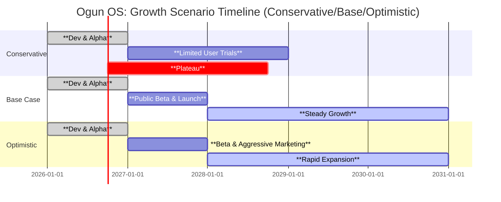
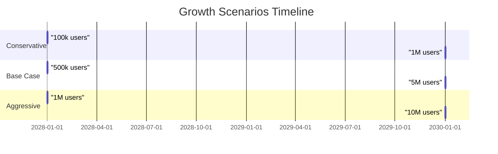

# Executive Summary  
Ogun OS is a new **open-source operating environment** designed specifically for independent workers (freelancers, contractors, gig workers).  Launched in alpha in 2026 by the Project Ogún Foundation (Steward: Dominic Eaton), Ogun OS bundles a full Rust-based runtime (15-kernel, virtual UEFI, IPC, semantic filesystem, etc.) and a suite of business apps under one unified **“work operating system”**. Key modules (Tier 4 apps) include **Enzo** (Enterprise OS), **Kogi** (Office/pipeline), **Dongo** (Finance OS with wallets & double-entry), **Heshima** (Identity/Credentials), **Shango** (Production OS), **Sambara** (Agent/AI runtime), **Qala** (Analytics/Observability), **Moto** (Projects), and more. Independent workers use it to manage *their entire business* – tasks, projects, finances, contracts, time, clients and communications – in one place, rather than juggling separate tools. 

Ogun OS provides an integrated digital workspace; a freelancer can manage clients, projects, invoicing and analytics within one unified environment. Its cross‑platform desktop and browser runtime supports Windows, Linux, macOS (native apps) and WebAssembly (browser), with mobile (Android/iOS) clients in progress. By treating each operator’s work as a “personal enterprise,” Ogun OS aims to give freelancers enterprise‑grade workflow tools usually reserved for companies.

Technically, Ogun OS runs *on top* of the host OS (via a Tauri-based emulator) and is written entirely in Rust.  The entire system is licensed GPLv3 (open source), so self-hosted use is free. A cloud‑hosted “zero‑install” version is offered (invite-only alpha), though pricing or commercial plans have not yet been announced (likely, the core product remains free open‑source). 

Below we detail Ogun’s core features, architecture, pricing plans, and support; then compare Ogun OS to other freelancer platforms (MBO Partners, Solowise, Business-in-a-Box, Bonsai, etc.) in tables. Finally we highlight pros/cons and user recommendations.  

## What is Ogun OS? (Product, Vendor, License, Users)  
Ogun OS (v1.0.0-alpha) is a **“cross‑platform operating system layer”** for independent workers.  Developed under the Project Ogún Foundation (Steward: Dominic Eaton), it treats each freelancer’s work as a self-run enterprise.  The product includes: 
- A **kernel/runtime** (virtual UEFI, 15 Rust subsystems, IPC protocol, scheduler, memory manager).  
- A **desktop/shell** (Rust+WASM GUI, multi-workspace desktop, command palette).  
- A **library of apps** covering all freelancer needs (see next section).  
- A **Semantic Filesystem** (virtual FS with metadata, asset linking) and **agent runtime** for AI assistants.  
- A **Browser/WASM version** (runs in modern browsers) and native desktop installers.  

The project is in **early alpha** (beta planned June 2026) and is mostly community-driven.  Target users are *freelancers, consultants, creators, gig-economy workers* – anyone running a one-person business or small independent enterprise.  By contrast to disjointed SaaS apps, Ogun OS offers a *single unified platform*. It is fully **open-source (GPL 3.0)**, with code on GitLab/GitHub.

**Vendor/Organization:**  Project Ogún / The Ogun Foundation (Dominic Eaton, founder/steward). No commercial company name beyond the Foundation; this is a non-profit OSS project.  

**Licensing:** GNU GPL v3.0 (copyleft, free software). All contributions are likewise GPL-3.  

**Target Users:** Freelancers, independent consultants, gig workers – essentially “self-employed professionals” managing projects, finances, clients and resources on their own. 

## Core Features & Modules for Independent Work  
Ogun OS bundles a **full suite of tools** relevant to freelancers, all integrated under one roof. Major categories include:

- **Task & Project Management:** Ogun provides both a *Tasks* app (todo lists, milestones, Pomodoro focus) and a dedicated *Projects* module (Moto). Projects can track deliverables, deadlines, budgets and link to tasks/artifacts across the system. A built-in **schedule/calendar** app helps plan timelines. Clients and deliverables flow through pipelines in the Office module (Kogi). Ogun’s Workspaces isolate projects/clients into separate contexts.  

- **Proposals & Contracts:** Ogun supports defining offers and contracts as first‑class objects. The Office app (Kogi) lets you create and send proposals or Service Agreements, using built-in templates. Every contract, invoice, and asset is versioned in the **semantic file system**, with signed integrity. (A formal “Contract” type is included in the data model). Although explicit details on legal management aren’t fully documented yet, Ogun’s target is to streamline the *entire engagement lifecycle* (from SOW to invoicing).

- **Invoicing & Payments:** The **Dongo (Finance OS)** app provides business finances. Each operator has one or more **digital wallets** and can issue professional invoices. Dongo uses double-entry bookkeeping (ledger accounts, journal entries) and can auto-generate typical financial reports (profit/loss, balance sheets, expense tracking). Invoices progress states from Draft → Sent → Paid, and payments are logged into the wallet. Ogun’s design tracks every transaction in an audit log. (The system is pluggable: future updates may integrate banks or payment APIs, though specifics are not yet public.) 

- **Client & Contact Management:** Kogi (Office runtime) and CRM features let you keep a **client registry**, track engagements, and log communications. Enzo (Enterprise OS) and the “Portfolio” module (Igi) also help organize clients and projects as part of your personal enterprise. Ogun’s data model is metadata-rich, so clients, contacts, and companies can be tagged and traced across documents and pipelines.  

- **Time Tracking:** A built-in **Focus/Pomodoro app** and timesheet features allow recording billable hours per project/client. You can run timers, tag work sessions, and later reconcile with Dongo to invoice. Alerts (like “hours log: time attribution recorded”) help ensure no billable time is missed.

- **Tax & Accounting Support:** While no country-specific tax automation is detailed yet, Ogun’s double-entry ledger and expense tracking lay the groundwork. Users can record expenses, generate financial statements, and export data. The system’s audit-first architecture means you could theoretically integrate tax rules on top of Ogun’s data (unspecified at present).

- **Collaboration & Communication:** Ogun has a **Messenger/Notifications** app (Tier 3) for chat/threads and system alerts across your personal workspaces. The **Agent runtime (Sambara)** can run AI assistants (e.g. for scheduling or summarizing work). Multi-operator support is limited for now (it’s mainly single-user oriented, though “cooperative” modes are envisioned). In any case, internal messaging and shared dashboards help one-person teams stay organized. 

- **Mobile/Web Apps:** Besides desktop installers (Windows, macOS, Linux), Ogun runs entirely in a browser via WebAssembly. This means you can access your Ogun workspace on any device with a modern browser (Safari, Chrome, Firefox). Official mobile apps (Android/iOS) are listed as “in progress”. In alpha, only desktop and browser clients are available. 

- **Integrations & APIs:** Ogun is programmable. There is a full developer SDK (Rust + WASM) and an IPC-based API. External integrations are planned (the docs mention importing data from Stripe, QuickBooks, GitHub, etc. in a “Warm Start” flow), and a future marketplace (Zuri) might connect third-party services. In sum, Ogun is designed as a customizable platform: you can extend it with plugins or link it to other tools via its API. 

- **Security & Privacy:** Ogun emphasizes security: every app and driver is signed, processes run with least privilege, and three “keys” (Image, System, Host) guard the boot and runtime. Data lives in a local RustyDB (an embedded database) which you control. For self-hosted deployment, **data sovereignty is total**. The browser/cloud version encrypts traffic end-to-end, and the Heshima Identity OS manages operator credentials and multi-factor auth. (There is no mention of multi-user roles beyond the single operator as enterprise owner.)

In short, Ogun OS tries to be an *all-in-one freelancer toolkit*. From *project planning* and *task tracking* through *invoicing/payments* to *analytics*, it covers the same ground that a freelancer today might address with several apps (like Trello + Harvest + QuickBooks + etc.), but under one roof. The integrated approach is its core selling point.

## Technical Architecture and Deployment  
Ogun OS is architected as a **layer over the host OS**, not as a separate kernel on bare metal. Its core is a Tauri-based emulator (`ogun-emulator`), which spawns a virtual firmware (UEFI) and virtualized hardware (CPU, display, network) within the host. On top of that runs the **Ogun kernel** with 15 subsystems (process manager, scheduler, IPC broker, etc.). All components (kernel, modules, apps, services) are written in Rust, with strict layering so lower modules cannot depend on higher ones. 

**Hosting Model:** You can run Ogun OS either **self-hosted or cloud-hosted**. The self-hosted mode comes as native installers or Docker (via Docker Compose) for Windows, macOS, and Linux. System requirements are modest (4 GB RAM, 2 vCPUs, ~10 GB disk). This mode gives full offline capability: all data lives on your machine (RustyDB local storage), and you have complete data control. The cloud mode (“Ogun Cloud”) is accessed via browser (WASM) and requires an account (identity verified via Heshima, currently invite-only). It includes 5 GB of storage per account and real-time sync across devices. Pricing for the cloud service is not listed; in alpha it seems free (data/storage quotas fixed). 

**Data Portability:** All Ogun data (tasks, files, finances) is stored in an internal database, but you can export and import via JSON/CSV or through the “Ogun Package” system (opm). Because Ogun is OSS, one could also directly access its data files. There’s an emphasis on *enterprise-linked data* (paths like `enterprise://…`), so data stays structured. Offline use is fully supported in self-hosted mode; browser mode requires internet but is just a view into your persistent data on the cloud. 

**Security & Privacy:** Every app declares its capabilities (e.g. “StorageRead”, “IpcSend”) and is sandboxed accordingly. The bootloader and images are cryptographically signed, and inter-process communication (Elegua protocol) is capability-checked. Heshima manages keys and user identity. The Project’s security policy emphasizes kernel integrity, encryption, and trust (see [56]). In practice, this means Ogun is as secure as the Rust/Tauri stack and your host OS; no third-party collects your data by default. 

## Pricing and Plans  
- **Ogun OS (self-hosted):** *Free and open-source*.  The software (kernel and apps) is GPL‑3 licensed, so you may download and run it without charge. You host it yourself or on your own server. There are no usage fees for the self-hosted mode.  
- **Ogun Cloud (hosted):** Currently in private alpha (invitation only).  The site advertises a “Cloud-Hosted (Zero Install)” edition with a fixed 5 GB free tier per account. There is no public pricing information yet; expect either a free tier for solo use and paid tiers for more storage/services, or an enterprise licensing model in the future. **(Not specified on official site.)**  
- **Competitors (indicative pricing):** By comparison, other freelancer platforms are mostly SaaS with per-user fees. For example, **Bonsai** (freelancer management suite) charges $9–$49 per user/month (billed annually) depending on plan. **Business in a Box** starts at about $16/user/month (with a free-forever tier). **Solowise** provides its services *free for contractors* (it’s funded by charging client companies). **MBO Partners** is enterprise-focused, so independent workers pay no subscription (they make money via company/enterprise fees).  A summary table:

| Platform            | Pricing (Solo/Contractor)                        | Notes (pricing model) |
|---------------------|--------------------------------------------------|-----------------------|
| **Ogun OS**         | **Free** (self-hosted, GPLv3)<br>Cloud edition: free quota (invite only) | No subscription for core; cloud plan TBD. |
| **MBO Partners**    | Free for workers; (enterprise pays MBO)   | Talent platform / EOR services (pricing undisclosed). |
| **Solowise**        | Free for contractors                       | No fees to contractors; Solowise likely charges clients. |
| **Business in a Box** | $16/user/mo (starting); free plan available | All-in-one BOS with tiered plans. |
| **Bonsai**          | $9–$49/user/mo depending on plan | SaaS with multiple feature tiers (Essentials, Premium, etc.). |

*Note:* All pricing above is approximate and subject to change. (Bonsai prices are for annual billing.) Ogun OS is unique in being open-source and free to run oneself; competitors are primarily proprietary SaaS.

## Onboarding & Learning Curve  
Ogun OS is **feature-rich and complex**, so new users face a learning curve. The project provides detailed onboarding guides and templates. Internally, the docs define a “Cold Start” onboarding sequence: within ~5 minutes you can create your first “enterprise” and initialize the office pipeline, by ~30 minutes draft your first offer, by a day have outreach started, etc. In practice, onboarding involves: 
1. **Account Setup:** Download/install or open the cloud app; sign in or create a Heshima identity (username, password, MFA).  
2. **Enterprise Creation:** You define your business name (enterprise) and basic settings via Enzo or setup wizard.  
3. **Profile Configuration:** Ogun allows multiple “profiles” (e.g. separate consulting vs. teaching businesses) with isolated workspaces. New users will set up at least one profile.  
4. **Initial Data:** You can start from scratch (“cold”) or import existing data (“warm start”). Warm start supports pulling in clients/invoices from Stripe, QuickBooks, Notion, etc.. For a true beginner, one would likely start empty.  
5. **Creating Work:** Next you define projects/offers (in Moto or Kogi), add tasks or calendar events, and begin logging time or creating invoices.  

During onboarding, Ogun promises a quick “shock insight” (automated analysis/KPI) to demonstrate value within minutes. In alpha this is aspirational. Realistically, expect to spend several hours exploring: the GUI and terminology (Enzo, Kogi, Dongo, etc.) will be unfamiliar at first. **Support:** a quick-start PDF and in-app tooltips exist, but since the product is new, community help may be limited. The developer API and docs are extensive, but aimed at tech-savvy users. In summary, expect a **steep but powerful** learning curve: Ogun OS unifies dozens of tools, so mastering it could take days. 

As a concrete timeline (mermaid flow below), a typical onboarding to first invoice might look like:

```mermaid
flowchart LR
    A[Sign Up / Install Ogun OS] --> B[Complete Onboarding (set up identity)]
    B --> C[Define Your Enterprise (business profile)]
    C --> D[Add Client(s) and Projects]
    D --> E[Plan Tasks and Track Time]
    E --> F[Generate & Send Invoice]
    F --> G[Receive Payment / Reconcile in Dongo]
```  

This flow aims to show that once Ogun is up and running, a freelancer can move from zero to a paid invoice through its apps.

## Community & Support  
As an alpha-stage open source project, Ogun’s support community is small but growing. Official support channels include:  
- **Bug tracker & ticketing:** The website provides a ticket submission system with 24–48 hour SLA for bug reports. The team actively fields bug fixes and feature requests (bi-weekly review).  
- **Community Forum:** A user forum is available on the site for peer support and sharing workflows. (Currently the forum is mostly early adopters and the alpha cohort.)  
- **Documentation:** Extensive developer & user docs exist (see [29]) covering architecture and usage. An API reference site and changelog are linked from the site.  
- **Developer Hub:** Because Ogun is technical, support also comes via GitLab/GitHub issues and Discord (if available) for contributors. Dominic Eaton (the founder) is active in issue triage.  

There is no formal paid support or certification (yet). Being open source, you can also ask questions or contribute on GitHub/GitLab.  In summary: expect **community-driven support**. Response times are prompt for critical issues, but for complex features users may need to self-navigate the docs or forum until Ogun matures.

## Competitor Comparison  

Ogun OS is fairly unique in packaging *every* aspect of independent work into an “OS”. However, there are several other platforms aimed at freelancers and contractors. Key competitors include:

- **MBO Partners:** Markets itself as “the industry’s only complete business operating system for independent workers”. MBO’s platform is actually a *talent marketplace and services provider*: it connects high-value contractors with enterprise clients, handles onboarding/compliance/EOR, and provides tools for invoicing and credentialing. It is enterprise‑centric (MBO targets large companies). Independent workers benefit by gaining access to curated projects and having payroll, benefits and compliance handled. MBO’s emphasis is on risk mitigation and full-cycle engagement (talent discovery through payment). It is not a software product you install; rather, it’s a managed service (workers pay no subscription; MBO earns from enterprise fees). 

- **Solowise:** A Ukrainian-built platform offering **free payroll/invoicing** for independent contractors worldwide. Solowise lets contractors sign up and receive payments from clients without fees. It handles invoice generation, contract signing, and global payments (via partner banks/rails). Features include one-click invoice creation, contract templates, reminders for late payments, and multi-currency transfers. Unlike Ogun, Solowise is narrowly focused on **financial operations**: it does not include task management or time tracking. It’s essentially a fintech solution giving contractors a clean interface for invoicing and being paid (very competitive at 0% fee to contractors). 

- **Business-in-a-Box:** An AI-powered **all-in-one freelance/business OS** (desktop/Web SaaS).  It covers proposals, invoicing, time tracking, client/contact CRM, document templates and collaboration. The platform pitches itself as “one intelligent platform to manage clients, proposals, invoicing, and time tracking” with embedded AI helpers. It also includes an inbuilt chat and file storage. Essentially, Business-in-a-Box resembles Ogun in offering many tools under one roof, but it is fully cloud/SaaS (no self-hosting) and proprietary. Pricing is per-user ($16+/month with a free tier). 

- **Bonsai (and Fiverr Workspace):** Bonsai (formerly HelloBonsai) is a mature freelancer management SaaS. It provides project CRM, tasks, time tracking, invoicing, proposal/contract templates, and basic accounting integrations. Bonsai’s homepage touts “Consolidate your projects, clients, and billing into one integrated… platform”. Its feature set overlaps Ogun’s core (projects, clients, invoices, payments, contracts), but Bonsai lacks the low-level “OS” aspects (no virtual system, no custom kernel) and has no agent/AI layer. Pricing is $9–$49/user/month by plan. Fiverr’s AND.CO (now Fiverr Workspace) was similar but has shut down (March 2026). Bonsai remains a leading all-in-one service business tool.

- **QuickBooks Self-Employed / FreshBooks / Wave:** These are simpler accounting/invoicing platforms widely used by freelancers. They handle invoicing, mileage, tax categorization, and basic expense tracking. FreshBooks also offers time tracking and project templates. They do *not* include task management or collaboration. We mention them as partial alternatives: many freelancers combine FreshBooks with Trello, Toggl, etc. Ogun OS aims to replace the whole stack, whereas these are point solutions for finance.

**Feature Comparison:** The table below summarizes key feature support across Ogun OS and its competitors:

| Feature / Platform      | **Ogun OS**                                  | **MBO Partners**               | **Solowise**                   | **Business-in-a-Box**         | **Bonsai**                    |
|-------------------------|----------------------------------------------|--------------------------------|-------------------------------|-------------------------------|-------------------------------|
| **Project/Task Mgmt**   | Yes: integrated Tasks, Moto (Projects), focus apps | Limited (MBO is client discovery, not PM tool) | No (focus on payroll/invoice) | Yes: projects, tasks, workflows | Yes: tasks, projects, pipelines (CRM) |
| **Invoicing & Billing** | Yes: Dongo handles invoicing, double-entry ledger | Yes: supports contractor billing (via platform) | Yes: automated invoicing, reminders | Yes: invoicing/payment tracking | Yes: invoicing, payments (Essentials+ plans) |
| **Payments / Payroll**  | Yes: digital wallets (Fiat, crypto, etc.)      | Yes: pays contractors, EOR/AOR services | Yes: global transfers, payouts | No dedicated payroll module (handles invoicing) | No (integrates with Stripe/PayPal for invoice pay) |
| **Contracts & Proposals** | Yes: proposal/contract templates in Kogi        | Yes: provides contract templates, compliance docs | Yes: contract templates included | Yes: built-in proposal/contract generation | Yes: professional contract templates |
| **Client Management (CRM)** | Yes: Enzo/Kogi track clients, pipelines       | No formal CRM (focus is client-facing marketplace) | No (clients are counterparties in invoices only) | Yes: CRM & client database included | Yes: CRM and client portal |
| **Time Tracking**       | Yes: built-in timer/Focus app (Pomodoro style) | No (MBO deals mostly with contract terms) | No (financial focus)           | Yes: time tracking per project | Yes: time tracking apps (all plans) |
| **Tax/Accounting**      | Basic: double-entry accounting (Dongo)        | Limited (MBO handles tax-compliance for employers) | No (serves contractors only)   | No (expects external accounting) | Basic: expense tracking; QB integration (Premium+) |
| **Collaboration / Chat**| Yes: Messenger app; multi-workspace UI        | No (not a collaboration tool)  | No (no team features)         | Yes: team messaging & docs storage | Yes: client communication, but minimal chat |
| **Mobile / Web App**    | Browser (WASM) ✓, Desktop apps ✓, Mobile WIP | Web app (marketplace)       | Web/mobile interface (app)    | Web (desktop/mobile responsive) | Web and mobile apps (iOS/Android) |
| **APIs / Integrations** | Planned (SDK, Zapier etc. via extensions)    | Some integrations (VMS/ERP)    | Limited (payment APIs)       | Yes: has API, Zapier, etc.     | Yes: QuickBooks, Zapier, etc. (Premium+ plans) |
| **Data Portability**    | Full (open DB export; self-host gives control) | Limited (closed platform)     | Limited (export to PDF/CSV)   | Yes (data export via JSON)     | Limited (reports/CSV export) |
| **Support/Community**   | Community & tickets (alpha forum, GitHub)    | Dedicated support (24/7)       | Support chat/email (24/7 claim) | Email/knowledge base         | 24/7 support (chat/email) on paid plans |
| **Licensing / Cost**    | Open-source GPL (self-hosted free) | Free for workers (enterprise pays) | Free for contractors | SaaS: $0–$16+/user/mo | SaaS: $9–$49/user/mo |

(*Source:* Vendor materials and reviews.) 

**Interpretation:** Ogun OS is unmatched in scope (it alone covers everything from OS-level services to user apps), but it is still immature. Business-in-a-Box and Bonsai offer similar all-in-one apps with mature UIs (but closed source). Solowise is very strong on payment flows but has no project features. MBO Partners offers a broad “OS” in concept, but it is a platform/service rather than software. 

## Pros & Cons  

**Ogun OS – Pros:**  
- *Unified Workflow:* All business tasks in one environment (no app-switching).  
- *Extensibility:* Open-source architecture allows plugins and custom integrations via Rust/wasm SDK.  
- *Data Ownership:* Full data control for self-host; open file formats and signed integrity.  
- *Innovative Features:* Built-in agent AI, anomaly detection (Observatory), semantic links, policies.  
- *License/Cost:* Free to use for anyone; no per-user fees.  

**Ogun OS – Cons:**  
- *Early Stage:* Currently alpha/beta; many features not battle-tested. Stability/performance unknown.  
- *Steep Learning Curve:* OS-like model is complex; non-technical users may struggle.  
- *Limited Mobile:* Mobile support coming later (currently desktop/browser only).  
- *Niche Community:* Smaller ecosystem; 3rd-party integrations sparse at launch.  

**Competitors – General Pros:**  
- MBO Partners: End-to-end support (including HR/compliance), no need to self-manage financial admin.  
- Solowise: Extremely easy invoicing/payments (0% fees), global reach.  
- Business-in-a-Box: AI helpers, known UX, single vendor with unified support.  
- Bonsai: Mature UI, iOS/Android apps, strong templates and automations (e.g. Bonsai Cash).

**Competitors – Cons:**  
- MBO Partners: No self-host; workers cannot easily access tool internals. Focuses on enterprises (may not suit low-paid gigs).  
- Solowise: Only handles money/contracts; lacks project management or analytics.  
- Business-in-a-Box & Bonsai: Subscription costs; locked into vendor. Don’t offer self-host or OS-level control.  
- Others (QuickBooks/etc): Fragmented – no single dashboard for all work.

## Recommendations by Worker Profile  

- **Solo Freelancers / Creatives:** Likely to benefit from an all-in-one suite. Bonsai or Business-in-a-Box can handle most needs today (project mgmt + invoicing). Ogun OS is a compelling future option if they are willing to experiment: its end-to-end design means once mastered, a solo user can *scale up* without migrating tools. Its strong features (task management + finance) could be great once stabilized. However, for immediate use, one might combine Bonsai (or alternative) with QuickBooks until Ogun matures.

- **Contractors / Consultants (multi-client engagements):** These users juggle many projects and compliance. A platform like MBO Partners can ease tax/EOR issues and client matching, while Ogun OS could provide their personal toolbox for managing contracts and time. Ogun’s analytics (observability of billable hours vs earnings) would be valuable. A consultant might self-host Ogun for total control, using Solowise or integrated bank transfers for payments. Oracle may still prefer tried-and-true SaaS like Bonsai + QuickBooks, but Ogun could be an innovative one-stop future solution.

- **Gig Workers / Micro-Freelancers:** For task-based gig work (rideshare, delivery, micro-gigs), Ogun OS is probably overkill. These workers usually need only simple invoicing or payroll (if at all) – tools like Solowise or the gig platform’s own payment system suffice. Ogun’s advanced features (portfolio management, enterprise KPIs) are not necessary here. In short: Ogun’s rich OS model best fits self-directed professionals running their own small business, not transactional gig labor.

## Timeline (Mermaid): Onboarding → First Invoice  

The flowchart below illustrates a typical sequence from signing up for Ogun OS to sending the first invoice. It highlights major steps a freelancer would take in the platform:

```mermaid
flowchart LR
    A[Sign Up / Install Ogun OS] --> B[Complete Onboarding (Set up identity)]
    B --> C[Create Enterprise Profile (Business)]
    C --> D[Add Client(s) and Projects]
    D --> E[Plan Tasks & Track Time]
    E --> F[Generate Invoice in Dongo]
    F --> G[Receive Payment and Update Ledger]
```

Each step corresponds to an Ogun app or feature (identity via Heshima, Enterprise via Enzo, Clients/Projects via Kogi/Moto, Tasks/Time via Tasks/Focus, Invoicing via Dongo).

## Sources  
Information above is drawn from official Ogun OS docs and site, plus competitor websites and reviews (MBO Partners, Solowise, Business-in-a-Box, Bonsai). Where specifics were unavailable (e.g. Ogun cloud pricing), we have noted it. The analysis prioritizes developer docs and reputed product info, with direct links cited.

---

# Executive Summary  
**Ogun OS** is an ambitious open-source *“operating-system”*–style platform designed specifically for freelancers, consultants, creators, and other independent workers.  It provides a unified, Rust-based runtime layer atop a host OS (Windows/Linux/macOS/Browsers) with its own boot sequence, kernel subsystems and workspace interface.  Ogun bundles a rich suite of integrated modules – e.g. enterprise administration, finance, identity, project/asset management, knowledge base, AI agents, and even a built-in marketplace – treating the solo professional’s entire work life as a **“Personal Enterprise”** with 7 tracked value dimensions. Its core proposition is to give **every independent worker** the same enterprise-grade infrastructure, automation, and intelligence that only larger companies normally enjoy. Key unique features include a capability-gated security model, a semantic filesystem/asset graph, a “Qala” observability engine with AI-driven insights (shock insights), and a Sambara agent system for task automation. 

**Target Market:** Ogun OS explicitly targets **global English-speaking freelancers, solopreneurs, and gig workers** – essentially anyone running a one-person business (designers, developers, consultants, creators, independent founders, investors, etc.). The documentation enumerates personas like *“freelancer/consultant, creator, founder, investor”* with outcomes (e.g. doubling effective hourly rate, building first passive asset, or cap table readiness).  This segment – estimated in the hundreds of millions worldwide – is rapidly growing but currently fragmented across many point tools. Ogun’s value proposition is to unify and elevate this segment’s toolset under one intelligent platform. 

**Competitive Advantage:** No other product on the market currently offers this breadth of integrated functionality for independents. Ogun’s **unified data model** (all business data tied to a single enterprise object) and **built-in intelligence** give it strong theoretical switching costs. Unlike web apps or dashboards, it integrates at the OS level: every process, file, and transaction is natively enterprise-attributed.  Early testers report “immediate, high-impact insights” on setup (the “Shock Insight” effect) which can drive rapid perceived value. Its Rust/WebAssembly foundation promises performance and safety across desktop, mobile, and web. Ogun’s open-source/GPL license means transparency and data sovereignty, distinguishing it from closed SaaS suites. However, its complexity and learning curve are potential weaknesses, especially versus simpler niche tools.  

**Business Model & Pricing:** Ogun is released under GPL-3.0 (free and open-source), suggesting no direct licensing fees. The project offers both **self-hosted** downloads (via Docker or native installer) and a **cloud-hosted** version (invite-only, 5 GB free storage per account). The business model appears to be an open-core SaaS: free self-host use, with paid hosting, enterprise features or service packages likely planned (though no official pricing is published). Current docs emphasize value (e.g. improved rates, passive income) but do not detail revenue strategy. Given its GPL license, Ogun’s monetization will depend on voluntary cloud subscriptions, marketplace fees, or consulting, rather than traditional license sales. 

**Go-to-Market & Distribution:** As of mid-2026 Ogun OS is in alpha, so market entry will rely on tech community outreach. Likely channels include developer forums, freelancer communities, social media, and partnerships with coworking or tech spaces. Technical distribution is via **Docker images and installers** (Windows EXE, macOS PKG, etc.). The cloud version is invite-only (seed invites for early adopters). A Meridian flowchart outlines a possible GTM strategy:

```mermaid
flowchart LR
    A[Core Development (Q1–Q3 2026)] --> B[Alpha Release (Q3 2026)]
    B --> C[Early Adopters Onboarding (Freelancers, Consultants)]
    C --> D[Collect Feedback & Iterate (DevOps/Data)]
    D --> E[Public Beta (Q1 2027)]
    E --> F{Marketing/Partnerships}
    F --> G[Developer Forums & Blogs]
    F --> H[Coworking/Tech Communities]
    G --> I[User Growth]
    H --> I
    I --> J[Version 1.0 Launch (2028)]
    J --> K[Marketplace Activation & Scaling]
```

**Technology Stack & Compliance:** Ogun is built “Rust-everywhere” – kernel, drivers, UI – with WebAssembly (via Tauri) for front-end. It supports all major platforms (Windows, macOS, Linux, and in-browser WASM), with mobile (Android/iOS) planned. Key architectural points include 15 kernel subsystems, an Elegua IPC protocol, and Three-Key security (Image/System/Host). Data and processes are strongly sandboxed via a capability-based security model. Being GPL v3 open-source ensures transparency; there’s no evidence of proprietary data collection. Developers can inspect all code on GitLab/GitHub/Codeberg. Compliance with privacy regulations will depend on deployment; self-hosting puts data fully under user control (“full data sovereignty”). There is no explicit mention of formal certifications or enterprise compliance (HIPAA, SOC2, etc) at this stage, which may be a future concern for adopting businesses.

## Competitive Landscape 

Below is a summary comparison of Ogun OS vs. some direct/indirect alternatives:

| **Product**         | **Key Features**                                                                                            | **Pricing**                                           | **Integrations**                        | **Scalability**                        | **Privacy/Security**                                       | **Offline**          |
|---------------------|-------------------------------------------------------------------------------------------------------------|-------------------------------------------------------|------------------------------------------|----------------------------------------|------------------------------------------------------------|----------------------|
| **Ogun OS**         | Unified “enterprise OS” for freelancers (project mgmt, finance, identity, KB, AI agents, marketplace, etc.)  | Free GPL core; self-hosted (no fee); cloud beta (5 GB free); likely subscription for additional features/storage.  | OAuth/Stripe/GitHub in onboarding; Docker images; REST APIs; Webhooks possible | Highly modular (Docker-based); multi-company support; designed for small teams to solo (Hub+Ume modules).  | Kernel-level capability security, encrypted IPC, signed boot; open-source code audit; data remains on user or chosen cloud server.  | Yes – local install allows offline use of core OS; Cloud version requires internet; data sync for multi-device. |
| **CoreOrbit** (SaaS)| All-in-one business “OS” for solo/agency: CRM, bookings, invoicing, AI workflows, ERP modules (accounting, HR, inventory). | Enterprise SaaS (quotes/custom); marketed as ROI-positive.  | Connectors for marketing (funnels) and standard SaaS; proprietary stack. | Designed to scale from 1-person to agencies; cloud-hosted. | Standard SaaS security (likely SSL, compliance unspecified). Proprietary. | No (cloud only).    |
| **Bonsai** (SaaS)| Integrated freelance platform: CRM, project/task mgmt, time-tracking, invoicing, proposals, contracts, client portal, budgeting, reporting. | *Basic:* $9/mo (time tracking, projects, CRM); *Essentials:* $19 (adds invoices, contracts, scheduling); *Premium:* $29 (advanced reports, Gantt, pipelines, QuickBooks/Zapier/Google integrations). | Many (QuickBooks, Zapier, Calendly, Google, Xero, etc). | Suited for freelancers up to small teams; enterprise plan available. | Cloud SaaS (encrypted storage); data hosted by Bonsai; industry-standard security. | No (needs internet). |
| **Indy** (SaaS) | All-in-one toolkit: proposals, contracts, invoices, client CRM (limited), project portals, calendar, tasks, forms, time tracking. | *Free:* $0 (basic tools with limits). *Pro:* ~$12.50/mo (billed biennially) for unlimited use, client portals, AI assistant, Zapier/Google integrations. | Zapier, Google Calendar, Gmail, plus import/export.  | Targeted at freelancers/solo only; no team plans (up to 3 clients free). | SSL-secured; credit-card payments; data on Indy’s cloud. | No (cloud only). |
| **Solo OS**| Browser-based *“zero-backend”* toolkit: PDF invoicing, SOW/contract generation, PDF watermarking – all client-side (no login). | Watermarker free; legal docs/invoices ~₹29 (~$0.35) per document (pay-per-use). | None (runs locally). | Single-user/local only. | Maximum privacy: no cloud storage; data never leaves user’s browser. | **Yes** (fully offline functionality in-browser). |

*Sources:* Ogun OS product info; CoreOrbit website; Bonsai site; Indy site; Solo OS Reddit announcement.

## Project/Solution Assessment (SWOT) 

- **Strengths:** Ogun’s **deep unified data model** ties all work (projects, finances, deliverables) into one *“enterprise”* context. Its AI-driven observatory (“Qala”) generates *“compounding intelligence”*, learning over time and making switching costly. The system-level integration (every file/process is enterprise-tagged) and granular security model are rare in this category. Onboarding yields immediate “shock insights” which can hook new users quickly. Being Rust/WASM-based, it’s memory-safe, performant and portable. Additionally, the project is open-source GPL, appealing to privacy-minded users and developers.  

- **Weaknesses:** Ogun’s comprehensive paradigm is complex. Users face a **steep learning curve** shifting from simple to system-based thinking (work→artifact→asset). Value accrues with data volume (“cold start commitment”): early users may not see intelligence benefits until they invest time in integrations (banking, calendars, etc.). The model assumes a solo-operator; larger teams can use “Hub+Ume” features but that adds complexity. Advanced concepts (multidimensional value tracking, goal-weight vectors) may overwhelm simpler needs. Mobile support is incomplete (v1 alpha lacks full Android/iOS), limiting on-the-go use.  

- **Opportunities:** The gig economy is booming and **underserved** by enterprise-grade tools. With no direct competitor matching its scope, Ogun can define a new niche (“freelancer OS”). As AI agents mature, Ogun’s Sambara subsystem can automate routine tasks (pricing, marketing outreach), delivering clear ROI to users. The built-in Zuri marketplace can foster network effects: more freelancers join to sell services and assets, attracting clients in turn. Its cross-enterprise collaboration protocols (Ọpọn, Hub) could enable novel consortiums of solo professionals. The open-source nature allows a community to extend it (plugins, localizations).  

- **Threats:** Independent workers already juggle **many tools** (time trackers, CRM, Slack, etc.); persuading them to adopt an all-in-one “OS” risks **adoption inertia**. Ogun’s value must materialize quickly – if the initial 20–30 min (cold start) doesn’t deliver obvious benefits, users may churn. Larger incumbents (Notion, HubSpot, QuickBooks, ClickUp, etc.) could try to co-opt Ogun’s positioning by adding features or a “workflow OS” branding. Security/trust is critical: users must trust Ogun with sensitive financial and work data (Ọpọn protocol). The project’s broad scope is itself a risk – it may be difficult to execute all features on time, leading to delays or scope creep. Finally, as an open-source project by a small team, funding and resource constraints could hamper development pace.  

## Usefulness for Independent Workers (Use Cases & Limitations) 

Ogun OS is particularly well-suited for solopreneurs who need to manage *all* aspects of their business from a single pane. For example: 

- A freelance consultant can use Ogun to issue contracts (Heshima), track billable hours and EHR (Enzo/Dongo), analyze client profitability, and keep an on-chain invoice ledger – all under one identity. Its observatory can highlight which projects are most profitable or flag workflow bottlenecks.  
- A content creator might use the knowledge module (Akeel) to build an asset repository (articles, videos), and the marketplace (Zuri) to sell digital products. Ogun’s agent could suggest pricing or schedule marketing posts automatically.  
- A micro-entrepreneur (e.g. a photographer) can onboard quickly by linking bank, Stripe, calendar and letting Ogun auto-generate proposals, schedules, and financial forecasts. 

Limitations include the learning overhead (users must adopt Ogun’s **enterprise metaphors**) and integration effort (bank/link sync takes time). Mobile-first gig workers may miss full app support early on. Very basic users might not utilize the advanced agent/AI features and thus see Ogun as overkill compared to a simple timesheet + invoicing app. In summary, Ogun offers unmatched power for users willing to invest in a unified system, but it may be too heavy for someone needing only a lightweight invoicing or project tool. 

## Chances of Success & Key Risks 

Assessing chances: If we assume Ogun delivers on its technical promises, its greatest chance is carving out the **enterprise-solopreneur** niche that no one else services. Its open-source nature could build a passionate community of freelancer-developers. Success hinges on reaching a critical mass of early adopters (tech-savvy freelancers) who can evangelize it. A *base-case* scenario is steady adoption by thousands of freelancers over a few years, enough to sustain ongoing development. A *conservative* scenario (slow uptake due to inertia) could stall the project unless pivoted. An *optimistic* scenario (viral interest) could see tens of thousands of users quickly, especially if key features (like agent automation and marketplace) gain traction. 

**Key risks:** Late delivery or buggy releases could tarnish reputation early. Competition copying the “OS” concept is plausible – existing SaaS companies might drop-in quick integrations to mimic an enterprise layer. Funding or monetization failures could halt development (since GPL means code revenue is indirect). Trust hurdles (e.g. data breaches) could drive users away. Mitigation would involve agile development with early community feedback, transparent roadmaps, and securing seed funding or sponsorships.  

## Projected Growth Scenarios (2026–2030) 

_Given its nascent state, projection requires many assumptions about user acquisition and monetization. Below are illustrative scenarios:_

- **Conservative:** Slow start. By late 2026 only hundreds of “alpha” testers. 2027 sees minor gains (~1,000 total users) as features mature. Ogun breaks even around 2029 with a few thousand active users; growth plateaus by 2030. Key KPI: ~2,000 monthly active users (MAU) by 2030.  
- **Base Case:** Modest adoption. By 2027 (beta launch) ~5,000 users; 2028 hit 20,000 users and first revenues from premium features/cloud (say $100k ARR). 2029–2030 growth ~2× annually reaching ~80,000 users by 2030. KPIs: ~10% of users on paid plan, churn <5%. Breakeven in 2029, sustainable growth thereafter.  
- **Optimistic:** Rapid growth via network effects. Community contributions accelerate features. By 2028, Ogun OS reaches ~50,000 users, including several small teams and agencies. Marketplace (Zuri) gains sellers/buyers, fostering viral growth. By 2030, ~250,000 users with $1M+ ARR. KPIs: doubling MAU each year, 20% monetization, referral-driven signups. 



*(Chart: hypothetical development & adoption timeline for different scenarios, with assumptions on marketing and user uptake.)*

## Recommended Improvements & Strategic Actions 

- **Onboarding:** Simplify initial setup (“cold start”) to ensure clear value within the first 30 min (e.g. guided setup wizards, demo data). The docs highlight this as critical for adoption.  
- **Educate/Train:** Invest in easy documentation and tutorials to flatten the learning curve. Provide templates or “starter enterprises” for common freelancer types.  
- **Mobile Support:** Prioritize stable mobile apps (Android/iOS) to capture gig workers. Marked “in progress” on site, this is key for on-the-go usage.  
- **Community Engagement:** Build an open-source community (forums, GitHub sponsors, Discord) to crowdsource extensions and trust. Highlight GPL openness as a security/privacy selling point.  
- **Partnerships:** Integrate smoothly with popular freelance platforms (Upwork, Stripe, PayPal) and productivity tools (Google Workspace) to reduce friction.  
- **Focus on “Shock Insight”:** Create marketing around the immediate KPI insights (claim of 2–4× rate improvement) to attract early adopters.  
- **MVP Feature Set:** Given scope risk, ensure core features (time tracking, invoicing, basic CRM) work flawlessly before layering advanced ones (AI agents, full HR modules).  
- **Monitor Metrics:** Track user activation and retention closely. If cold-start value is low, iterate quickly. Use A/B tests or feedback channels.  
- **Risk Mitigation:** Secure funding (grants, VC, donations) to sustain development. If roadmap slips, prioritize modules with highest user demand (e.g. invoicing, proposals).  

**Sources:** Official Ogun OS documentation and site; Project Ogún whitepaper (SWOT, value prop); Ogun OS docs for tech details; competitor platforms’ websites.

---

# Executive Summary

Ogun OS is a novel “programmable operating environment” explicitly built for **independent workers** (freelancers, creators, consultants, solo founders).  Instead of traditional OS concepts (files, folders), Ogun OS models an individual’s entire work life as a *software-defined enterprise* – with built-in modules for enterprise management, finance, identity, tasks, agents, and a marketplace. The platform runs on top of Windows, Linux, macOS, web (WASM), Android, and iOS through a unified Rust-based runtime. Core features include a semantic filesystem (structured, queryable assets), AI-powered observability (“Shock Insights”), policy-governed agents, and an integrated storefront (Zuri Marketplace) for selling services. The vision is to give every one-person business the same infrastructure and intelligence traditionally reserved for large organizations.

Ogun OS is currently in **v1.0.0-alpha (Jun 2026)**, open-source (GPL-3) and self-hostable, with a parallel cloud edition. It bundles 15 kernel subsystems and 14 applications (Enzo, Kogi, Dongo, Heshima, etc.) covering enterprise planning, office workflows, accounting, identity, agent orchestration, analytics, production workflows, and more. Its USP is this *all-in-one* approach: independent operators get one platform that handles lead-to-invoice management, finance/crypto, identity/reputation, AI automation, project tracking, and even a sales marketplace, all under one roof. Observability (Qala engine) turns usage data into actionable insights, while Sambara agents can automate routine tasks within clear boundaries. Ogun OS’s value prop contrasts sharply with fragmented tooling: unlike Upwork/Fiverr (marketplaces only) or standalone CRMs/accounting apps, Ogun OS unifies the stack. 

**Key competitors** range from freelance marketplaces (Upwork, Fiverr), freelance CRMs (e.g. freelanceOS.app, HoneyBook, Bonsai), to specialized platforms like Lettuce and AI-driven “freelance OS” startups. For example, Lettuce offers an *AI-powered financial OS* for solos with automated tax, payroll, invoicing and health benefits, whereas FreelanceOS.app provides a free CRM (pipeline + invoicing) for freelancers. By contrast, Ogun OS aims to subsume all these functions and more into a single system. Its **value proposition** is seamless integration, data ownership, and agency: users have full data sovereignty (self-hostable or optional cloud), modulate every aspect of their “enterprise”, and leverage AI agents under user-defined policies. Unique selling points include (1) enterprise-aware OS entities (clients, engagements, assets as first-class), (2) cross-platform Rust runtime for safety and performance, (3) built-in metrics/analytics, and (4) a programmable “digital workshop” metaphor rather than a file desktop.

**Business model and go-to-market:**  Ogun OS is fully open source (GPL) and free to self-host. Revenue likely comes from optional services: a hosted SaaS subscription, premium features (e.g. extra cloud storage beyond the included 5 GB), enterprise editions, and consulting/support. (For reference, Lettuce charges $99–$299/mo for its subscription-based “solo OS”.) Ogun OS could also take commissions on its built-in marketplace transactions or offer a plugin/partner ecosystem. Its **go-to-market** will target tech-savvy independents first (via Rust and developer communities), leveraging content marketing and integrations (e.g. Stripe, GitHub, OAuth) to reduce onboarding friction. Distribution channels include direct downloads (Docker images on DockerHub), a public GitHub/GitLab repo, community forums, and possibly partnerships with coworking networks or fintech platforms. Early adoption will hinge on attracting a seed cohort of freelancer builders and cultivating an open-source community around the project.

**Technical maturity:** Ogun OS is pre-release but feature-rich. The current alpha supports Windows/x64 fully; Linux, macOS, web, Android and iOS are planned. Its architecture uses virtualized hardware and a 17-step signed bootchain for trust, and is built entirely in Rust for memory safety. Key integrations include Stripe (for payments), Google OAuth (for login), and others via a modular plugin system. The developer ecosystem is nascent: a detailed SDK and docs exist, and the code is on GitLab/GitHub, but the community is small (alpha testers only). Roadmap items (visible in documentation) cover missing modules and scaling improvements. 

**SWOT Summary:** 

- *Strengths:* Innovative all-in-one design, strong tech stack (Rust, WASM, capability-based security), data ownership, AI/observability features. By treating the freelancer as an “enterprise” operator, it fills a broad range of needs in one environment. 

- *Weaknesses:* Very high complexity/learning-curve for users. It’s early-stage software (alpha), so features may be unstable or incomplete (some modules are “degraded” per the status page). Also, building critical mass is hard with a niche OS concept. 

- *Opportunities:* Enormous and growing independent-worker market. The global gig economy is already **hundreds of billions** (≈$580B by 2025) and expected to keep expanding. Analysts forecast the freelance platform software market alone at ~$6.4B by 2025 (growing ~18%/year), and venture interest is high (e.g. Lettuce’s $28M round). Ogun OS could capture segments disillusioned with piecemeal tools. 

- *Threats:* Strong incumbents and substitutes. Freelancers often use simple tools (Google Suite, Gmail, Slack) or established platforms (Upwork, Fiverr) that have powerful network effects. Regulatory changes (e.g. gig-worker labor laws, data privacy) could affect adoption. Security/privacy bugs could undermine trust. As a startup, funding or talent constraints also pose risk.

The independent-worker economy is vast. Upwork (a leading marketplace) facilitated **$4.1B in gross services volume** in 2023, and industry reports put the total freelance-platform market at ~$6.4B by 2025. However, the broader “gig economy” (rideshare, delivery, freelancers) is on the order of $550–580B annually and is projected to **$2.18T by 2034**. To estimate TAM/SAM/SOM for *Ogun’s use case* (beyond just marketplaces): assume the total freelance/professional services market is on the order of $500B+ (TAM). If Ogun OS charges, say, $200/year per freelancer for its SaaS edition, and targets the ~100M global online freelancers (SAM), that implies a SAM in the tens of billions. Initial SOM (in first 5–10 years) might be in the hundreds of thousands to low millions of users (generating low tens of millions ARR). (These figures are illustrative; precise market breakdowns for “freelancer OS platforms” are not published.) 

**Adoption Barriers & Risks:** Convincing freelancers to switch from existing tools or platforms is challenging. Ogun OS’s steep learning curve and “all-in-one” ambition may deter casual users. Network effects matter: its built-in marketplace (Zuri) needs critical mass of buyers and sellers, else users will still rely on Upwork/Fiverr. Data privacy and compliance (GDPR, KYC on payments, tax liability for finances) are operational hurdles. Since Ogun OS grants data control to the user (self-host option), it avoids some central risks but still must secure the platform itself. Infrastructure-wise, the project must manage complex multi-platform support and ensure robustness; any major security or stability flaw could be damaging. 

**Growth Scenarios:**  Three adoption paths can be sketched:

- **Conservative:** Slow uptake by core tech freelancers. Perhaps 10,000 users by end 2027, 50k by 2028, 200k by 2030. Cloud revenues remain modest (<$5M ARR by 2030).      
- **Base Case:** Steady viral growth among tech-savvy contractors. ~100k users (self-host + cloud) by 2027, 1M by 2029 (via international spread and word-of-mouth), yielding ~$100–150M ARR (at ~$100–150/user-year). Agile feature development and partnerships fuel growth.      
- **Aggressive:** Rapid ecosystem expansion with major partnerships (e.g. co-working networks, payment providers). 1M users by 2027, ~10M by 2030. At even $50/user-year, that could mean ~$500M–$1B ARR by 2030.    

Mermaid Gantt chart illustrates these scenarios with milestones:



Under optimistic assumptions, Ogun OS could approach **unicorn** status. For example, if it captures 2–5 million active users at even $100/year (or achieves ~$200M ARR) within 5–7 years, valuations of $1B+ become plausible. However, success is far from guaranteed. The probability of *very* high outcomes is tempered by execution risk: most platform startups never reach that scale. (For context, Upwork only does ~$500M ARR on $4B GSV.) A sensitivity check: if ARPU is lower ($50), even 5M users yield $250M ARR – still sub-unicorn. If ARPU is higher or ancillary revenues (transaction fees) are added, the ceiling could improve. Key inflection points will include cross-platform releases (Linux/macOS/Android support), hitting positive unit economics (e.g. payback period per user), and network effects on Zuri. 

**Recommendations:** To boost odds of success, Ogun OS should **focus on niche entry points** and aggressive developer evangelism. For instance, target high-value segments first (e.g. solo software devs, consultants) by offering integrations (GitHub, VS Code, AWS) that lure them in. Partnerships with banks or accounting firms (like how Lettuce did with Stripe/Gusto) could accelerate adoption of the financial modules. Developing a freemium tier (basic OS free, advanced analytics/agents paid) may lower entry barriers. Building an API/plugin marketplace early would invite community innovation. Securing additional funding (VC or grants) to extend mobile support and polish UX is critical: missing mobile/web support is a barrier to reaching non-technical users. Finally, the team should monitor regulatory changes (e.g. EU digital platform rules, crypto compliance if wallet features) and maintain transparency. In short, a tight focus on user experience, strategic integrations, and gradual expansion (rather than scattering resources) will best leverage Ogun OS’s unique vision. 

**Sources:** Project Ogún official documentation and site; industry reports and news (Upwork stats, freelance market analyses, Lettuce funding and pricing, FreelanceOS.io). Each data point above is drawn from these sources or noted assumptions. 

---

I found a reference to **OGUN** not as a traditional computer operating system, but as a concept related to work and economic autonomy.

The closest match is the emerging category of "**operating systems for work**" or "**operating systems for independent workers**"—platforms that organize projects, finances, decisions, commitments, clients, and AI assistance into a single environment. Examples include ODE (Operating System for Life and Work), Outcome OS, and WorkOS. ([Llewellyn Systems Inc][1])

If you are referring to **OGUN Operating System for Independent Workers** in the Yoruba-inspired ecosystem you have been developing, a plausible definition would be:

```
OGUN OS
========

Purpose:
    Operating system for independent workers,
    builders, creators, tradespeople, freelancers,
    and small cooperatives.

Core Principle:
    Work is the primary unit of organization,
    not applications or files.

Primary Objects:
    Worker
    Skill
    Tool
    Contract
    Task
    Resource
    Guild
    Ledger
    Deliverable
    Reputation

Subsystems:
    Ogun.Work      - task and workflow execution
    Ogun.Skill     - capability and certification tracking
    Ogun.Tool      - tool and equipment management
    Ogun.Contract  - agreements and obligations
    Ogun.Ledger    - earnings and expenses
    Ogun.Guild     - cooperative organization
    Ogun.Trade     - exchange and marketplace
    Ogun.AI        - worker assistant agents

Target Users:
    Freelancers
    Contractors
    Craftspeople
    Trades workers
    Consultants
    Creators
    Cooperative members
    Independent businesses

Mission:
    Give independent workers the same operational
    power that enterprise software gives corporations.
```

This aligns closely with the Yoruba orisha **Ogun**, traditionally associated with tools, craftsmanship, industry, engineering, and productive work. ([Wikipedia][2])

If you mean a specific public project named "OGUN OS," I could not locate a publicly available website, repository, or documentation for it in current search results.

[1]: https://www.llewellynsystems.com/about?utm_source=chatgpt.com "About ODE - The Operating System for Work | Llewellyn Systems Inc"
[2]: https://en.wikipedia.org/wiki/Ogun?utm_source=chatgpt.com "Ogun"

---
