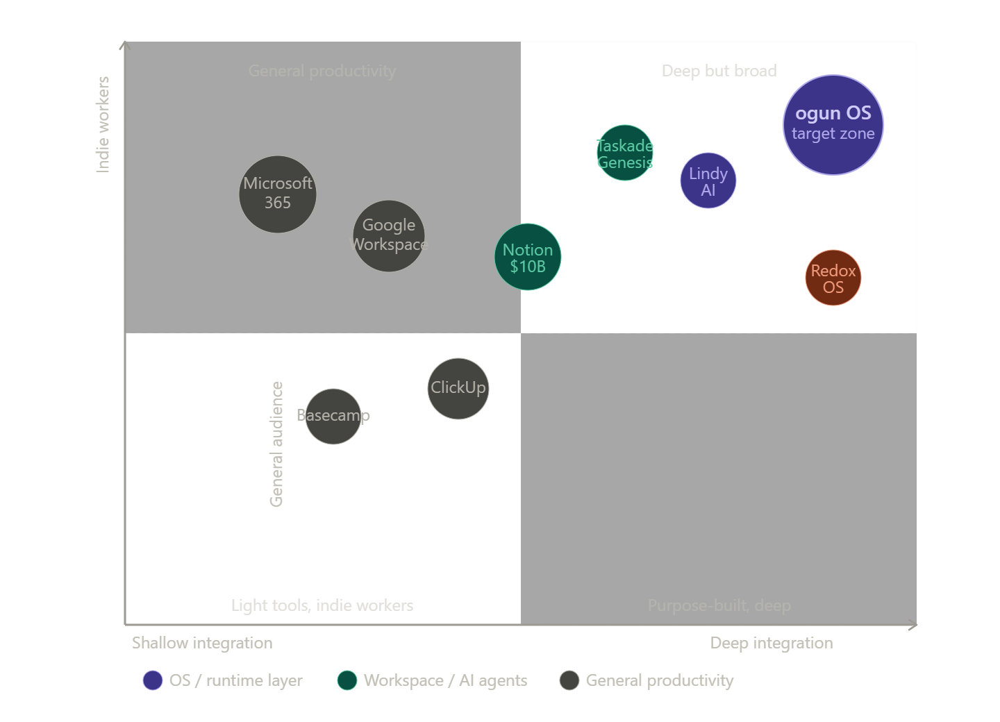

# ogun OS — Competitive & Market Analysis

*Prepared June 2026 based on project documentation and current market research*

---

## Executive summary

ogun OS is a hosted OS layer for independent workers — freelancers, founders, contractors, creators — built in Rust, running on top of Windows (with Linux/macOS/mobile designed for later), and structured around the concept of a **personal enterprise OS** rather than a conventional productivity suite. It has no direct competitor occupying the same space. The closest parallels sit in adjacent categories: general-purpose workspace tools (Notion, ClickUp), AI agent stacks for solopreneurs (Taskade Genesis, Lindy), and experimental Rust OS projects (Redox). The project's ambition is architecturally genuine and technically differentiated, but it enters at a moment of intense competition for the independent worker's attention and budget, when the "solopreneur stack" is consolidating around a small set of already-dominant SaaS platforms.

---

## 1. Market context

The addressable market is large and structurally favorable. The global gig economy market is projected to reach $674.1 billion in 2026, fueled by a 15.79% compound annual growth rate. MBO Partners reports a record 5.6 million independent workers earning over $100,000 annually in 2025, and the US independent workforce stands at approximately 72.9 million people. Full-time independent workers more than doubled from 13.6 million in 2020 to 27.7 million in 2024, and freelancers are projected to make up over 50% of the US workforce by 2027.

The software market serving this group is growing even faster than the workforce itself. The global freelance platforms market was estimated at $6.37 billion in 2025 and is projected to reach $24.16 billion by 2033, at a CAGR of 18.6%.

The timing is also shaped by a structural shift in how independent workers organize their tools. The operating system for this new era is increasingly described as the "agentic workspace": memory, agents, and automations in a single compound loop. Nearly 60% of US small businesses now use AI tools in their operations — more than double the rate in 2023. ogun OS's core thesis — that independent workers are running enterprises with no structure, memory, or intelligence layer — is validated by market trends, even if those trends are currently being captured by SaaS incumbents rather than OS-layer challengers.

---

## 2. Competitive landscape

### Tier 1 — Direct concept competitors (none exist yet)

There is no product currently shipping that positions itself as an operating system layer specifically for independent workers with this architecture: signed images, a capability-gated kernel, workspace-bounded AI agents, enterprise isolation, and a full four-tier application stack. The space ogun OS is targeting is genuinely unoccupied. This is both the biggest opportunity and the biggest risk.

### Tier 2 — Workspace and "business OS" tools

These are the products that users currently call their "operating system for work." They are SaaS-native, cloud-first, and collaborative in design.

**Notion ($10B valuation)** is the most direct conceptual competitor, even though it operates as a web app rather than a system layer. Notion launched its AI Agents in September 2025 and is doubling down on AI integration and platform breadth. Solo founders and small teams choose Notion as a personal CRM, project tracker, journal, and wiki simultaneously — a "second brain" for the entire freelance business. Notion's model is "organize everything in databases"; ogun OS's model is "organize enterprises, engagements, assets, workflows, and value production." These are philosophically distinct, but Notion occupies the mindshare that ogun OS would need to displace.

**ClickUp, Basecamp, and Google Workspace** round out the general productivity tier. In 2026, the best project management tools are flexible, visually intuitive, and increasingly integrated with automation and AI. These tools have the advantage of immediate availability, established user bases, and no installation overhead.

### Tier 3 — AI-native solopreneur platforms

A typical solo founder stack in 2026 costs $300–500/month and includes AI coding, design, content, automation, customer support, and an agentic workspace like Taskade Genesis that combines AI agents, automations, and app building in one platform.

**Taskade Genesis** is the most relevant emerging competitor. It is explicitly building toward the "one-person company OS" framing. Lindy functions as a digital chief of staff — managing inbox, qualifying leads, updating CRM, booking meetings, and keeping workflow running without technical setup. These agent platforms are abstracting above the OS level, not below it, which means they are cloud-dependent by design. ogun OS's kernel-level agent system (Sambara) is architecturally the inverse: agents with declared authority levels, workspace-bounded execution, and kernel-enforced isolation — rather than cloud agents with opaque permissions.

### Tier 4 — OS and systems projects

**Redox OS** is the most prominent Rust-native OS project. Redox is a Unix-like operating system based on a microkernel design, community-developed, and distributed under an MIT License. As of September 2024, Andrew Tanenbaum commented that Redox "has real potential, but is not there yet." Redox is targeting bare-metal replacement with POSIX compatibility — fundamentally different from ogun OS's hosted, application-layer approach aimed at workers rather than developers.

**Asterinas** targets confidential virtual machines and data center workloads, not end users at all.

**Windows Subsystem for Linux (WSL)** is the closest structural analog from a major player — a hosted OS layer running on top of Windows — but its purpose is developer tooling, not a sovereign application environment for independent workers.

---

## 3. ogun OS's differentiation

The project's genuine differentiators, as reflected in the documentation:

**Architectural depth.** Most competitors are SaaS apps with APIs. ogun OS is a complete runtime: virtual UEFI, three-stage bootloader verification, 15 kernel subsystems, capability-gated IPC (Elegua Protocol), cross-enterprise data isolation (Ọpọn Protocol), a software-defined execution scheduler (ogun-cpu), a P2P network layer (OgunNet), and an embedded database (RustyDB). Tauri applications start faster and use less memory than Electron because they avoid bundling an entire browser engine — Rust's compiled nature ensures the backend executes with minimal resource consumption. Building on Rust+Tauri gives ogun OS a meaningful performance and security baseline that web-native competitors cannot match.

**Security model.** The bootloader's three-stage verification (image signature → manifest integrity → host key re-derivation), mandatory capability auditing before every grant/denial, and the Ọpọn Protocol's kernel-level enterprise isolation are not features that SaaS productivity tools can credibly replicate. This is a genuine moat if the target user has compliance, confidentiality, or multi-client isolation needs.

**Personal enterprise model.** The framing of every independent worker as an "enterprise operator" with named enterprise types, lifecycle stages, engagement models, and revenue attribution is architecturally embedded into the runtime — not bolted on as a feature. The Tier-4 application suite (enzo, kogi, dongo, ume, shango, igi, moto) is built around this model. No current competitor has committed this deeply to the independent-worker-as-enterprise framing at the platform level.

**Sambara's agent authority model.** The four authority levels (OBSERVE → RECOMMEND → EXECUTE_BOUNDED → FULL_AUTONOMY), the requirement that escalation requires explicit operator interaction, and workspace-bounded execution are a more defensible and auditable agent model than anything currently available in consumer solopreneur platforms. For high-stakes professional contexts, this matters.

---

## 4. Risks and gaps

**Alpha-stage implementation vs. beta-scope documentation.** The TODO file is candid: many crates are still placeholder scaffolding, the top-level `cargo check --workspace` fails due to missing dependencies, `ogun-bootloader` has a malformed import, and `rustydb`, `elegua`, and `bula` have substantial specification claims but very small code bodies. The gap between the specification's sophistication and the current implementation state is the most immediate risk. The June 2026 beta target is aggressive.

**Installation friction as a moat-and-barrier.** A full installer, signed images, and a boot chain are exactly what make ogun OS architecturally credible — and exactly what will cause friction at first adoption, compared to a Notion tab or a Taskade signup. The target user (freelancer, creator, founder) is accustomed to zero-friction SaaS onboarding. The value proposition has to be strong enough to justify the setup overhead.

**Windows-only beta.** The online gig economy is global and increasingly mobile-first. Launching on Windows x64 only is a defensible pragmatic choice, but it excludes macOS-native freelancers (a large and affluent segment of the creative and tech professional audience) and mobile-first workers in international markets. Linux/macOS/mobile are designed but post-beta.

**The SaaS incumbents are moving fast.** Notion is expanding into adjacent categories including calendars and email, and launched AI Agents in late 2025. The "solopreneur OS" framing is becoming mainstream SaaS marketing language. The window during which ogun OS can establish this positioning as genuinely differentiated — rather than as a feature category every major workspace tool is rolling into — is narrowing.

**No cloud sync in beta.** Cloud synchronization is listed as a post-beta feature. Freelancers and independent workers who work across devices will notice this immediately. Local-first is an architectural choice with a meaningful audience (privacy-conscious professionals), but it limits early adoption among workers who treat cloud continuity as a given.

**GPL-3.0 licensing.** For a project targeting entrepreneurs and independent operators, the GPL-3.0 creates potential friction for operators who want to build proprietary tooling or workflows on top of the platform. This is a philosophical alignment question as much as a legal one, but it will affect enterprise and commercial partnership options.

---

## 5. Strategic positioning assessment

ogun OS is not competing with Notion for the Notion user. It is trying to create a new category: a sovereign, security-enforced, enterprise-aware operating environment that treats the independent worker's professional life as a first-class OS concern — not as a collection of apps that happen to run on Windows.

That category doesn't exist yet, which means ogun OS has to both build it and populate it simultaneously. The technical foundation is genuinely differentiated. The documentation quality and architectural coherence are unusually high for a solo-founded alpha project. The naming system (Elegua, Ọpọn, Sambara) reflects a thoughtful identity and cultural specificity that distinguishes it from generic productivity tooling.

The path to market success hinges on three things the documentation does not yet fully answer: what is the onboarding experience for a non-technical freelancer or creator, what is the pricing model, and how does ogun OS demonstrate its enterprise isolation and security properties in a way that resonates with workers who have never needed to think about capability-gated IPC. The architectural depth is real. The translation of that depth into user-perceptible value is the critical next challenge.

---

## 6. Competitive positioning summary

| Dimension | ogun OS | Notion | Taskade Genesis | Lindy | Redox OS |
|---|---|---|---|---|---|
| **Target user** | Independent workers as enterprise operators | Teams and solo users | Solo founders, one-person companies | Solopreneurs, operations | Systems/OS developers |
| **Deployment model** | Local installed OS layer | Cloud SaaS | Cloud SaaS | Cloud SaaS | Bare metal |
| **AI agents** | Kernel-level, workspace-bounded, authority-gated | Database-embedded AI | Agentic workspace platform | Chief-of-staff automation | None |
| **Security model** | Boot-verified, capability-gated, enterprise-isolated | Access control, SSO | Cloud permissions | Cloud permissions | Microkernel isolation |
| **Tech stack** | Rust + Tauri | TypeScript/React | Cloud | Cloud | Rust |
| **Status** | 0.1.0-alpha, beta June 2026 | Shipping, $10B valuation | Shipping | Shipping | Not stable, developer preview |
| **Open source** | GPL-3.0 | Proprietary | Proprietary | Proprietary | MIT |
| **Maturity gap** | High (spec ahead of impl) | Mature | Mature | Mature | High |

The closest competitive threat in the near term is not any single product — it is the continued consolidation of the freelancer/solopreneur stack around a small number of cloud-native platforms that are increasingly building the features ogun OS's architecture would deliver from the OS layer. The longer the implementation-to-release timeline, the more that window narrows.

---

---

## ogun OS — Project Assessment

### What It Is

ogun OS is an ambitious **hosted operating system layer** — not a bare-metal OS, but a fully structured runtime environment that sits on top of an existing host OS (Windows first, others planned). Its target audience is independent workers: freelancers, founders, consultants, creators. The core thesis is that every independent worker is already running a de facto enterprise, and ogun OS gives that enterprise explicit structure, tooling, memory, and intelligence.

The name and terminology draw from Yoruba cosmology (Ogun, Elegua, Ọpọn, Sambara, etc.), which is distinctive and coherent as a naming system.

---

### Architecture Quality

The architecture is genuinely sophisticated and well-thought-out. Standout elements:

**Strong design decisions:**
- A real boot chain (virtual UEFI → bootloader → kernel → session manager) with a three-stage cryptographic verification pipeline (image signature, manifest integrity, host key re-derivation via HKDF-SHA256). This is more rigorous than most application-layer software.
- ed25519 signing of platform images, per-section SHA-256 checksums, zstd compression — these are production-quality choices, not hand-waving.
- The Ọpọn Protocol's kernel-enforced `opn_enforced = true` that cannot be disabled at config time is a real security invariant, not just a checkbox.
- The Elegua IPC protocol mandating `operator_id`, `enterprise_id`, `workspace_id`, `trace_id` on every message from boot Step 12 onward is a solid observability and isolation design.
- `CleanShutdownMarker` as an absolute last act is a thoughtful crash-consistency primitive.
- The `ogun-cpu` software-defined scheduler with dynamic Tokio thread pool scaling, priority bands, and per-component `catch_unwind` protection shows real systems thinking.
- DESIGN.md's invariants are clear, specific, and enforceable — this isn't vague architectural prose.

**The layering model is clean:** emulator-backend is the only component that touches host OS APIs; virtual devices present a stable abstraction above that; the kernel, session manager, and app tiers sit cleanly above that. Lower layers don't depend on higher ones — this is stated and appears to be enforced structurally.

---

### Current State vs. Documentation Gap

This is the project's most significant challenge, and to Dominic's credit, it's honestly documented. The TODO.md is candid:

- The umbrella `cargo check --workspace` **fails to load**, blocked by a merge conflict marker in a manifest, stale path dependencies, and a duplicate crate name.
- `ogun-runtime` fails on a malformed import (`gun_types` instead of `ogun_types`) and a missing macro import.
- `ogun-sdk` fails on trait visibility errors and a non-existent type alias (`OResult` vs `OgunResult`).
- `ogun-devices` has two crates with identical package names.
- Most supporting libraries (`elegua`, `rustydb`, `bula`, `jaku`, `oya`) have extensive README/spec claims but minimal or placeholder implementations.
- Virtual device binaries are described as "print-only" with placeholder startup text.

The codebase is firmly in **alpha scaffolding** state — the architecture is designed and partially framed, but most crates are not yet implementing their specifications. The documentation (particularly DESIGN.md, the architecture doc, and the product spec) is substantially ahead of the code.

This is not unusual for an early-stage solo or small-team project, and the gap is clearly acknowledged. What matters is that the design is coherent enough that implementing toward it is feasible, which it appears to be.

---

### Governance & Community Docs

These are genuinely well-written and appropriate for the stage:

- **CONTRIBUTING.md** is precise and technically specific — it names the exact invariants contributors must preserve, gives workspace-specific check commands, and explicitly distinguishes alpha scaffolding from production expectations.
- **SECURITY.md** is thorough, identifies the right sensitive areas (image signing, Ọpọn enforcement, Elegua routing, etc.), and sets a realistic safe harbor policy.
- **GOVERNANCE.md** is honest about being founder-led at this stage while laying out a credible future structure by area.
- **CODE_OF_CONDUCT.md** has a notably good "Technical Disagreement" section that distinguishes between substantive critique and personal attacks.

---

### Product Concept Assessment

The "OS for independent workers" framing is clear and differentiated. The four-tier application model (kernel services → OS apps → utility apps → personal enterprise suite) maps sensibly onto the user's needs. The Tier 4 suite is large — 20+ named applications — but the scope is documented as future work rather than claimed as shipped.

The agent system (Sambara) with explicit authority levels (`OBSERVE` → `RECOMMEND` → `EXECUTE_BOUNDED` → `FULL_AUTONOMY`) and the rule that authority escalation cannot be triggered by agent logic — only by explicit operator interaction — is a thoughtful and currently relevant design choice.

---

### What Needs Immediate Attention (P0)

The TODO.md already correctly prioritizes these, but to summarize the critical path to a working beta:

1. Fix the `Cargo.toml` merge conflict in `ogun-os/src/servers/ogun-host-server` — this blocks everything.
2. Fix stale `ogun_types` path dependencies across several workspaces.
3. Fix the duplicate package name in `ogun-devices`.
4. Fix the handful of compile errors in `ogun-runtime` and `ogun-sdk`.
5. After that, get `cargo check --workspace` clean across all submodules before promoting any implementation work.

Until the workspace loads cleanly, the project cannot be CI-gated, and there's no reliable way to know which implementation work is actually wired in.

---

### Summary Verdict

This is a high-ambition, architecturally serious project with documentation and design quality that's well above average for an early-stage solo open-source effort. The security design in particular — the three-key trust chain, boot verification, Ọpọn enforcement, capability auditing — reflects genuine OS-level thinking rather than application security bolted on afterward.

The primary risk is the gap between the specification depth and the implementation depth. That gap is large right now, and the beta target is June 2026 (this month). Shipping a full beta on that timeline with the current build state would require a concentrated sprint on compile fixes, core implementation, and end-to-end testing — the TODO's P0 list is the right starting point.

The project has the design to become what it claims to be. The question is execution velocity from this point forward.
